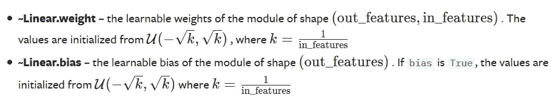
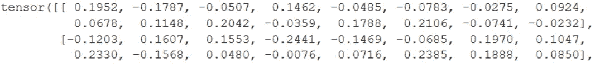
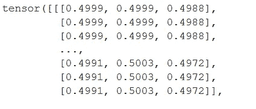
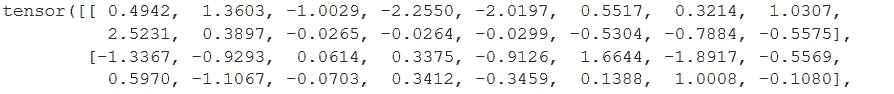
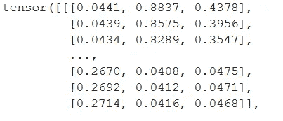
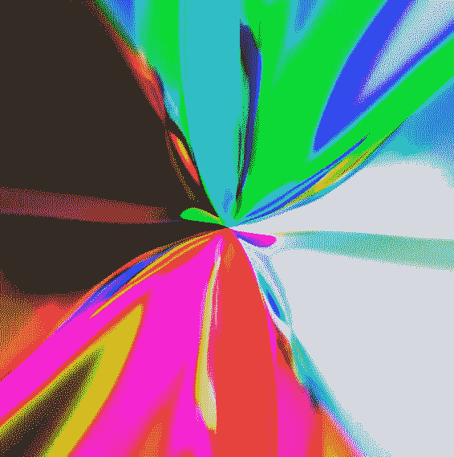
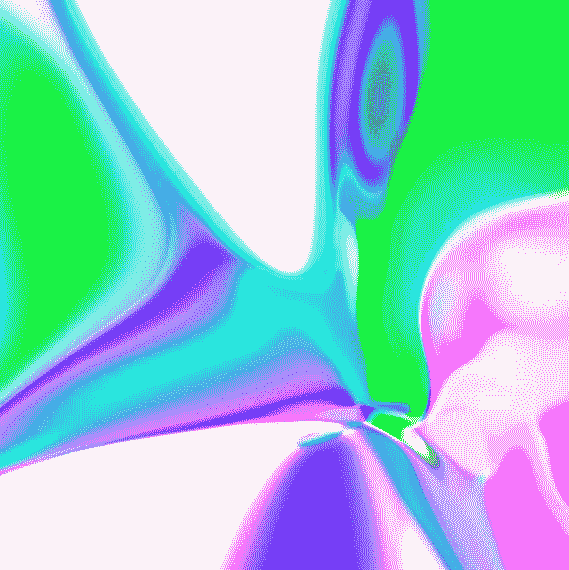
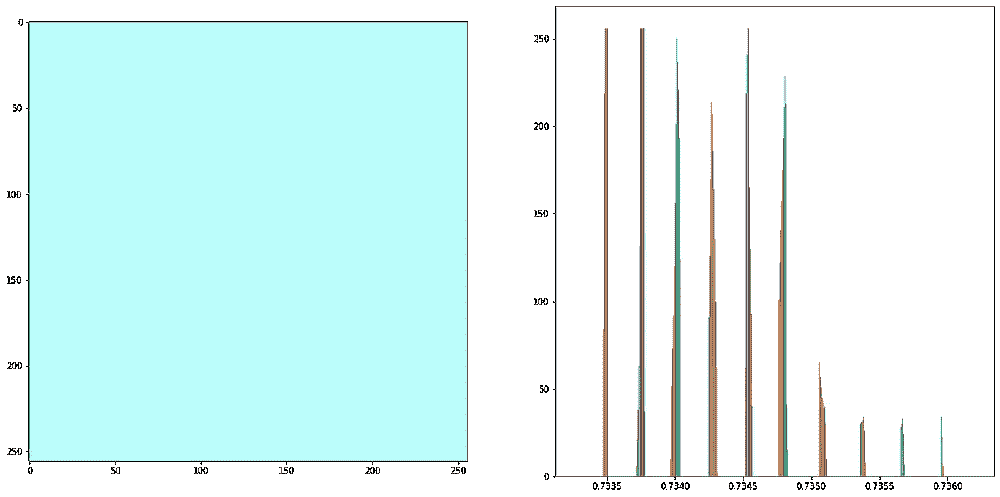
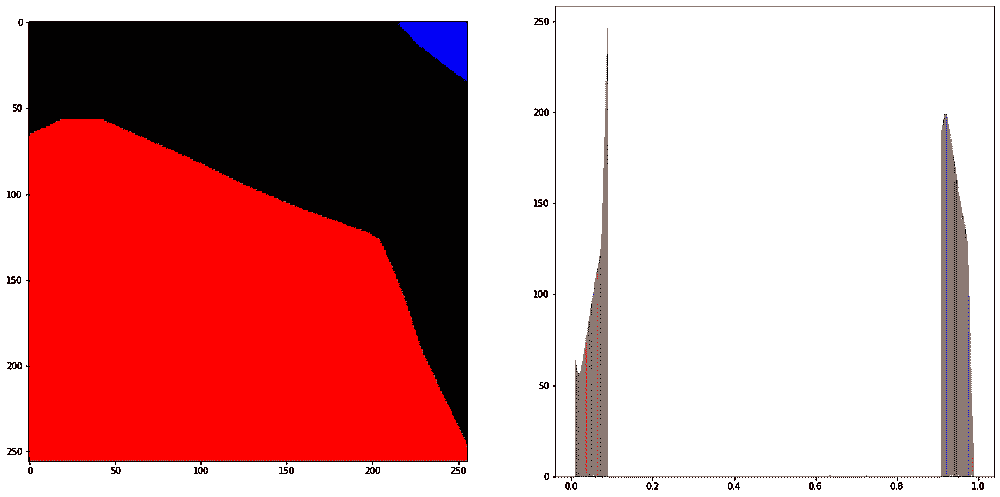

# 神经网络中权重初始化的可视化探索

> 原文：<https://medium.com/analytics-vidhya/a-visual-exploration-of-weight-initialisation-in-neural-networks-32c9736eec36?source=collection_archive---------24----------------------->

我最近开始探索神经网络的视觉潜力，在这个过程中，我看到了大卫·哈令人着迷的[博客。](http://blog.otoro.net/archive.html)

在他的一篇[帖子](http://blog.otoro.net/2015/06/19/neural-network-generative-art/)中，他通过 MLP 传递每个像素的 x，y 坐标来创建一系列图像。输出到 3 个通道(每个像素的 RGB)，他最终得到了这样的图像:

从 MLP 生成的图像

相当酷。

我很想尝试自己实现它来生成一些这样的图片。因此，在 PyTorch 中，我将一个具有 2 个输入(标准化像素索引)、3 个输出(RGB 通道)和 8 个线性层(16 个神经元)的 MLP 放在一起。

点击播放并..

瞧啊。一个灰色的斑点…嗯嗯…

我花了太多时间检查我的代码是否有 bug。我恍然大悟，默认情况下权重到底是怎么初始化的？

事实证明 PyTorch 就是这么做的:

【https://pytorch.org/docs/stable/nn.html#linear-layers 

我不会深入不同初始化方案的细节，因为有很多好的解释。但本质上，任何神经网络都只是一系列矩阵乘法。如果我们有很多这样的(一个“深”网络)，那么每一层的输出可以逐渐变得巨大或微小，它们的梯度也是如此(爆炸/消失)。这对于学习来说并不理想，解决这个问题的方法是通过权重初始化。

然而，在这种情况下，我只是试图从一个单一的向前传球漂亮的图片。

让我们来看看一些使用默认初始化的重量:

使用默认初始化的前两个神经元的权重

模型的输出是:

6 个像素的 RGB 值

难怪一切都是灰色的。

如果我们用一个标准的正态分布来初始化呢？

使用正态分布初始化的前两个神经元的权重

最终层的 6 个输出

而结果…

哒哒！这还差不多。但是为什么所有的东西都穿过图像的中间呢？

最初我将偏差设置为 0，因此每个神经元都必须经过原点。这只是像素指数归一化后的图像中点。

这里有一个 1.25 的偏差

20 层 16 神经元

8 层 48 个神经元

我应该提到，这些都使用双曲正切作为激活函数，因为它提供了更广泛的输出频谱。

为了比较，这里是乙状结肠和 ReLU

Sigmoid(左)、ReLU(右)，图表显示了 R 输出通道的分布

如果你想修改的话，这是密码