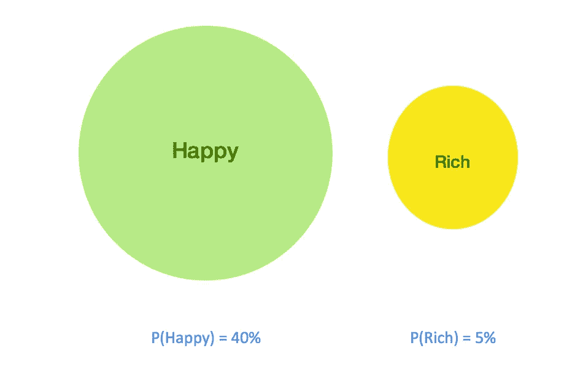
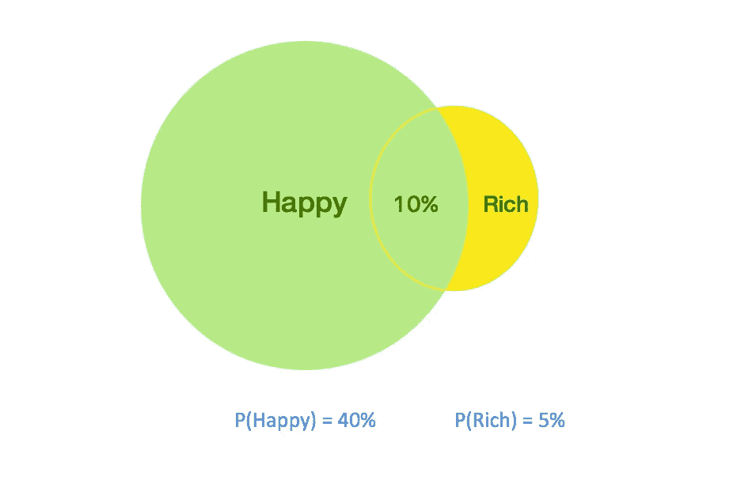
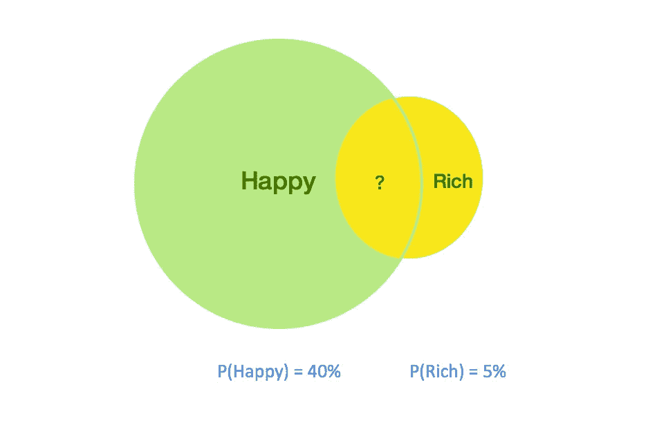

# 贝叶斯规则的直观性

> 原文：<https://medium.com/analytics-vidhya/a-visual-intuition-of-bayes-rule-149b48f76608?source=collection_archive---------3----------------------->


詹·西奥多在 [Unsplash](https://unsplash.com?utm_source=medium&utm_medium=referral) 上的照片

来自 Quora 的一个[问题](https://www.quora.com/What-is-an-intuitive-explanation-of-Bayes-Rule)让我思考贝叶斯定理的直觉，所以我试图从[答案](https://qr.ae/TWnBwr)中提到的一个场景中得出一个视觉直觉。

## 问题:

比方说，你的朋友试图通过引用一项著名的研究来让你相信富有并不能让一个人快乐，这项研究称只有 10%快乐的人是富有的。你是一个有逻辑的人，你知道这里有意义的实际统计数据是富人快乐的百分比，而不是相反。所以你开始用贝叶斯法则来找出答案。

## 贝叶斯法则:

贝叶斯规则通常用于寻找已知条件概率的反向概率。在我们的例子中，我们希望从已知值 P(Rich|Happy)中找到 P(Happy|Rich)，

```
P(Happy|Rich) = (P(Happy) X P(Rich|Happy))/ P(Rich)
```

让我们通过考虑某人快乐的概率是 40%,某人富有的概率是 5%,来尝试对上述等式有一个直观的认识



绿色和黄色的圆圈分别代表人们幸福和富有的概率分布。我们从研究中得知，10%快乐的人是富人。那就是重叠面积是快乐圈的 10%。所有这些信息可以如下图所示。



我们感兴趣的数据是快乐的富人的百分比。这可以重新表述为富圈上重叠部分所占的面积百分比(如下所示)。



重叠面积可计算如下:

```
 overlap area = P(Happy)  X  Percentage of overlap on P(Happy)
               = P(Happy)  X  P(Rich|Happy) overlap area = P(Happy)  X Percentage of overlap on P(Rich)
               = P(Rich)   X P(Happy|Rich)  combining the above two equations, P(Rich) X P(Happy|Rich) = P(Happy) X P(Rich|Happy) **P(Happy|Rich) = (P(Happy) X P(Rich|Happy)) / P(Rich)**
               =  40% X 10% / 5%
               =  0.4 X 0.1 / 0.05 = 0.8 = **80%**
```

所以，80%的富人是幸福的。

## 警告:

1.  为什么两个概率分布的交集会被认为是条件概率(P(Happy|Rich))而不是联合概率(P(Happy，Rich))？

是的，在一般情况下，两个概率分布的交集总是一个联合概率。但在我们的例子中，我们只对人们快乐或富有的情况感兴趣，我们的分布并不代表其他情况，如不富有或不快乐。

换句话说，这是一个人在有钱的情况下能够幸福的概率。所以，交集应该被认为是一个条件概率。