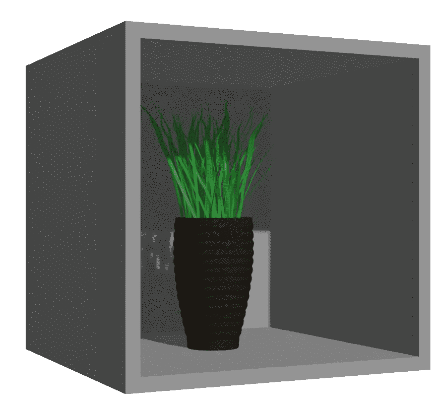

# 一个使用 OpenCV 和 Blender 的 VR 图像

> 原文：<https://medium.com/analytics-vidhya/a-vr-image-using-opencv-and-blender-250a98594d6d?source=collection_archive---------14----------------------->

VR 有许多不同的形状和大小(从字面上看)。我不太确定该怎么称呼它，但虚拟现实是我最终选择的词。这篇文章的主要目的是记录我所做的尝试(以备后用)。但是请随意四处看看。最后有一个小演示。

# VR 影像到底是什么？

老实说我不知道。我试着用谷歌搜索“虚拟现实图像”,我很确定没有一个结果与此有丝毫关系。但我还是选择了它，因为它听起来比“3D 外观的东西”更酷。

无论如何，我的工作原理是这样的:程序跟踪头部的位置，然后根据头部的位置以一定的角度显示 3D 模型的图像。

这听起来可能相当简单。然而，当图像倾斜时，仅仅显示渲染图像是不够的。为什么？这是因为我们看到的实际上是一个透视图，为了让用户看起来更真实，应该考虑到这一点。

# 我做了什么

1.  我创建了一个简单的 3D 场景，一个立方体的一边是开放的，一个花瓶放在立方体里面。
2.  我将相机设置为始终指向立方体，并在 Blender 中编写了一个 [python 脚本](https://github.com/dilithjay/VRImage/blob/main/blender_camera_control.py)，使其始终朝向立方体，同时保持与立方体的恒定距离。
3.  接下来，我对相机进行编程，使其以小增量移动，在每个位置渲染相机视图。首先，我尝试使用相当大的增量，但视频输出似乎很不稳定。所以我决定采用较小的增量。这不是最节省空间的方法，因为我现在一个文件夹里有 600 张图片。然而，由于我之前提到的视角问题，我别无选择，只能这样做。
4.  我在网上找到了一个 [python 脚本](https://github.com/dilithjay/VRImage/blob/main/warp.py)，它使用 OpenCV 将任何四边形扭曲成正方形。我改变了它，使图像循环，立方体的开放面的角可以被选择，扭曲的图像被保存到一个文件夹中。
5.  接下来是最乏味和耗时的部分。我必须浏览 600 张图像，手动选择代表每张图像中立方体开放面的角的点，以使其变形。如果我足够了解 Blender 渲染系统，我可能会自动完成这一步。也许有一天我会的。
6.  之后，我使用 OpenCV 和预先训练的 haar 级联模型编写了人脸检测代码。为此，我决定走出自己的舒适区，用 [C++](https://github.com/dilithjay/VRImage/blob/main/TrompeLoeil.cpp) 编写代码。使用 C++还意味着我必须为整个系统安装 OpenCV，而不仅仅是为 python 安装 pip。我决定从源头开始建造。在多次尝试使用 Visual Studio 代码和 Code::块编译任何 OpenCV 程序而不出现链接器错误失败后，我决定尝试一下 Microsoft Visual Studio，这也是我想熟悉的一个程序。幸运的是，这非常有效。所以一石二鸟。
7.  现在我要做的就是从扭曲的图像中确定正确的图像(取决于头部的位置)并显示它。

你瞧，它终于起作用了。

看起来还是有点不稳定。我能想到两个可能的原因。

*   人脸检测中的细微异常。
*   我在标记拐角时的人为错误:这可以通过前面提到的自动化这个步骤来解决。

正如我在开始时提到的，我写这篇文章只是为了记录这个项目，所以读者可能不会从阅读这篇文章中获得什么。除非你想自己做这样的东西，在这种情况下，去做吧。:)

对任何感兴趣的人，我也在维护我自己的网站，所以来看看:):【http://www.dilithjay.com/blog/T2