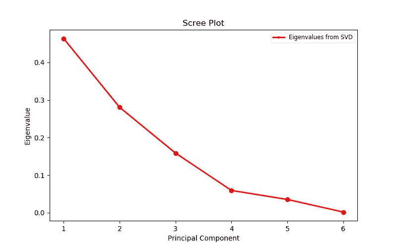
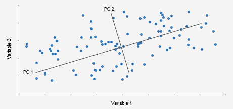
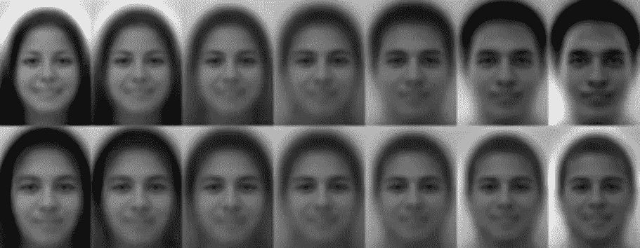

# 主成分分析演练

> 原文：<https://medium.com/analytics-vidhya/a-walk-through-of-principal-component-analysis-b076ee5221b7?source=collection_archive---------20----------------------->

多酷的照片啊。我打赌很多人都用过。

宿舍又罢工了。你坐得太快了，开始想知道是什么让你上下铺爆米花天花板上的某些突起如此难以忍受。收集数据的时间到了。

不幸的是，我们遇到了一个问题(除了你的头痛):我们无法绘制出你今天早上起床时砸到你头上的所有 20 个爆米花天花板的宽度、高度、锐度和白色阴影，因为我们像世界上的其他人一样，缺乏有效的四维图。

那么，恭喜你，我们已经解锁了实施被称为主成分分析或 PCA 的降维策略的绝佳机会！虽然你可能像一个绝对的疯子一样，为你头顶上每个痛苦的小肿块绘制了宽度、高度、锐度和白色阴影，但我们真正想要弄清楚的是**的关键因素**，或者说是使不同组的爆米花肿块特别且非常痛苦的因素。然后我们做数学。

# PCA 的高级解释

那么 PCA 有什么用途呢？虽然在当今社会，对爆米花天花板上的凸起进行分类似乎是一个极其紧迫的问题，但在一些情况下，使用 PCA 可能更适用:比如确定跳绳的最佳岩石种类。是的。在 CS 地牢中的漫漫长夜，甚至没有看到来自上面世界的一丝阳光的希望，让无数的灵魂渴望重温他们的眼睛仍然闪亮的时光。跳过石头可能会满足这个愿望。

但还是有一个问题。感觉像过了一辈子，你不再记得什么样的岩石适合跳过。你甚至没有按类型分组的摇滚乐！所以你收集数据对它们进行分类:体积，重量，光滑度，相对于体积它们有多薄，它们有多圆。但是，这些不能同时用图表表示，因为有三个以上的属性和主题(岩石)。

因此，我们必须做出决定，像你在进入大学时与高中朋友一样，砍掉一些属性！记住，这个过程的目的是为了看看**是什么让不同的岩石群变得特别**。因此，我们希望在最终结果中表示的属性是那些具有最大方差的属性。

不同的属性可以按方差或重要性排序，如下图所示。x 轴上的每个点代表一个不同的属性或组件，从[特征值](https://towardsdatascience.com/the-mathematics-behind-principal-component-analysis-fff2d7f4b643)计算的 y 轴代表该属性的变化。在这个特定的例子中，无论第一主成分代表什么，都占变化的 45%以上，第二主成分占变化的 25%以上。换句话说，第一个主成分的方差最大，接下来的主成分方差依次递减。

鉴于这两个变量可以解释受试者之间 70%以上的差异，有理由假设这些特征有**高可能性**拥有**区分受试者群体**所需的差异。所以我们可以去掉其他属性，比如你第一次期中考试不及格的那门课。主成分分析告诉我们，这些其他特征对我们的目的来说完全无关紧要，因为它们几乎不会使受试者组与其他受试者组有所不同(假设这些变量的方差很小)。

理想情况下，我们选择的主成分将足以将主题分类到有意义的集群中(尽管当我们选择其他成分时，看看会发生什么可能是有用的)。最终结果应该如下图所示，轴代表我们选择的变量。

“PC 1”和“PC 2”线是每个单独选择的变量的最佳拟合线。该图也可以用那些最佳拟合的线作为轴来描绘，因为它有助于吸引人的可视化，并且重要的部分是点之间的相互关系。既然我们可以看到什么样的变量使岩石与其他岩石最不相同，我们可以从每组或极端中测试一些，找出它们的表现，并根据这些结果预测所有其他岩石的表现。

# 行业如何使用 PCA

## 人脸识别

将[雌性与雄性](https://www.sciencedirect.com/science/article/pii/S0262885609002613)分开的前两个 PCA 最具判别力的主成分

当一个程序试图识别一张脸时，有许多变量可以收集，因为一张图像可以包含如此多的信息。尽管几乎每个人都有相同的基本面部结构(眼睛、鼻子、嘴巴等)。)，有足够多微妙的变化，我们可以告诉每一个我们认识的人除了彼此。

鉴于人们面部表现出的丰富而微妙的差异，一种平衡行为出现了:我们需要一台机器处理足够的信息来区分人们，但又不至于让机器花太多时间来处理，或者让机器发现同一个人的显著差异。因此， [PCA 非常适合于确定我们可以用来区分人的最重要的特征](http://ijarcet.org/wp-content/uploads/IJARCET-VOL-1-ISSUE-9-135-139.pdf)。PCA 使机器运行得更快，检查的变量更少，运行得更有效，因为它发现不同人之间差异最大的特征，并使用这些区分特征来对人脸进行分类或区分男性和女性，如上所述。

## 计算机网络攻击的检测和可视化

在分析网络攻击时会涉及到大量的数据，而且每种攻击都有几十个可以测量的变量。因为我们中的一些人有生命，虽然对于像我们这样的 UCSD stem 专业的学生来说很少，但我们不会浪费所有的时间盯着每一小段代码。相反，PCA 可以帮助我们从所有这些数据中找到什么是重要的，以便我们可以更快地确定网络攻击是否正在进行，通常采用两种方式之一:**异常检测**，它试图识别异常活动，以及**签名检测**，它试图将以前攻击的行为与当前活动进行匹配。

在[的一项研究](https://web.cs.ucdavis.edu/~vemuri/papers/pcaVisualization.pdf)中，PCA 被用来学习如何防御这种攻击，有七个数据集，每个数据集有三百个特征向量(太多了，无法分析所有的东西)。多亏了 PCA，他们能够使用双图以图形方式解释他们的数据。[未来的工作包括测试该模型在实时环境中的工作情况，在这种环境中，网络流量被动态地收集、处理和分析以发现入侵。](https://web.cs.ucdavis.edu/~vemuri/papers/pcaVisualization.pdf)”

# 后果

在处理大量数据时，主成分分析是一种节省时间、降低计算成本和提高效率的好方法。因此，随着技术允许我们收集的数据量持续增长，这是许多现代行业实施的持续降维方法。时候到了。收集石头。