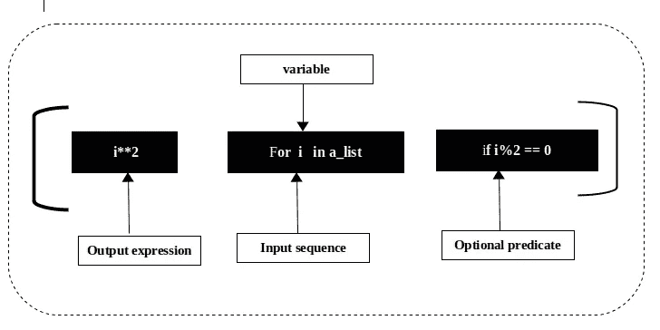

# python 列表理解概述

> 原文：<https://medium.com/analytics-vidhya/a-walk-through-python-list-comprehension-845f02f95436?source=collection_archive---------1----------------------->

## **创建列表的简洁方法**

列表理解允许从另一个序列或 iterable 创建一个新的列表。

Python 中的列表理解构造如下:

```
list_variable = [x for x in iterable one_or_more_condition]
```

列表理解由以下部分组成:

*   一个输入序列。
*   代表输入序列成员的变量。
*   可选的谓词表达式。
*   从满足谓词的输入序列成员中产生输出列表元素的输出表达式。

假设，我们需要找到一个给定列表的所有`even`整数的平方。

```
a_list = [1, 4, 6, 5]squared_list = [ i**2 for i in a_list if i%2 == 0 ]print(squared_list)
output: [16, 36]
```

这里，方括号表示输出是一个 ***列表。***



*   迭代器部分遍历输入序列 **a_list** 的每个成员 **i** 。
*   谓词检查成员是否是一个`even`数字。
*   如果成员是一个`even`数，那么它被传递到输出表达式，平方，成为输出列表的成员。

使用`for`循环可以获得相同的结果

```
a_list = [1,4,6,5]
output_list = []for i in a_list:
    if i%2 ==0:
        output_list.append(i**2)
print("Output List using for loop:", output_list)output: [16, 36]
```

> **从循环到理解**

**每一个列表理解都可以重写为一个** `**for**` **循环，但不是每一个** `**for**` **循环都可以重写为一个列表理解。**

来源[https://trey hunner . com/2015/12/python-list-comprehensions-now-in-color/](https://treyhunner.com/2015/12/python-list-comprehensions-now-in-color/)

**使用** `**for**` **循环从两个列表中找出公共数字:**

```
first_list = [1, 2, 7, 0]
second_list = [2, 3, 4, 5]common_numbers=[]
for i in first_list:
    for j in second_list:
        if i == j:
            common_numbers.append(i)
print(common_numbers)output: [2]
```

**使用列表理解从两个列表中找出公共数字**

```
first_list = [1, 2, 7, 0]
second_list = [2, 3, 4, 5]common_numbers = [i for i in first_list for j in second_list if i==j]print(common_numbers)output: [2]
```

> **使用列表理解操作字符串**

列表理解也可以用于迭代字符串:

```
new_string = "Hello World In Python"

lower_case_string = [i.lower() for i in new_string.split(' ')]print(lower_case_string)output: ['hello', 'world', 'in', 'python']
```

**使用列表理解从字符串中提取所有数字:**

```
my_string = "Hello 12345 Python"
numbers = [x for x in my_string if x.isdigit()]
print(numbers)output = ['1', '2', '3', '4', '5']
```

> 嵌套列表理解

除了条件句，你还可以通过将它们嵌套在其他列表理解中来调整你的列表理解。当你想处理列表时，这是很有用的:生成列表列表，置换列表列表或将列表列表展平为常规列表。

**使用列表理解生成列表列表:**

```
new_list = [2, 5, 3]squared_list = [(i, i**2) for i in new_list]
print(squared_list)output: [(2, 4), (5, 25), (3, 9)]
```

这里我们使用`new_list` 创建`squared_list` ，这是一个 Python 中的列表的*列表，包含来自`new_list`的数字的方块和自身*

**再比如:**

**展平**一个矩阵:

```
list_of_list = [[1,2,3],[4,5,6],[7,8]]flatten_list_of_list = [j for i in list_of_list for j in i]print(flatten_list_of_list)output: [1, 2, 3, 4, 5, 6, 7, 8]
```

这里实际发生的是，您获取`list_of_list`中嵌套列表(`i`)的列表元素(`j`，并返回包含在`i`中的列表元素`j`的列表。

您会发现嵌套列表理解示例中使用的大多数关键字和元素与简单列表理解示例中使用的相似:

*   方括号
*   两个`for`关键字，后跟一个变量，该变量表示列表列表的一个项目(`i`)和嵌套列表的一个列表项目(`j`)；和
*   两个`in`关键字，后跟一个列表列表(`list_of_list`)和一个列表项(`i`)。

现在让我们考虑另一个**转置**矩阵的例子:

```
matrix = [[1,2,3],[4,5,6],[7,8,9]]transposed_matrix = [[row[i] for row in matrix] for i in range(3)]print(transposed_matrix)output: [[1, 4, 7], [2, 5, 8], [3, 6, 9]]
```

> **注:**一个矩阵的**转置**是一个新矩阵，它的行是原矩阵的列。这使得新矩阵的列成为原始矩阵的行。

现在使用嵌套的 for 循环重写代码:

```
matrix = [[1,2,3],[4,5,6],[7,8,9]]transposed_matrix = []
transposed_row = []for i in range(3):
    for row in matrix:
        transposed_row.append(row[i])
    transposed_matrix.append(transposed_row)output: [[1, 4, 7], [2, 5, 8], [3, 6, 9]]
```

当你需要创建一个实际上是一个矩阵的列表时，你也可以使用嵌套列表理解。看看下面的例子:

```
matrix = [[0 for col in range(4)] for row in range(3)]print(matrix)output: [[0, 0, 0, 0], [0, 0, 0, 0], [0, 0, 0, 0]]
```

将上面的代码块重写为嵌套的 for 循环:

```
matrix=[]for x in range(3):
    nested = []
    matrix.append(nested)
    for row in range(4):
        nested.append(0)
print(matrix)output: [[0, 0, 0, 0], [0, 0, 0, 0], [0, 0, 0, 0]]
```

**单位矩阵**

大小为 n 的单位矩阵是一个 n 乘 n 的方阵，主对角线上有 1，其他地方有 0。一个 3 乘 3 的单位矩阵是:

[ [ 1，0，0 ]，T32，[ 0，1，0 ]，T33，[ 0，0，1 ] ]

上述矩阵可以通过以下理解生成:

```
identity_matrix = [[ 1 if item_idx == row_idx else 0 for item_idx in range(0, 3) ] for row_idx in range(0, 3) ]print(identity_matrix)
output: [1, 0, 0], [0, 1, 0], [0, 0, 1]]
```

就是这样！