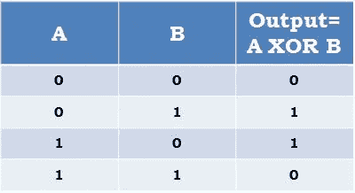
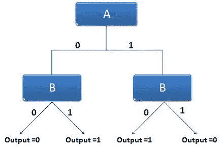
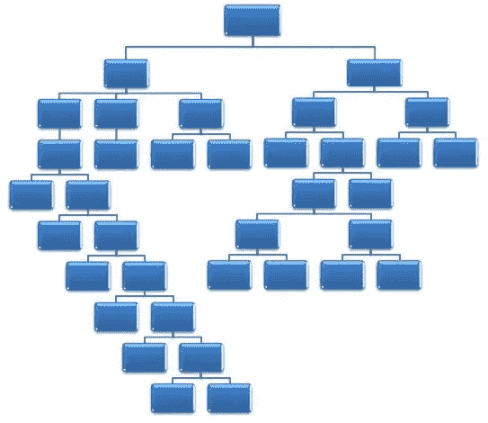
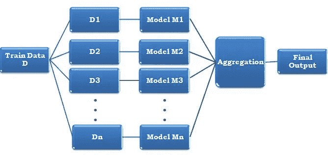
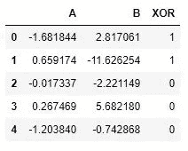
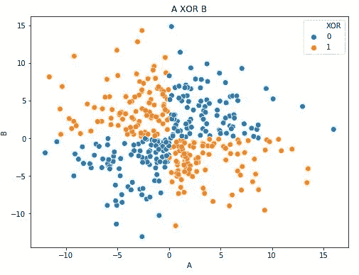
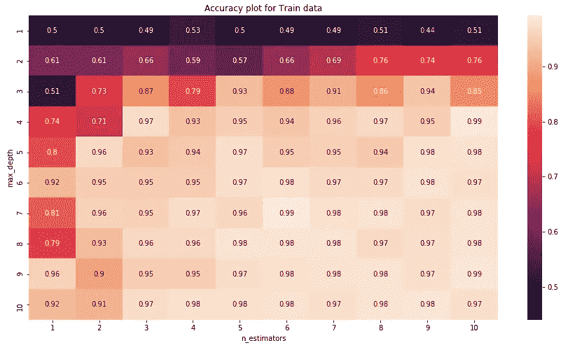
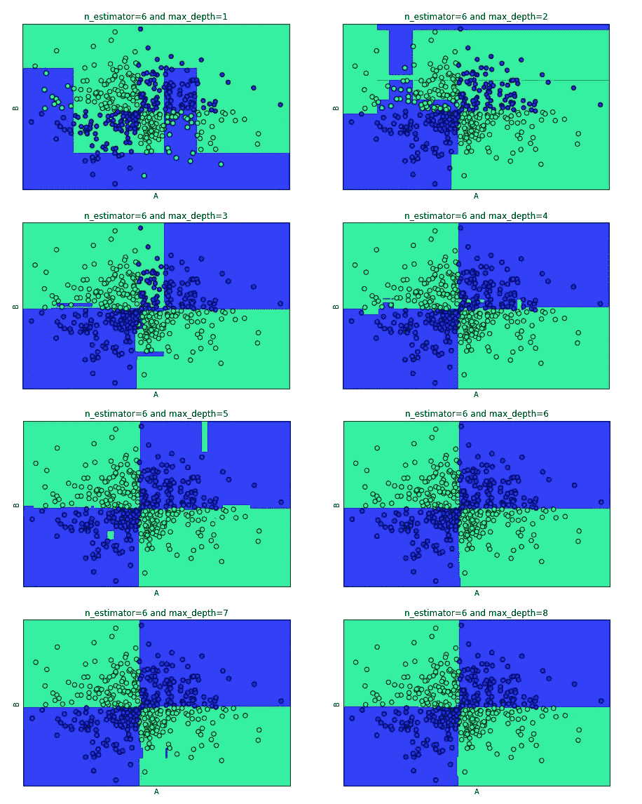

# 带代码的遍历随机森林决策树(RFDT)算法

> 原文：<https://medium.com/analytics-vidhya/a-walk-through-random-forest-decision-tree-rfdt-algorithm-with-code-932271af4ec7?source=collection_archive---------5----------------------->


照片由[阿莫斯 G](https://unsplash.com/@amosg?utm_source=unsplash&utm_medium=referral&utm_content=creditCopyText) 在 [Unsplash](https://unsplash.com/?utm_source=unsplash&utm_medium=referral&utm_content=creditCopyText) 上拍摄

*先决条件:机器学习基础*

在本文中，我将带您浏览一下随机森林决策树(RFDT)。出发前，让我们先装备好一些必备的东西，这样我们就不会在森林里迷路了；).在步入森林之前，首先要掌握的概念是决策树本身。我们去看看。

# 什么是决策树

一棵 ***决策树*** 不过是一个 ***if-else*** 分支的序列或者简称为 ***嵌套 if-else*** 。我们大多数了解计算机编程基础的人都知道 if-else 语句是如何工作的。但是为了完整起见，让我简单解释一下 if-else 是如何工作的。

如果你已经知道 if-else 分支的工作原理，你可以跳过下一段。

考虑下面的伪代码。

```
if(condition1)
 {
  statement1
 }
else if(condition2)
 {
  statement2
 }
else
 {
  statement3
 }
```

*   如果条件 1 被评估为真，将执行语句 1，并跳过所有其他语句。
*   如果条件 1 为假，条件 2 为真，则只执行语句 2。
*   如果条件 1 和条件 2 都为假，则只执行语句 3。这种结构叫做 ***嵌套 if-else*** 。我们可以根据需要自由地拥有任意多的 if-else 语句。

如果或*否则*，我们根据每个*处的条件进行分支。我们可以用树形图的形式表达嵌套的 if-else 语句，并由此命名为 ***决策树。****

让我们考虑 XOR 真值表的例子。



异或真值表

上面的真值表可以用如下所示的嵌套 if-else 来表示。

```
if(A==0)
 {
  if(B==0)
   {
    output=0
   }
  else
   {
    output=1
   }
 }
else
 {
  if(B==0)
   {
    output=1
   }
  else
   {
    output=0
   }
 }
```

这可以用如下所示的树形图来表示。



我们评估一个条件并基于它进行分支的每个点称为一个节点/顶点。

*   树的起始节点/顶点称为根节点/顶点。
*   终止节点/顶点称为叶节点/顶点。
*   除了根和叶以外的所有节点/顶点都称为内部节点/顶点。

在叶节点，我们做出最后的决定。在上面的例子中，在叶节点，我们决定输出是 0 还是 1。

就机器学习而言，上述真值表中的 A 列和 B 列称为输入特征，输出列称为类别/标签。选择哪个特征应该是根节点及其后续节点是基于这些特征的熵或 gini 杂质，这超出了我们当前讨论的范围。

你可以从这个[链接](https://homepage.cs.uri.edu/faculty/hamel/courses/2018/spring2018/csc581/lecture-notes/31a-decision-trees.pdf)中读到更多关于决策树构造的数学细节。

# **过拟合问题**

树的深度指的是树的层数。所以有很多层的树有很高的深度。例如，参考下图。



高深度树

我们可以看到，随着深度的增加，最终的决定是在评估了很多条件之后做出的。因此，具有很高深度的机器学习模型将对训练数据给出很高的预测精度，但它可能无法对看不见的测试数据进行一般化预测，即，很高的深度可能导致 ***过拟合*** 。

如果深度太小，即使在训练数据上，模型的性能也会很差。这在拟合 下称为 ***。***

# 装袋解决过度装配

Bagging 是一种用于解决过拟合问题并结合许多机器学习模型优点的集成技术。打包也称为 Bootstarpped 聚合。



装袋技术

在 bagging 中，实际的列车数据集 D 通过替换进行采样，以形成 n 个数据集 D1、D2、D3…Dn，如上图所示。这些新数据集中每一个都有 m 个数据点。现在，独立的机器学习模型 M1，M2，M3…Mn 在这些数据集上接受训练。所有这些模型的结果被汇总以获得最终输出。聚集可以通过平均值、中间值、多数投票分类器等。

方差是模型性能随着输入数据集的变化而变化的量。如果方差很高，则模型过度拟合。例如，假设输入数据集 D 有 10k 个数据点。不同的模型作用于 D 的子集，比如说 5k 个点。因此，如果 D 中的 100 个点发生变化，它不会显著影响所有模型的组合结果，因为每个模型都使用 D 的一个小样本集。这就是 bagging 可以抵抗过度拟合的方式。

# 随机森林决策树

在装袋中，我们对行进行随机采样，即我们从实际数据集 D 中随机选择数据点，以生成新的数据集 D1、D2、D3…Dn。在 RFDT 中，除了行采样，我们还进行列采样。即，我们从实际数据集 D 中随机选择行(数据点)和列(特征)以形成新的数据集 D1、D2、D3…Dn。

例如，如果实际数据集 D 具有 n 个数据点和 D 个特征，则形成的每个新数据集将仅具有 m 个数据点和 D’个特征，其中 m

In short,

**RFDT= Bagging +特征采样**

在 RFDT 中，基本模型是 M1、M2、M3...Mn 都是决策树模型。

RFDT 模型的性能随着树的深度和使用的基本模型的数量而变化。这是 RFDT 模型的两个超参数。

# 我们来编码吧！

作为一个例子，我采用 XOR 数据集，因为它很容易解释。我已经将数据集作为 csv 文件放在这个[链接](https://github.com/jijoga/XOR-dataset)中。

数据集有 3 列；即 A、B 和 XOR。a 和 B 是输入特征，而 XOR 列是我们的机器学习模型必须预测的输出。

让我们使用 pandas 加载数据集。

```
import pandas as pd
data=pd.read_csv('XOR dataset.csv')
```

数据集的样本:

```
data.head()
```



数据集样本

让我们使用 seaborn 库绘制数据点的散点图，以获得数据的清晰图像。

```
import seaborn as sns
import matplotlib.pyplot as pltfig, ax = plt.subplots(figsize=(8, 6))
sns.scatterplot(ax=ax,x="A", y="B",hue='XOR', data=data,s=60)
plt.show()
```



数据点散点图

现在，让我们将数据分为输入训练数据和输出类标签

```
X_train,y_train=data[['A','B']],data['XOR']
```

现在输入训练数据已经准备好了，让我们将 RFDT 模型放在上面。我在 sklearn 中使用了 GridSearchCV 函数来尝试一些超参数(max_depth 和 n_estimators)的组合，并获得了理想的模型。max_depth 是每个决策树模型的最大深度，n_estimators 是决策树模型的数量。你可以通过这个[链接](https://scikit-learn.org/stable/modules/generated/sklearn.model_selection.GridSearchCV.html)了解更多关于 GridSearchCV 的信息。

```
from sklearn.model_selection import GridSearchCV
from sklearn.ensemble import RandomForestClassifiertuned_param={'max_depth':range(1,11),'n_estimators':range(1,11)}
model=GridSearchCV(RandomForestClassifier(n_jobs=-1),param_grid=tuned_param,return_train_score=True)
model.fit(X_train, y_train)
```

让我们打印出最好的超参数和相应的精度

```
print("Best hyper paramters:",model.best_params_)
print("Best accuracy value: ",model.best_score_ )
```

输出:

最佳超参数:{'max_depth': 7，' n_estimators': 6}
最佳精度值:0.9925

因此，使用 6 个基本模型和最大深度 7，我们得到 99.25%的准确度。让我们绘制各种超参数组合的精度热图，以便了解模型性能如何随着超参数的变化而变化。在热图中，随着颜色亮度的增加，准确度值增加，反之亦然。

```
ac_df=pd.DataFrame(model.cv_results_['params'])#Creating a data frame with hyperparameters and accuracy
ac_df["accuracy"]=model.cv_results_['mean_test_score']

#Pivoting the dataframe for plotting heat map
ac_df=ac_df.pivot(index='max_depth',columns='n_estimators',values='accuracy')#Plotting the graph
plt.figure(figsize=(15,8))
sns.heatmap(data=auc_df,annot=True)
plt.title("Accuracy plot for Train data")
plt.show()
```



超参数的准确度图

现在让我们检查模型的决策面如何随超参数而变化。我将 n_estimators 固定为 6，并将 max_depth 参数从 1 改为 8。下图中的蓝色区域表示落在该区域中的任何点都将被模型预测为蓝点(0)。绿色(1)也是如此。我们可以看到，对于 n_estimators=6 和 max_depth=7，获得了最佳决策表面，这又是最佳超参数。

```
#Reference:[https://stackoverflow.com/questions/51297423/plot-scikit-learn-sklearn-svm-decision-boundary-surface](https://stackoverflow.com/questions/51297423/plot-scikit-learn-sklearn-svm-decision-boundary-surface)
#[https://stackoverflow.com/questions/31726643/how-do-i-get-multiple-subplots-in-matplotlib](https://stackoverflow.com/questions/31726643/how-do-i-get-multiple-subplots-in-matplotlib)
import numpy as np
def make_meshgrid(x, y, h=.02):
    x_min, x_max = x.min() - 1, x.max() + 1
    y_min, y_max = y.min() - 1, y.max() + 1
    xx, yy = np.meshgrid(np.arange(x_min, x_max, h),np.arange(y_min, y_max, h))
    return xx, yydef plot_contours(ax, clf, xx, yy, **params):
    Z = clf.predict(np.c_[xx.ravel(), yy.ravel()])
    Z = Z.reshape(xx.shape)
    out = ax.contourf(xx, yy, Z, **params)
    return outfig, ax = plt.subplots(nrows=4, ncols=2,figsize=(15,20))# Set-up grid for plotting.
X0, X1 = X_train['A'], X_train['B']
xx, yy = make_meshgrid(X0, X1)depth=1
for row in ax:
    for col in row:
            model=RandomForestClassifier(max_depth=depth,n_estimators=6,n_jobs=-1)
        clf = model.fit(X_train, y_train)
        plot_contours(col, clf, xx, yy, cmap=plt.cm.winter, alpha=0.8)
        col.scatter(X_train['A'], X_train['B'], c=y_train, cmap=plt.cm.winter, s=40, edgecolors='k')
        col.set_ylabel('B')
        col.set_xlabel('A')
        col.set_xticks(())
        col.set_yticks(())
        col.set_title('n_estimator=6 and max_depth={}'.format(depth))
        depth+=1
plt.show()
```



决策面