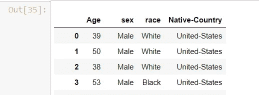

# 熊猫漫游

> 原文：<https://medium.com/analytics-vidhya/a-walkthrough-in-pandas-662a45f298f1?source=collection_archive---------13----------------------->


在当今世界，技术在改变我们的生活方面起着至关重要的作用。尤其是机器学习下一个高级计算时代。你觉得是下一个时代吗？它已经在银行、零售、金融、医疗、农业等各个领域展开。

嗯，我对我在数据科学中学到的东西太兴奋了。所以，我将分享我的熊猫操纵知识。


我在用熊猫专用的 Jupyter 笔记本。在这里，我将从读取数据集的开头开始基本的事情。要成为任何领域的专家，我们需要有实践经验。所以，我理解了为什么我们不使用实时数据集而直接用 CSV 渲染的想法。我参观了加州大学欧文分校。他们在不同的流中包含了大量的数据集。我把成人数据集如下。

在此下载数据集[。](https://archive.ics.uci.edu/ml/machine-learning-databases/adult/)

先从基础开始，如何使用熊猫读取数据。

导入库的第一件事。说进口熊猫当 pd。其中“pd”用作引用变量来调用 pandas 中的内置函数。这适用于笔记本广泛使用的各个图书馆。

**导入库**

```
**import** pandas **as** pd
```

**数据集概述**

屏幕参考。


数据由分隔符'，'分隔。

**列类型的图示是连续的还是分类的**

*   年龄:连续。
*   工作阶级:私人，自营企业，自营企业，联邦政府，地方政府，州政府，无薪，从未工作过。
*   fnlwgt:连续。
*   学历:学士、部分大学、11 年级、HS-grad、Prof-school、Assoc-acdm、Assoc-voc、9 年级、7-8 年级、12 年级、硕士、1-4 年级、10 年级、博士、5-6 年级、学前教育。
*   教育-编号:连续。
*   婚姻状况:已婚配偶，离婚，未婚，分居，丧偶，无配偶，已婚配偶。
*   职业:技术支持，工艺修理，其他服务，销售，行政管理，专业教授，清洁工，机器操作员，行政文员，农业渔业，运输，私人服务，保安服务，武装部队。
*   关系:妻子、亲生子女、丈夫、非家庭成员、其他亲属、未婚。
*   种族:白人，亚洲太平洋岛民，美洲印第安爱斯基摩人，其他，黑人。
*   性；女性，男性
*   资本收益:持续
*   资本损失:持续
*   每周小时数:连续
*   本土:美国、柬埔寨、英国、波多黎各、加拿大、德国、美国外围地区(关岛-USVI 等)、印度、日本、希腊、韩国、中国、古巴、伊朗、洪都拉斯、菲律宾、意大利、波兰、牙买加、越南、墨西哥、葡萄牙、爱尔兰、法国、多米尼加共和国、老挝、厄瓜多尔、台湾、海地、哥伦比亚、匈牙利、危地马拉、尼加拉瓜、苏格兰、泰国、南斯拉夫、萨尔瓦多、特立尼达和多巴哥、秘鲁、香港、荷兰。

**读取数据集**

*read_table* —用于读取表格格式的数据

*sep* —用于使用分隔符分割数据，如'，'

编码-指定使用哪个字符编码

names——包含要在整个数据集中使用的列的列表。

skipinatalspace-True，符号化避免在数据中使用空格或\t。基本上，它会修剪数据

index _ col-False，提供从 0 开始的默认索引。

```
df = pd.read_table(r’D:\DataSet\adult.data’, sep=’,’, encoding=”utf-8", names=[‘Age’,’workclass’,’fnlwgt’,’education’,’education-num’,’martial-status’,’occupation’,’relationship’, ‘race’,’sex’,’capital-gain’,’capital-loss’,’hours-per-week’,’Native-Country’], skipinitialspace=True, index_col=False)
```

**找出跨列的数据类型**

```
df.dtypes
```


数据类型

**查看数据前 3 条记录&后 3 条记录**

```
**df**.head(3)
```


最后 3 条记录

**形容**

结果为您提供了数据集的统计分析。对于统计分析，列的数据类型应该是整数/浮点数。这里考虑列 Age，fnlwgt…的类型为 int64。

下面是参数的图解部分，

count —该列中存在的数据总数。因此，我们可以看到，所有列的总计数都是 32561。

平均值—显示各列的取平均值

std 说明平均值中出现偏差的程度

min 提供列中的最少数据

25% —首先按升序对列进行排序。取前 25%的数据并计算平均值。

50% —再取 25%的数据，计算平均值

75%-再取 25%的数据，计算平均值。

max 提供列中数据的最大值

```
df.describe()
```


形容

**形状**

提供尺寸结果(行、列)

```
df.shape
```


形状

**重命名列**

在现实世界中，一些数据集是一种混乱/需要缩小与现实世界兼容的数据。在这些情况下，列名可能会有所不同。因此，在这种情况下，这将有助于更容易地进行进一步分析。

columns = {旧列名:新列名}

inplace=True，用于保存原始数据集中的更改。

```
df.rename(**columns**={'education-num' : 'standard'}, inplace=True)
```


重命名列

**排序**

用于对列列表进行排序。

```
df.sort_values(**by**=['relationship','Age'], **ascending**=False)
```


整理

**添加新列**

修改单列中的两列值，如下所示。从而也修改了工作类别和职业列。

```
df['newCol'] = df.workclass + df.occupation
```


添加新列

**过滤**

过滤年龄> 35 岁且性别为“男性”的数据集

```
**df**[(df.Age > 35) & (df.sex == 'Male')]
```


过滤

**索引**

使用列而不是默认索引应用到索引从 0 开始

```
**df**.set_index['Age','sex'])
```


应用索引

**列数有限的新数据帧**

```
new_data = df[['Age','sex','race','Native-Country']]
```



有限列显示

**以所需的文件格式保存数据帧**

我们可以使用 *to_csv* 从数据框中导出数据，但这只会生成一个 csv 文件。导出 JSON，XML，表格格式有单独的方法实现。

```
**new_data**.to_csv('csv_output')
```

文件保存在目录中，验证如下:


**iloc**

基于数据框中的默认索引检索数据

*iloc[startIndex:endIndex:slicing]*

startIndex —需要从哪个索引开始

endIndex —需要结束的索引

切片-告知在范围之间要跳过多少记录。

```
**df**.iloc[0:10]
```


没有切片

```
**df**.iloc[0:3:2]
```


带切片

**loc**

基于数据框中的列索引检索数据。为了更深入地解释，我将采用一个新的数据集。

```
**df**.set_index('education', inplace=True)
```


为名为“教育”的列应用索引

```
**df**.loc['Bachelors']
```


将 loc 用作单列

```
df.loc[['Bachelors','HS-grad']]
```


将 loc 用作多列

**对数据集中的列应用自定义定义**

考虑一下这个场景，每个记录增加 10 个小时。如何实施？是否要重新访问数据集并修改？你认为那会是最佳解决方案吗？。


变化前

```
df['hours-per-week'] = df['hours-per-week'].apply(**lambda** x: x+10)
```


变更后

另一种方法是调用 Python 函数，如下所示:

```
**def manipulateData(x):
    return x-20;****df['hours-per-week'] = df['hours-per-week'].apply(manipulateData)**
```

**下降**

考虑这里的数据集

```
df = pd.DataFrame({'A': [1,2,3], 'B':[5, np.nan, 89], 'c':[np.nan,2,3]})
```

显示数据


数据帧

我们的目标是移除数据帧中的 NaN 值。

```
**df**.dropna(axis=1)
```


放下 NaN

axis =1，在行级别查找以删除空值的状态

axis =0，表示要在列级别查找以删除空值的状态

**补楠**

```
**Copy****df**.fillna(3)
```


用 3 填 NaN

```
**Copy****df**.fillna('Pandas')
```


用字符串值填充 NaN

我已经介绍了使用 Pandas 的一些基本实现。因此，将有“N”个库可以在数据集中使用。你感到惊讶。希望我的演练对初学者有所帮助。学习总是好的，但分享知识总是令人愉快的。

祝大家学习愉快。