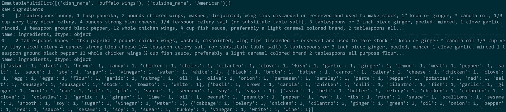

# 使用 MeaLeon 的 NLP 工作流演练:第 1 部分，准备数据

> 原文：<https://medium.com/analytics-vidhya/a-walkthrough-nlp-workflow-using-mealeon-part-1-prepping-the-data-8ffe46820f56?source=collection_archive---------23----------------------->

上次，我[谈到了 Google 的 Word2Vec](/analytics-vidhya/an-overview-of-word2vec-where-it-shines-and-where-it-didnt-cb671b68a614) ，为什么它是一种很酷的技术，以及为什么它不一定是所有自然语言处理(NLP)任务的最佳选择。

接下来，我认为展示从一个数据集到两个不同但简单的 NLP 方法的工作流是一个好主意。

这将是我的独立项目，名为 [MeaLeon](http://mealeon.herokuapp.com/) 。MeaLeon 通过自然语言工具包(NLTK)和术语频率、逆文档频率(TF-IDF)执行 NLP，并试图找到与用户请求/喜爱的菜肴以及该菜肴的烹饪风格相似但来自不同烹饪的菜肴。这是通过对由 TF-IDF 变换创建的成分向量执行余弦相似性计算来实现的。这些向量是从一元语法(N 元语法，其中 N 是 1)创建的。

**准备步骤**

当执行 NLP 任务时，您需要做一些事情来准备您的数据进行处理。记住:计算机实际上不能像人(有时)那样看一堆文本并从中提取意义。

说到人，这是专家知识发挥作用的时候，也是数据科学中标准跨行业数据挖掘流程(CRISP-DM)中数据准备和建模之间迭代过程和交换的一个很好的例子。我说的是为你的 NLP 项目制作停用词。

停止的话不会停止进程。相反，它们是出于各种原因将从项目中排除的单词。容易和明显排除的单词是冠词，如“The”、“a”、“an”。每次执行 NLP 任务时都要创建停用词库，这将是非常乏味的…幸运的是，许多研究人员已经做了大量工作来制作一组通用的停用词，以便从处理中排除，我将在 MeaLeon 中使用这些停用词。这些都在 NLTK！

为什么要使用停用词？额外的单词可能会伤害我训练的任何模型，无论它只是试图计算相似性还是执行烹饪分类。如果不排除的话，文章可能会在相似度计算中被赋予权重。[看看这个](https://www.analyticsvidhya.com/blog/2019/08/how-to-remove-stopwords-text-normalization-nltk-spacy-gensim-python/)关于停用词的好资源。

**智慧:经验丰富的老手的价值**

NLTK 的停用词列表虽然非常全面，但对于 MeaLeon 的特殊用例来说还不够。我在最初的探索性数据分析和执行标记化的最初几次尝试中意识到了这一点。我发现的一个问题是，一些食谱在准备步骤中混入了配料。例如，食谱会要求切洋葱，而不是列出切洋葱的步骤。“chopped”这个词甚至它的基底“chopped”按理说对相似性分析没有帮助；我能想到的唯一例外是当用来描述“猪排”时，但在 MeaLeon 的上下文中，该成分更重要的部分是“猪肉”。此外，品牌名称经常出现在成分列表中，这些也很大程度上没有帮助。一个例外是特定的产品与该项目联系紧密，没有替代品。想想“老湾调料”甚至“bis quick mix”；在这些情况下，“老贝”是香料的适当混合，没有简单的替代品，“Bisquick mix”是不同成分的已知混合物，但很容易得到 Bisquick mix 而不是单个项目。因此，品牌名称和准备步骤会增加停用词的列表，我对烹饪的热爱以及对品牌、配料和准备技术的熟悉在这里帮了很大的忙。

我需要为 MeaLeon 移除的其他项目是 measures！我处理的配料表会列出杯子、汤匙、盎司、克等。这些单位、缩写甚至数字本身都必须被删除，否则它们会给模型增加不必要的复杂性。为此，我们将在预处理步骤中使用正则表达式。*喘息*正则表达式？真是个怪物！不要担心:如果你想使用令人惊讶的强大，但并不奇怪的正则表达式，试着把你想过滤掉的东西放在这里。对于 MeaLeon，我删除了所有数字，保留了所有只包含真实字符串的成分。最初，我曾试图做一个 try/except 块，在那里成分被测试为一个浮动，如果它是一个浮动，它将被忽略。然而，这提出了一个问题，因为一些成分缺少空格，我发现像“10 毫克”这样的东西作为成分轴包含在内。Regex 允许过滤这些边缘情况，并且比我的 try-except 块更可靠。

然后，整个文本准备好开始转换成数学和/或矢量表示，以便进行计算和比较。

显示本文描述的 NLP 处理前后的终端文本墙

**将文字转换成数字:不仅仅是象征性的努力**

我们首先需要在一个称为标记化的过程中将文本转换成可单独访问的元素。您必须决定您希望您的项目如何处理这一步，但是对于 MeaLeon，我决定将配料列表转换为每个单词的单独标记。为此，我使用了 [NLTK 标记器](https://www.nltk.org/api/nltk.tokenize.html)。

之后，我们需要简化要处理的文本量。我说的是从单词本身中去掉一些无关的信息。要做到这一点，我们将需要执行某种方式来减少单词的根源。

**词根:不止一个萝卜短语(像“转折短语”？)**

现在，已经是 2020 年了，大量关于信息检索的研究已经出现，所以我们不必费时费力地分解每个单词。根据您正在处理的语言，您有几个选项可以做到这一点。一种常用的方法是词干法，最流行的词干分析器是马丁·波特写的[波特词干分析器。这也已经在 NLTK](https://tartarus.org/martin/PorterStemmer/) 中实现了[。为了简单总结而不重复文档，您可以将您的标记输入词干分析器，以将每个标记简化为其对应的词干。](http://www.nltk.org/api/nltk.stem.html)

然而，我决定对 MeaLeon 使用词汇化而不是词干化。我用的是 WordNet 的 lemmatizer，NLTK 里也有[。为什么？嗯，MeaLeon 的目标之一是建立食材和烹饪风格之间的关系，WordNet 声称它能够保留语义和单词之间的关系。当我第一次构建 MeaLeon 时，这看起来是一个很好的特性，但完全诚实地说，我不确定当前版本的 MeaLeon 相似性分析在词干化或词条化方面是否会表现得更好。将来，我可以对这两种词根方法进行比较。](http://www.nltk.org/_modules/nltk/stem/wordnet.html)

此外，我应该提到 WordNet lemmatizer 默认执行的一个限制:它假设您给它的是名词。因此，像“是”和“是”这样的动词将不能正确地分解到它们的词根。对于 MeaLeon 的配料来说，这是可以接受的！无论如何，成分将主要是名词，因为停用词正在对成分中常见的动词进行过滤。为输入到 lemmatizer 中的每个单词指定语法太难了。然而，你可以看到这是一个问题，如果配方成分同时也列出了准备步骤(见上面的“切碎的洋葱”例子)。

好了，总结一下我们现在的情况，我们已经收集了大量的文本，并在去除停用词的同时，将其缩减为词根。这些令牌必须转换成向量！但是，说实话，这篇文章已经很长了！我将在这里分开，以便您可以休息一下，稍后再查看更多内容！

来源:

[https://medium . com/analytics-vid hya/an-overview-of-word 2 vec-where-it-shine-and-where-it-not-CB 671 b 68 a 614](/analytics-vidhya/an-overview-of-word2vec-where-it-shines-and-where-it-didnt-cb671b68a614)[https://en . Wikipedia . org/wiki/Article _(grammar)](https://en.wikipedia.org/wiki/Article_(grammar))

[https://www . analyticsvidhya . com/blog/2019/08/how-to-remove-stop words-text-normalization-nltk-spacy-gensim-python/](https://www.analyticsvidhya.com/blog/2019/08/how-to-remove-stopwords-text-normalization-nltk-spacy-gensim-python/)

[https://www.nltk.org/api/nltk.tokenize.html](https://www.nltk.org/api/nltk.tokenize.html)

[https://tartarus.org/martin/PorterStemmer/](https://tartarus.org/martin/PorterStemmer/)

[http://www.nltk.org/api/nltk.stem.html](http://www.nltk.org/api/nltk.stem.html)

[http://www.nltk.org/_modules/nltk/stem/wordnet.html](http://www.nltk.org/_modules/nltk/stem/wordnet.html)

[https://wordnet.princeton.edu/](https://wordnet.princeton.edu/)

[http://mealeon.herokuapp.com/](http://mealeon.herokuapp.com/)