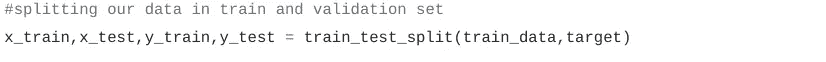

# 一周的机器学习:第一天

> 原文：<https://medium.com/analytics-vidhya/a-week-of-machine-learning-1st-day-cb52e467f488?source=collection_archive---------2----------------------->

这是初学者 7 天机器学习的第 1 天。我会尽可能保持简洁。只讨论与初学者相关的内容。

**什么是机器学习？**

简而言之，我们可以说使用数学方法从数据中提取模式。然后用它们来预测新数据的值。比如:-预测股票价格。

**猜测 vs 预测**

当我们在没有任何计算或观察的情况下给出任何值时，这仅仅是一种猜测，这只是一种赌博，在解决现实世界的问题时是没有用的。但是我们在观察模式和做一些相关计算后预测结果。例如:-猜测明天的天气 vs .使用不同的参数预测明天的天气。

**机器学习的主要类型:**

1.  监督
2.  无人监督的

**被监督**

如果可用数据具有目标或标签，则问题属于受监督类别。或者我们可以说，对于一个给定的数据，我们也得到了我们需要预测的值。

我们基本上有两种类型的监督问题:

1.  分类—二元、多元
2.  回归

***分类***

我们必须预测数据所属的类别。如果只有两个类，则称为二元分类，如果有两个以上的类，则称为多类分类。例如:-电子邮件是否是垃圾邮件。

多类分类问题

二元类分类问题

***回归***

我们必须预测一个值而不是一个类。比如:-房屋价格预测。

回归

**无人监管**

如果可用数据没有目标值或标签来预测，这类问题就属于无监督范畴。例如:-预测一个球员是击球手还是投球手。

***聚类***

解决这类问题的基本方法是将数据组织成簇。当有新数据时，只需检查它属于哪个集群。例如:-考虑击球手和投球手的相同例子。

跑垒次数多、三柱门少(蓝色圆圈中)的一群或一组球员是击球手。而另一个具有较少跑垒和较多三柱门的群或组是投球手。稍后当我们讨论 K-means 聚类时，将会详细讨论它。

让我们来学习我们的第一个机器学习算法。

**线性回归**

线性回归

这是一种非常简单的监督机器学习算法。在这种情况下，我们在数据上拟合一条误差最小的线。

**y = ax+b**

这是基本等式。其中,“x”是我们的特征或自变量,“y”是目标或因变量。我们找到了 a 和 b 的值。在我们得到 a 和 b 的值后，我们可以找到 x 的新值 y。

有数学方程式和公式可以得到这些系数的值。你不必去那么深。我们将更多地关注这些算法的应用部分，并学习它们如何工作等基本概念。

**让我们实现线性回归:-**

让我们来分解这个代码。我将逐行解释这段代码，但首先

**你要做什么？**

**安装 sklearn 库。此处有安装说明** [**。**](https://scikit-learn.org/stable/install.html)

**安装 Jupyter 笔记本。如果你不知道 Jupyter 笔记本，没关系。你试试看。当我们必须对代码进行各种实验时，这是一个很大的帮助。如果您已经在使用其他一些用于 python 代码的 IDE 或编辑器，您也可以使用它们。但是我建议你试一次 Jupyter 笔记本。此处有安装说明[和**。**](https://jupyter.org/install)**

另一种选择是使用 Google [**colab**](https://colab.research.google.com/) 。它是谷歌提供的免费平台。我们可以在那里运行我们的 python 代码。并且已经安装了常用的机器学习库。看看这个。

理解代码后，你应该自己写完整的代码。不要复制和粘贴。你可以想看多少次代码就看多少次，但是你必须自己写完整的代码。

好了，让我们深入研究代码。

在本节中，我们导入了所需的库。这里 sklearn 是一个库， **linear_model** 是其中的一个文件， **LinearRegression** 是存在于 **linear_model** 文件中的一个类。sklearn 是一个非常有用的库。我建议不要试图限制图书馆。您可以随时查阅这些文档。你只需要学会如何使用它。

我们需要一些数据来处理。sklearn 提供了一些玩具数据集来玩。在 **california_housing** 数据集中，我们必须预测房屋的价格。解释完这段代码后，我将向您展示如何导入 sklearn 中没有的任何数据集，并对其执行线性回归。你看，我们必须预测这里的值，因此，这是一个回归问题。在训练数据中，我们给出了房屋的价格，即目标或因变量存在，因此这是一个监督问题。

**train_test_split** 用于将我们的数据分成训练和测试数据。我们需要一些数据来验证我们的模型。它需要两个参数，第一个是自变量集合，第二个是因变量或目标变量。

**均方差在做什么？**

这个函数帮助我们发现预测值和实际值之间的误差。很简单。从实际值中减去预测值，然后将它们平方，然后找到它们的平均值。

在本节中，我们已经获取了数据集。我们的变量数据是一个包含自变量、因变量、特性描述和特性名称的字典。这里我们将不同变量中的值分开，以便于对它们进行操作。

在这一部分中，值被打印出来，以查看它们的外观。他们的类型也是印刷的。这里我们只是打印出来检查每个变量的内容。

这里我们使用了 **train_test_split** 将我们的数据分成两部分。一个用于培训，另一个用于测试。一旦我们的模型被训练，我们就用测试数据来检验它的性能。

我们首先创建了一个 **LinearRegression** 类的实例或对象。然后我们调用 fit 函数，传递作为自变量的 **x_train** 和作为因变量的 **y_train** 。我们使用了**均方误差**函数来计算误差。它越小，我们的模型越好。

**多大的均方误差值被认为是好的？**

这取决于我们的目标变量。如果我们的目标变量包含像百万这样的大值，那么三到四位数的误差是好的。但是如果我们的目标值像数据集一样非常小，它应该小于 1。

现在轮到你了。打开 Jupyter 笔记本，开始输入整个。不要复制和粘贴。看着它，然后打出来。试着玩玩吧。打印出每个变量。对它进行一些修改。

**线性回归导入您自己的数据集。**

我们来分析一下。如果有些东西你没有得到，不要担心。这些内容将在接下来的部分中详细介绍。

除了熊猫，你已经知道这些图书馆了。Pandas 是用来操作数据的。它提供了强大的功能来轻松处理数据。

这里我们从 CSV 文件(逗号分隔文件)导入数据到 pandas dataframe。Pandas 提供了从不同类型的文件中读取数据的功能。例如- **read_excel** 用于从 excel 文件中读取数据。当你需要它们的时候，我们会了解它们的。在这个阶段，您将遇到的大多数数据集都是 CSV 文件格式。不要担心，如果你发现现在很难得到这些东西，随着我们继续前进，它们会变得清晰。

这用于查看列名及其数据类型等。去运行这个命令，你就知道了。请不要复制粘贴。你应该自己输入代码。只需将您的 CSV 文件的路径放在 **read_csv** 函数中。

这将打印数据的前 5 行。这是用来知道我们的数据是什么样子的。

这里 **drop** 用于删除列或行。**轴**的 1 值表示列，0 表示行。在这里，名为' **target** '的列将被删除，其余的列将被返回。在第二行，我们将目标值放入 **y_train** 中。

代码的其余部分已经在上面解释过了。如果你有疑问(你可能认为很傻),请提问。不要试图记住密码。你必须专注于概念和如何使用它们。这个系列的主要目的是让你熟悉机器学习领域。

**感谢阅读。快乐学习！！**

**关注我获取更多类似内容。**