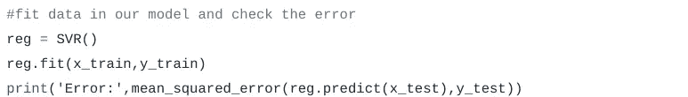

# 一周的机器学习:第二天

> 原文：<https://medium.com/analytics-vidhya/a-week-of-machine-learning-2nd-day-d14c4a9b08f?source=collection_archive---------3----------------------->

这是为期 7 天的机器学习系列的第二天。

# **逻辑回归**

逻辑回归

这是一种监督学习算法。我们有给定的目标值，我们必须预测看不见的数据。它用于分类问题。

其背后的直觉是，曲线是用误差最小的数据拟合的。在设定曲线之后，在层的上部下面的新的看不见的数据点属于一个类别(具有概率 1)，而在层的下部的数据点属于另一个部分(具有概率 0)。介于两者之间的数据点的概率为 0.5。

上图显示了一只老鼠是否肥胖的例子。曲线拟合得很好，体重轻意味着不肥胖，体重多意味着肥胖。

我们来玩代码吧。尽量不要复制这段代码，并尝试自己编写代码。你想看多少遍都可以。

## **代号**

让我们一部分一部分地理解代码。

在本节中，我们将导入所需的库。这些在前一篇文章中都已经解释过了。

我们用熊猫的 **read_csv** 功能从网上读取了一个 csv 文件。我们可以在 **read_csv** 函数中传递 CSV 文件的路径或者指向它的链接。

如果你想离线工作，那么从 [**这里**](https://query.data.world/s/67p5gkjye5vocfiqm2cuxnrkx4ijim) 下载数据集。在 **read_csv** 函数中用正确的路径代替链接放入文件名。

为了检查数据的外观，我们使用 **head** 功能打印了前 5 行。

为了检查数据类型，空值我们使用了 **info** 函数。它的输出:-

这里我们可以看到“3P%”列有一些空值。所以我们现在用零填充这些空值。有不同的方法来处理空值，但现在，我们只是用简单的方法。

**fillna** 函数的第一个参数是放在空值位置的值。“就地”意味着应该在数据帧中进行更改，并且不返回任何内容。否则，它将返回具有已更改值的数据帧。运行不带“inplace”的这行代码，您就会知道其中的区别。

在这部分做一个简单的任务。将目标值和特征分配给不同的变量。 **drop** 函数删除指定的行或列。这里我们放“axis = 1”表示列。如果“轴= 0 ”,那么它意味着行。删除“TARGET _ 5Yrs”和“Name”列并返回其余数据，因为我们尚未设置“inplace = True”。

把我们的数据分成两组。一个用于培训，另一个用于测试。

在这里，我们创建一个类 LogisticRegression 对象，并使用函数“fit”根据我们的训练数据训练我们的模型。拟合函数将特征和目标变量作为输入。然后我们使用得分函数来获得准确度。分数函数采用特征和实际目标。

# **支持向量机(SVM)**

该算法用于回归和分类问题。

该算法在两类超平面中寻找最佳超平面。具有最大余量的超平面被认为是最佳超平面。从上图可以很容易的得到直觉。数据点被称为支持向量，超平面和这些点之间的距离被称为余量。

## **SVC (SVM 为分类)**

让我们把代码分成几部分。有些部分已经解释过了。

1.  导入所需的库:

2.从互联网上的 CSV 文件中读取数据到 pandas dataframe。数据集与上面逻辑回归示例中使用的数据集相同:

3.打印前五行数据:

4.打印数据的详细信息:

5.填充空值:

6.获取我们的目标变量和不同变量的特征:

7.将我们的数据分为训练集和测试集:

8.训练我们的分类器并检查准确性:

## **SVR (SVM 回归)**

让我们把代码分成几部分。

1.  导入所需的库。有些部分已经解释过了。因此，我们会很快扔了它们。

2.加载波士顿房价预测数据集。你可以从[这里](https://www.kaggle.com/fauzantaufik/boston-housepredict/downloads/boston-housepredict.zip/1#boston_train.csv)下载

3.打印前五行以查看我们的数据:

4.打印数据的详细信息

5.“medv”是我们必须预测的目标值。在 y_train 中获取，其他放在 x_train 中:

6.将数据分为训练集和测试集:

7.训练回归器并检查误差。

去玩数据吧。下载上面的数据集，自己进行逻辑回归和支持向量机。

## 感谢阅读。快乐学习！！