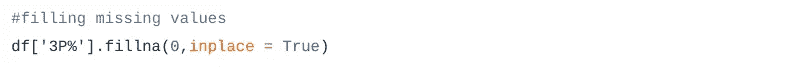

# 机器学习一周:第三天

> 原文：<https://medium.com/analytics-vidhya/a-week-of-machine-learning-3rd-day-13843fda63c3?source=collection_archive---------4----------------------->

## 介绍

这是“机器学习的一周”系列文章的第三篇。在第一篇文章中，我讨论了机器学习、线性回归算法和评估指标的基础知识。在[的第二篇文章](/analytics-vidhya/a-week-of-machine-learning-2nd-day-d14c4a9b08f)中，我探索了逻辑回归算法和 SVM 算法，以及它们的 python 代码。

这是 7 天机器学习系列的第 3 天。在本文中，我们将探讨两种机器学习算法——kNN(k 近邻)和朴素贝叶斯。我们开始吧！

# k-最近邻

【https://www.saedsayad.com/images/KNN_example_1.png 

它用于分类和回归。它的概念非常简单。它找出测试样本和训练样本之间的距离。然后挑选最接近的 K 个样本。预测这 K 个样本中的优势类。

例如:-

[https://www.saedsayad.com/images/KNN_example_2.png](https://www.saedsayad.com/images/KNN_example_2.png)

让我们开始编码吧。

正在导入所需的库。Sklearn 库有一个非常好的 KNN 实现。

从链接加载数据到熊猫数据帧。该数据集存在于互联网上，我们也可以加载本地存在于我们系统中的数据集。我们必须提供该数据的完整路径。

这将打印前五行。我们用它来查看我们的数据。

这给出了我们数据的基本细节。您应该自己运行所有这些命令。和他们一起玩，你会很容易学会的。输出显示数据中的一列有空值。

我们的数据有空值，我们使用 *fillna* 用 0 填充这些空值。

将目标变量和特性放在不同的变量中，这样我们就可以轻松地使用它们。

我们将数据分为训练集和测试集。训练集将用于拟合我们的模型，测试集将用于验证。

我们正在使用 sklearn 库的 *KNeighborsClassifier* 类训练我们的模型。方法拟合用于训练分类器。使用评分法来检查分类器的性能。它返回准确性，并接受两个参数测试特性和正确的目标值。

# KNN 回归

在回归的情况下，输出值是所有 K 个最接近值的平均值。

## 密码

让我们来分解代码。它类似于分类代码。唯一的区别是数据集和模型。我们将讨论这两个部分。

我们使用了波士顿房价数据集。我们必须预测给定某些特征的房子的价格，或者我们可以说房子的质量。

我们使用**均方误差**来检查我们模型的性能。模型的性能通过不同的度量标准来检查，这些度量标准取决于问题和数据的类型。我们的模型误差越小越好。

# 朴素贝叶斯

https://www.saedsayad.com/images/Bayes_rule.png

这是一个概率分类器。它使用贝叶斯定理。它假设特征之间没有相关性。然后使用条件概率来预测因变量，即我们的目标值。所有特征都被视为独立的。现在，请记住这些事情。随着你在数学概念的帮助下在这个领域前进，你会更加清楚。如果你有数学背景，我想你有。举个例子，你会更清楚。

## 密码

这里唯一的区别是分类器，代码的其余部分是相似的。朴素贝叶斯是一种非常快速的算法，因为与其他算法相比，它需要做更少的计算。我这篇文章的目的是让初学者熟悉这些算法。慢慢地，渐渐地，你会适应它们。你应该越来越多地练习。找到一些数据集并尝试实现这些算法。尽可能多做实验。

## 感谢阅读。快乐学习！！