# 一周的机器学习:第四天

> 原文：<https://medium.com/analytics-vidhya/a-week-of-machine-learning-4th-day-599e53032c97?source=collection_archive---------6----------------------->

*   一周的机器学习:第一天
*   [一周的机器学习:第二天](/analytics-vidhya/a-week-of-machine-learning-2nd-day-d14c4a9b08f)
*   [为期一周的机器学习:第三天](/analytics-vidhya/a-week-of-machine-learning-3rd-day-13843fda63c3)

# 决策树

我会尽量保持简单。想象一棵树。因为树有不同的分支，每个分支又进一步分成新的分支。这里使用了相同的概念。我们称之为决策树，是因为在每个节点上，我们都决定向哪个分支前进。像这样移动，我们到达终点，我们在那里有我们的答案。

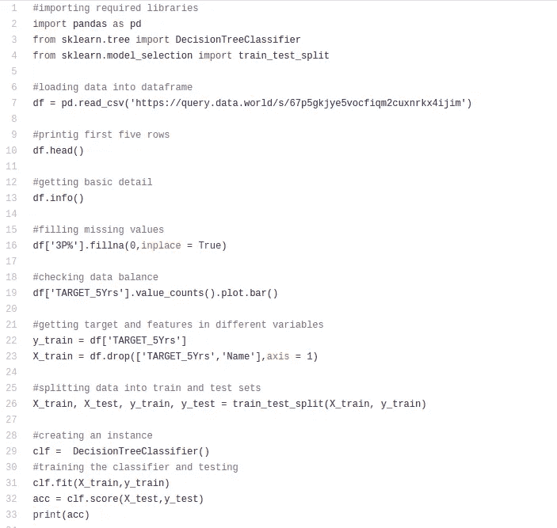

我将解释代码的每一部分。事实证明，在处理表格数据或结构化数据时，树非常有效。以上是决策树的一个实现。我们正在解决一个分类问题。你应该自己编写整个代码来更好地理解它，这也会让你在编码时感到舒服。

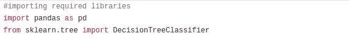

在这里，我们导入所需的库。熊猫加载和处理数据。另一个是我们的分类器。

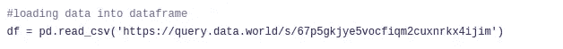

我们正在这里加载数据。在 pandas 中，我们可以提供本地数据的路径，即已经下载的路径，或者我们可以传递数据的 URL。熊猫将下载数据并载入数据帧。这里链接到数据集的是 [***。***](https://query.data.world/s/67p5gkjye5vocfiqm2cuxnrkx4ijim)

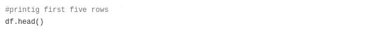

这是为了打印前 5 行。我们需要调查我们的数据。

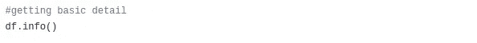

这提供了关于我们数据的基本信息。

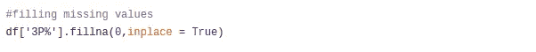

从 ***info()*** 中，我们发现‘3P %’的值为空。所以我们需要填充这些空值。我们使用 ***fillna()*** 函数将它们填充为 0。

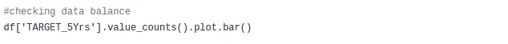

这里我们绘制了目标值，以检查我们有多少真值和多少假值。

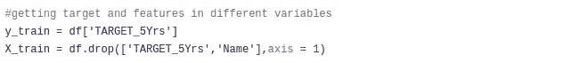

获取不同变量中的目标值和特征值。

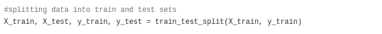

在训练和测试集中拆分我们的数据。

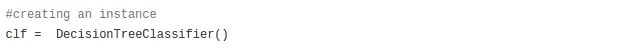

创建分类器。

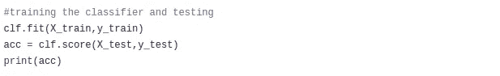

训练分类器并根据测试数据对其进行测试。 ***得分()*** 用于打印准确度。

# 集成学习

单一模型无法覆盖数据的多样性。因此，我们需要一个以上的模型一起工作。这种技术被称为集成学习。在这种情况下，我们将不同模型的结果结合起来，产生我们的最终结果。所有模型都对最终结果有贡献。这就像把对一个问题有不同看法的不同人的意见结合起来。

集成学习用于增加决策树的能力。我们有两种方法

1.  **装袋**
2.  **增压**

# 制袋材料

在这种技术中，我们创建了彼此独立的不同的树。然后在最后，我们结合他们的结果得到我们的最终结果。随机森林是装袋的一个很好的例子。性能非常好。我不会深入研究它背后的数学原理，因为现在还不需要。作为初学者，首先要学会如何使用事物及其基本概念。然后一个接一个地，我们应该深入他们。这保持了学习的趣味性。

# 随机森林

这是装袋的一种。在该算法中，样本和特征是随机选取的。选择特征来分割树的分支。在决策树中，这是通过杂质分数来完成的。选择具有最小杂质分数的特征来分割树。但是在随机森林的情况下，我们是随机进行的。通过这样做，我们有了许多较弱的树。我们把所有弱树的结果结合起来，这就是我们如何覆盖大量的多样性。

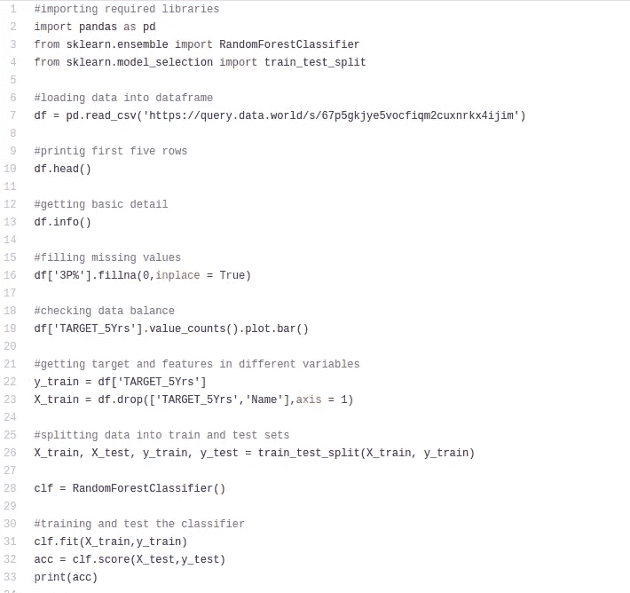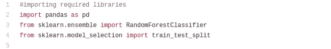

代码的其余部分是相同的。只有两个部分有所增加。我们导入了 RandomForestClassifier 来创建模型。使用 sklearn 非常简单。我们可以很容易地创建和训练一个模型。

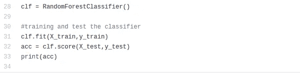

这里我们创建了 RandomForestClassifier 的一个实例。然后用 ***fit()*** 的方法我们训练了它。score()方法用于检查准确性。

# 助推

在这里，我们创建了许多不同的树，但是它们依赖于前面的树。一棵树试图最小化先前树的误差。这一切背后的数学原理非常简单，但现在，我不打算深究。请记住，在提升一棵树的过程中，需要从之前的树中获取输入，并尽量减少误差，就像这样，我们有很多不同的树。但是在 bagging 中，我们创建不同的树，它们独立工作，最后我们平均(在回归的情况下)或最高票(在分类的情况下)。

# LightGBM

这是一个非常著名且被广泛使用的算法。它使用助推概念。它非常简单，易于使用。Lightgbm 在大多数情况下非常适合处理表格数据。下面是一个代码示例。

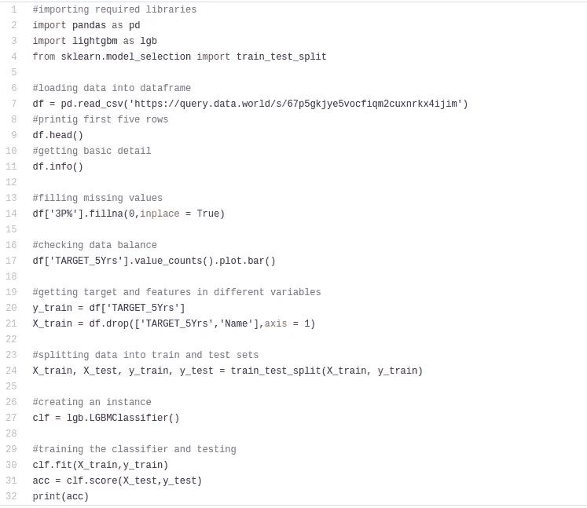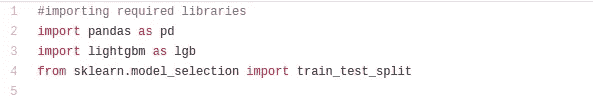

我们需要安装 LightGBM 库。如果你正在使用谷歌 Colab，那么你不必担心它。但是如果你在本地机器上工作，那么就安装 LightGBM。这是一个非常简单和容易的过程。我们给 LightGBM 分配了 ***lgb*** 名称，这样我们就不需要每次都输入全名了。 ***as*** 用于指定任何你想给的名字。

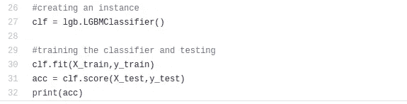

简单的步骤。创建 LightGBM 的实例，然后使用 ***fit()*** 方法训练模型，使用 ***score()*** 方法测试或检查准确性。

还有其他的提升算法。比较有名的有 XGBoost，CatBoost 等。但是 LightGBM 比 XGBoost 使用的内存更少，效率更高。

如果你自己写代码，你会学到更多。因为你是初学者，不要只是复制和粘贴代码。如果你想复制一段代码，那就看着它，自己打出来。看多少遍都没关系。但是你应该试着自己输入，在你的工作完成后，再去玩那些代码。

如果你有一些表格数据，但不知道该用哪种算法。我会说去找树。从随机森林开始，然后尝试 LightGBM。

# 快乐学习！！