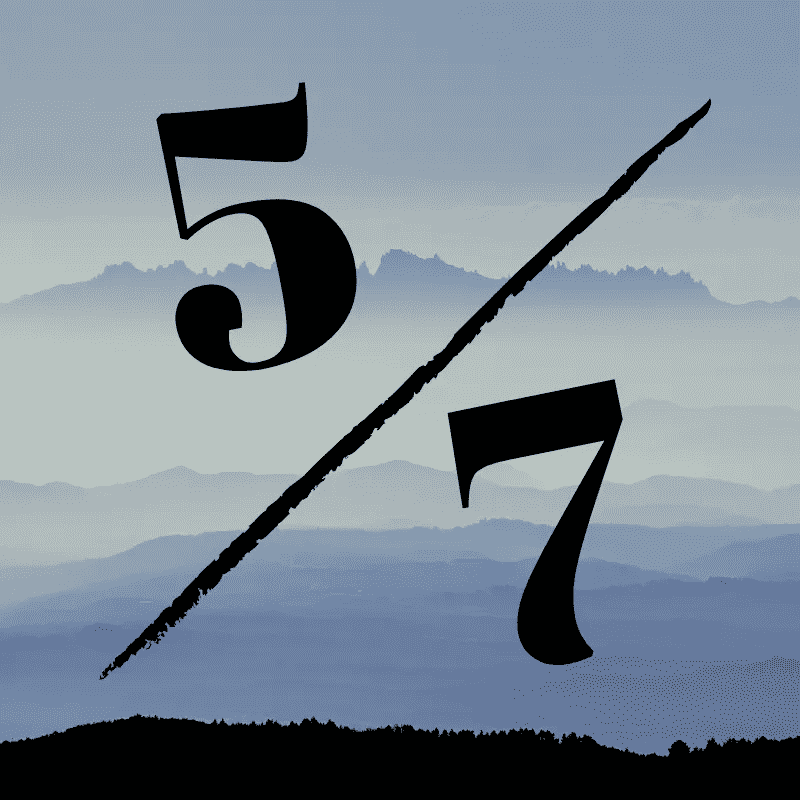
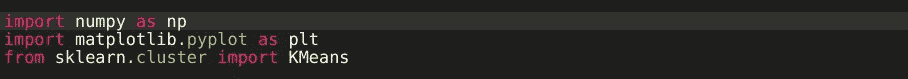
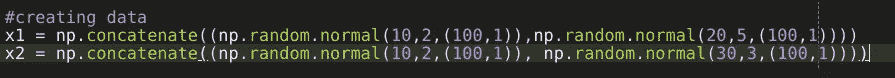
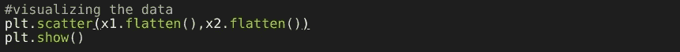
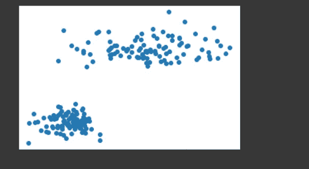
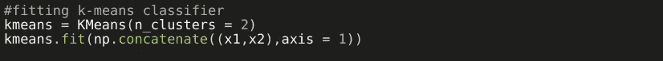
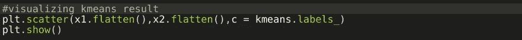
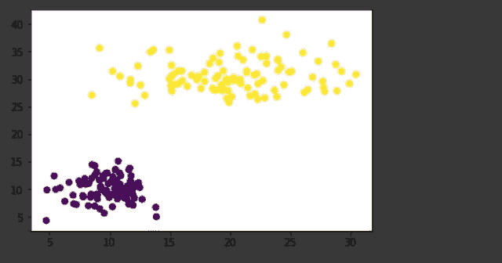

# 机器学习一周:第五天

> 原文：<https://medium.com/analytics-vidhya/a-week-of-machine-learning-5th-day-e0795edfd35c?source=collection_archive---------6----------------------->

这是 7 天机器学习系列的第 5 天。

# 无监督学习

当我们没有数据的标签时，我们使用无监督学习算法。这些算法寻找数据中的模式，通过这些模式可以将数据分成不同的组。主要我们看到 PCA(主成分分析)和聚类。

# 使聚集

我们把数据分成不同的组。存在于同一组中的数据样本具有一些相似性或者它们遵循相同的模式。这些组被称为集群。这个过程叫做聚类。有不同的算法用于聚类，例如 K-means。

# k 均值

这是一个著名的聚类算法。这遵循相当简单的步骤来形成数据的聚类。这里“K”表示我们需要多少个集群。它遵循以下步骤

*   用随机平均值初始化 K 个变量。
*   将平均值分配给最接近平均值的数据样本。
*   更新 K 意味着
*   迭代几次

为了分类，我们只需找到所有聚类的平均距离，并预测最接近的聚类。

我们玩小代码吧。正如我之前所说，我们将遵循自上而下的方法。我们不会从零开始实现这个算法，虽然我们可以做到，但它很简单。但是我们的目标是，现在，让我们自己介绍这些算法，只做有趣的部分。

正在导入所需的库。

我们正在创建自己的简单数据。这里创建了具有两个不同组的数据。这是一个相当简单的数据。在现实世界中，数据更加复杂，我们也不知道它所包含的不同组的确切数量。Numpy 的 normal 函数用于创建正态分布的随机值。“concatenate”函数用于组合两个 Numpy 数组。

让我们将数据可视化。我们可以观察到两个不同的星团。

这是我们创造的数据。现在，我们必须检查 K-Means 算法如何处理这些数据。

用创建的数据拟合模型。我们在这里传递了 n_clusters = 2，但是在现实世界中，我们并不确定会有多少个集群。有一些技术可以使这个值正确。现在，让我们保持简单。

看看数据是如何被 K-Means 分成两类的。

这是一个非常好的结果。

请记住，这是相当简单的数据。随着数据维数的增加，k-means 的计算时间也增加。希望你理解了 k-means 算法背后的思想。

以下是完整的代码

还有其他方法属于无监督学习。它在各个领域都有应用。作为初学者，你应该试着理清你的概念。不要被互联网上的内容淹没。本文的目的是让您熟悉无监督学习和 k-means 聚类。

*   一周的机器学习:第一天
*   一周的机器学习:第二天
*   [一周的机器学习:第三天](/analytics-vidhya/a-week-of-machine-learning-3rd-day-13843fda63c3)
*   [为期一周的机器学习:第四天](/analytics-vidhya/a-week-of-machine-learning-4th-day-599e53032c97)

## 感谢阅读。快乐学习！！