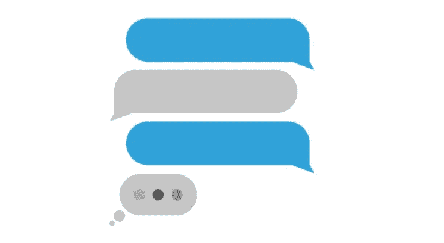
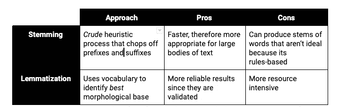
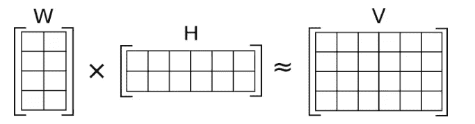

# “wym”的全新含义:非负矩阵分解的主题建模

> 原文：<https://medium.com/analytics-vidhya/a-whole-new-meaning-to-wym-topic-modeling-with-non-negative-matrix-factorization-d8813b296e95?source=collection_archive---------21----------------------->

阅读短信和电子邮件需要几秒钟。但是，随着你要读的内容越来越多，这就需要更长的时间，而且也更难掌握所有的东西。想象一下，在一家产品面向消费者的公司工作。客户可以写评论并给出反馈。这些评论是丰富的信息，但是你必须投入大量的时间和资源去阅读和理解它。通过主题建模，您可以利用线性代数和统计数据来揭示影响业务决策的洞察力，并加速产品开发。

这里有一个 Github 上的 Jupyter 笔记本供你使用。

*什么是主题建模？*

> 在机器学习和自然语言处理中，主题模型是一种统计模型，用于发现出现在文档集合中的抽象“主题”[(维基百科)](https://en.wikipedia.org/wiki/Topic_model)

基本上，这是一种理解某些单词在某些文本中出现频率的方式。

*为什么我需要主题建模？*

文本数据因其非结构化而难以处理，这是众所周知的——其自由形式的特性允许我们表达自己，但需要额外的努力才能理解。主题建模，我们能够发现文本中隐藏的模式，提供一些分析文本的维度。

*如何做主题建模？*

文本数据是杂乱的，因此通过清理和预处理数据，可以使数据更容易处理。以下是一些关于如何清理数据的建议:

1.  删除标点符号、表情符号等。
2.  删除屈折(例如。词干和旅鼠)
3.  删除停用词。

我提供了一个表格来比较处理单词变形的不同方法。根据你的问题陈述和业务需求，你可以选择对你的文本进行词干化或词条化。

太好了！现在你的文本已经非常干净了，我们需要用一种计算机更容易理解的方式来表示它:向量。我们可以选择使用 sklearn 的计数矢量器对单词进行一键编码，或者使用词频-逆文档频率(TFIDF)矢量器对更常见的单词进行去强调，对更罕见的单词给予更高的权重。

通过创建特征向量，我们增加了语料库的维度空间。在数据科学中，我们减少维度的数量以降低复杂性，从而最大限度地利用资源，并提高速度和效率。有几种方法可以降低维度:概率(例如潜在狄利克雷分配)，或矩阵分解(例如 PCA 或 NMF)。今天，我们关注 NMF，又名**非负矩阵分解。**

*我们如何使用 NMF 进行主题建模？*

[来源](https://en.wikipedia.org/wiki/Non-negative_matrix_factorization#/media/File:NMF.png)

NMF 是一种将矩阵分解成权重和分量的技术。你可能熟悉 PCA(在文本分析中也叫 LSA)，这是类似的东西。PCA 和 NMF 的区别在于*他们分解矩阵的方式:PCA 的目标是捕捉主成分的最大方差，而 NMF 的目标是限制其成分为非负。由于 NMF 的非负约束，它是一种流行的主题建模技术。*

*我的主题是什么意思？*

为了弄清楚你的主题是什么意思，看看与每个主题相关的单词，并试图从中提取意义。你也可以查看对你正在分析的主题权重最高的文本，并以这种方式提取主题含义。这是您利用您的领域专业知识来解释主题的地方！找出你的文章中突出的主题，并将其转化为可操作的业务要点。

现在，当有人问你“wym”时，你可以用你的主题建模向他们展示！

祝你好运，玩得开心！

如果你有问题，[发微博给我](https://twitter.com/jennzhen):)