# 探索性数据分析

> 原文：<https://medium.com/analytics-vidhya/a-z-exploratory-data-analysis-3fb5e388168e?source=collection_archive---------11----------------------->

人类的感知非常灵活。我们人类是在三维世界中进化的。所以，我们只能看到三维空间。这些三维主要称为长度、宽度和深度。因为我们是在 3d 世界中进化的，我们是非常有创造力的生物，我们用数学和其他各种技巧来想象 4d，5d，甚至 n-d 空间。

在这篇文章中，我们将了解人类的伟大发明。这就是所谓的探索性数据分析(EDA)。

# EDA 是什么？

探索性数据分析(EDA)是一种数据分析方法/理念，通过使用简单的绘图工具，在进行实际的机器学习之前，采用从统计到线性代数的各种技术(主要是图形技术),以了解我们的数据集是什么。

数据分析是“探索性的”，因为当我们开始时，我们对数据集一无所知。我们试图通过扮演夏洛克·福尔摩斯来理解这个数据集。

这是我们第一次遇到数据集时的做法。但这不是一蹴而就的过程。

EDA 是一个很大的弯路。让我们开始探索吧。

# 资料组

现在，我们将尝试使用一个样本数据集来理解数据。我们将使用的数据集是*鸢尾花数据集*。我们将使用这个简单的数据集来快速理解我们的每个术语。那么，让我们加载数据集

这是一个简单的数据集，有 3 种鸢尾属植物的花。[见维基百科上的图片[链接](https://en.wikipedia.org/wiki/Iris_flower_data_set)

要开始 EDA，指出你的问题总是一个好主意。

Q1)数据集中有多少数据点和特征？

我们的数据集中有 150 行和 5 列。

Q2)数据集中的列名是什么？

虹膜数据集有 4 个特征

*   分离长度，
*   SepalWidth，
*   PetalLength，和
*   佩塔尔维特

“物种”列包含所有类别级别。即 setosa、versicolor 和virginica。

我们的目标是给定 4 个特征，将一朵新的花分类为属于 3 类中的一类。

Q3)每个类别有多少个数据点？

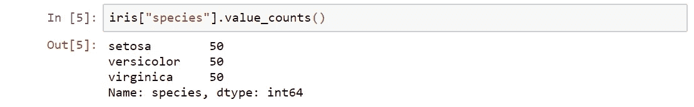

Iris 是一个平衡的数据集，因为每个类的数据点数为 50。

# 绘图工具

现在，让我们去了解非常非常简单的绘图工具。

## 二维散点图:

在这个图中，我们分散了所有的点，并把它放在地图上。

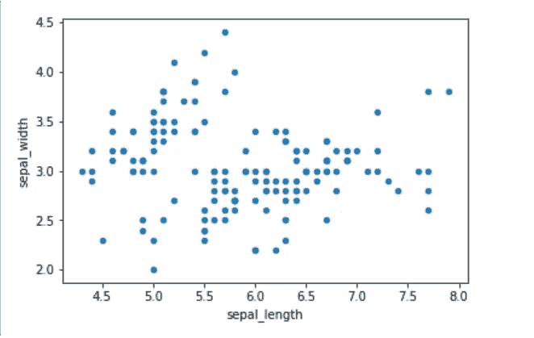

为了获得更好的视觉效果，我们可以根据这些点所属的类来给它们着色。所以，让我们快点。

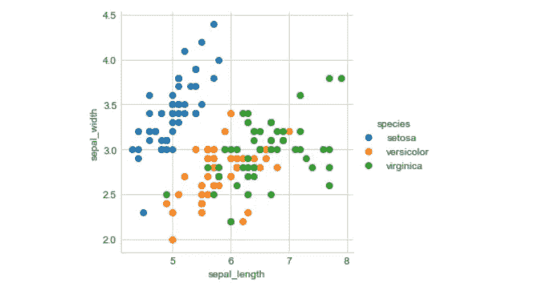

请注意，通过画一条线，可以很容易地将蓝色点与红色和绿色区分开。但是红色和绿色数据点不容易分开。我们可以为每个特征组合绘制 3D 散点图吗？

是的，当然。

## 三维散点图

是的，可以使用 3D 散点图显示要素。但是它需要大量的鼠标交互来解释数据。[这里](https://plot.ly/pandas/3d-scatter-plots/)你可以看到虹膜数据集的 3d 散点图。

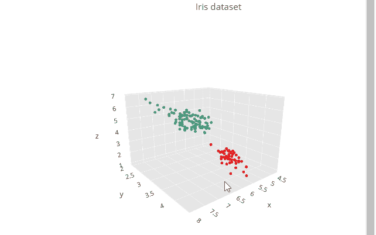

了解了 2D 之后，现在问题出现了:

**四维、五维或多维散点图怎么样？**

如你所知，我们人类不能可视化 4 维数据集，必须有一些方法来可视化我们的数据集，它有 4 个特征，即 SepalLength，SepalWidth，PetalLength 和 PetalWidth。

一个有趣的方法叫做结对图。

## 配对图

顾名思义，我们实际上是在特征之间进行配对。因为我们有 4 个特征，所以存在 6 种组合。(4C2 = 6)

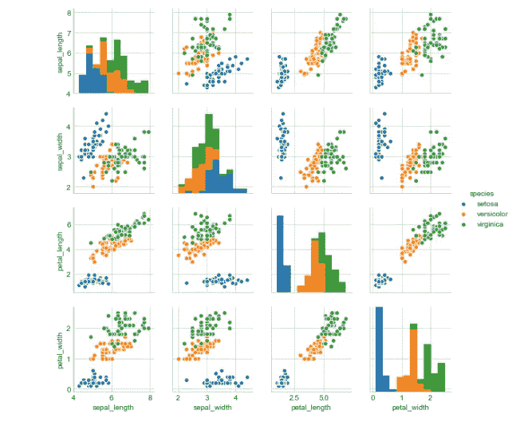

所以，根据我们的配对图，我们可以观察到，

1.  花瓣长度和花瓣宽度是识别各种花类型的最有用的特征。
2.  虽然 Setosa 很容易识别(线性可分)，但 Virnica 和 Versicolor 有一些重叠(几乎线性可分)。

## 柱状图

现在，在看到 2D 和三维散点图后，你会问一维散点图。是的，我也给你买了这个。它被称为“直方图”。

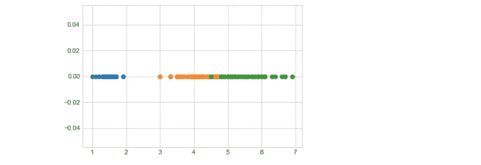

一维散点图有一个缺点，那就是它很难理解，因为点会重叠很多。

**有没有更好的可视化一维散点图的方法？**

是的，我们可以使用 seaborn 库实现更好的可视化。有一种叫做“概率密度函数(PDF)”的技术可以平滑地可视化直方图。

花瓣长度:

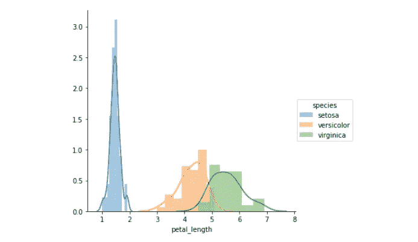

## 使用 PDF 的单变量分析

顾名思义，这是一个变量分析。为了查看我的 4 个特征中哪一个更有用，我们需要使用 PDF 进行单变量分析。

花瓣宽度:

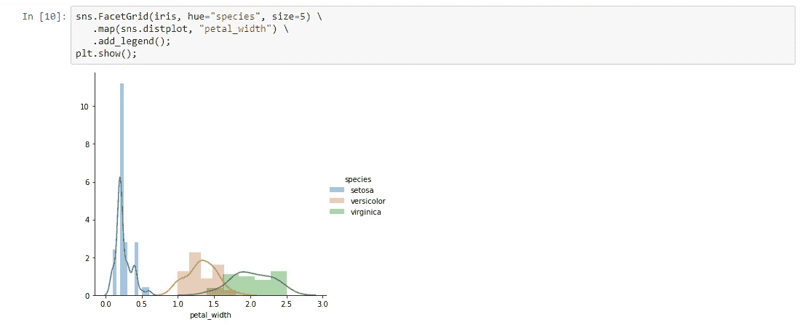

萼片长度:

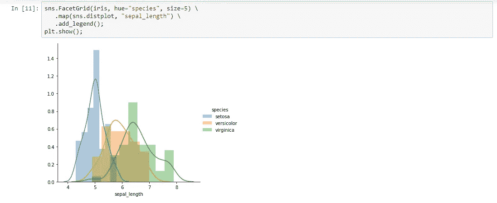

萼片宽度:

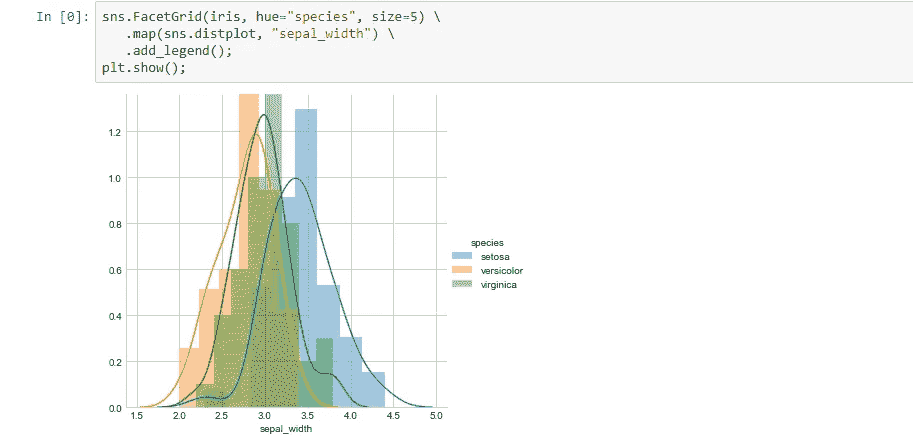

因此，通过查看 4 个直方图或 PDF，我们可以得出结论，花瓣长度略好于花瓣宽度，花瓣宽度明显好于萼片长度，萼片长度也明显好于萼片宽度。

> 花瓣长度>花瓣宽度>>萼片长度>>萼片宽度

随着我们将容器尺寸变得越来越小，我们将会做出越来越精确的决定

## 累积分布函数

CDF 是一个描述随机变量取给定值或更小值的概率的函数。

让我们在 Iris 数据集上理解这个概念。

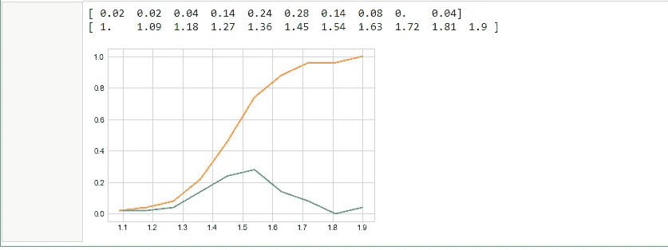

上图的 CDF 是橙色线。它总是介于 0 和 1 之间。这表示数据点的百分比。

当直方图和 PDF 非常擅长确定存在的点的密度时。但是它仍然不能告诉我们第 25、50 和 75 百分位的值。如果我们能看到这一点，那么我们的生活将会更简单。那么，有没有其他的情节可以清晰的可视化。

这种图被称为“盒图”。

## 箱形图

通过将特征设置到 seaborn 脚本中，我们可以可视化 3 个干净的方框图。

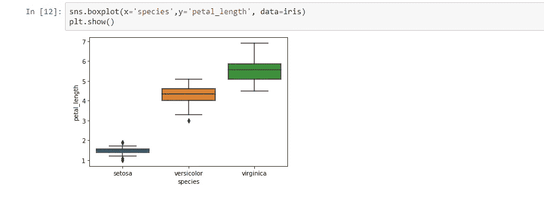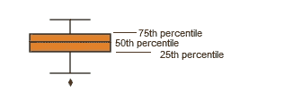

仔细看剧情。这里盒子被分成了三部分。

## 小提琴情节

正如我们看到的 PDF 和箱线图，它为我们理解数据提供了非常好的可视化效果。还有一种叫做小提琴图的图，它是直方图和箱线图的组合。

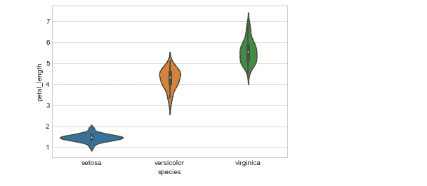

## 多元概率密度

一个小提琴的剧情结合了前两个剧情的好处，简化了。现在让我们看看 2D 密度图实际上是什么样子。

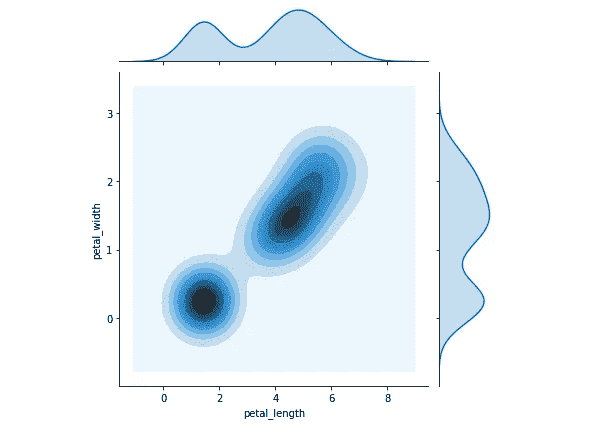

在中心，因为有更多的点，它看起来更暗。这是一个 3D 图，这些蓝线被称为等高线。有时它也被称为等值线概率密度图。

恭喜你。

今天你学习了 A-Z 探索性数据分析。

在本系列的下一篇文章中，我们将更上一层楼。直到这里，你学会了如何理解数据。现在是时候在一个简单的数据集上应用您的知识了。所以，一切顺利。

如果你认为这篇文章遗漏了什么，请在下面留下回复，或者在我的收件箱中告诉我。否则，你可以在 https://shritam.com/的[上找到我。](https://www.shritam.com/)