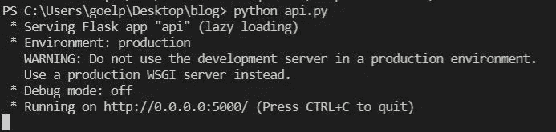
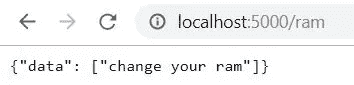

# 关于如何在 Android 上运行 Python/机器学习代码的 A-Z 指南

> 原文：<https://medium.com/analytics-vidhya/a-z-guide-on-how-to-run-your-python-machine-learning-code-on-android-68ddbe1c3802?source=collection_archive---------4----------------------->


图片取自[https://py . checkio . org/blog/py game-python-writing-your-first-game 1/](https://py.checkio.org/blog/pygame-python-writing-your-first-game1/)

众所周知，机器学习(ML)/人工智能(AI)在计算机科学领域掀起了一场风暴。计算机科学社区中的每个人，不管他们的专业是什么，都已经开始以某种形式学习或使用 ML 或 AI。不仅因为它如何简化复杂的任务，还因为对它的热爱。人工智能和人工智能不仅在计算机科学领域，而且在许多其他领域都有应用。它成功地打破了这些领域的研究界限，创造了 20 年前似乎不可能的新机会。除了 ML 之外，Android 应用程序开发在过去几年里也获得了很多关注。随着智能手机的日益普及，android 应用程序及其开发者(flutter 或 native)这些年来呈指数级增长。因此，出现的大问题是 ***如何将这两种庞大的技术连接起来，以创造出更加用户友好的东西？***

这个问题变得更加重要，因为 ML 模型通常是用 Python(首选)或 R 编写的，而 Android 应用程序的后端是用 Java(本机)或 Dart (Flutter)编写的，这取决于所使用的框架。因此，有人可能会问，既然它们是用两种不同的语言实现的，我们如何将这两者联系起来。尽管有许多方法可以做到这一点，例如使用 Firebase 定制模型。我发现最吸引人也最容易的一个方法是，首先使用 Flask 为 Python/ML 代码实现一个应用程序编程接口(API ),然后将其托管在服务器上。最后，使用这个 API 发送 **get** 和 **post** 请求，以获取应用程序中的输出，使其工作。

由于本文主要关注 Python/ML 代码与 Android 的连接，所以我不会深入讨论我的 ML 代码的细节。我将简要介绍我的 ML 模型的基础，然后继续解释我期望 API 做什么。关于我的 ML 代码的更多细节，请随意访问我的 [**GitHub**](https://github.com/parthgoe1/Python_in_Android_Blog) ，在那里您可以找到完整的代码以及对我的 ML 模型的解释。

**第一步:使用烧瓶制作 API**

有各种各样的框架可以用来制作 REST APIs，例如 Django、Node.js 等。但是我发现最用户友好和容易使用的是 Flask。我使用 Apriori 创建了一个非常基本的基于 ML 的推荐系统，并将推荐保存在 **out.csv** 文件中。我的 API 首先以 **get** 请求的形式获取问题字符串，然后在 **out.csv** 中找到推荐的解决方案，最后以 **JSON** 的形式返回解决方案字符串。

> 如果你想在其他设备上运行你的 API(host = ' 0 . 0 . 0 . 0 ')是必要的。

# **第二步:运行 API**

强烈建议在 **Visual Studio 代码**中运行该文件，因为 Spyder 或 Jupyter Notebook 不支持托管服务器。将您的工作目录更改为包含运行代码所需的所有其他文件的目录。这可以通过使用终端中的 **cd** 命令来完成。

```
cd C:\Users\goelp\Desktop\blog
```

然后只需使用以下命令运行该文件

```
python api.py
```

如果您的 API 没有错误，它将显示如下内容



# **第三步:测试你的 API**

转到任何浏览器并键入

```
[http://localhost:5000](http://localhost:5000/ram)/ram
```

如果您的 API 正在工作，它应该返回一个 **JSON** 。像这样的东西。



这意味着您的 API 已经启动并运行，没有任何错误。

# **步骤 4:尝试从另一个设备发送请求**

因为你想在你的应用上运行这段代码，而你的应用在不同的设备上(即使你在同一台电脑上使用模拟器，它也算作不同的设备)，你需要遵循一些额外的步骤。

**步骤 4.1:** 将两个设备连接到同一个网络(如果你在同一台电脑上使用模拟器，跳过这一步)。

**步骤 4.2:** 将您的网络设置为“家庭网络”。这样做可以让您的电脑与同一网络上的其他设备共享信息。在 Windows 10 上要做到这一点，进入**设置>网络&互联网> WiFi > (Wifi 名称)**，将网络的**网络配置文件**设置为**私人**。

**步骤 4.3:** 你需要找出你电脑的 IP 地址。要在 Windows 10 上这样做，只需打开命令提示符，键入 **ipconfig** 并保存 **IPv4 地址**。

**第 4.4 步:**打开第二台设备(手机或另一台电脑)上的浏览器，输入

```
[http://IPv4-Address:5000/ram](http://IPv4-address:5000/ram)
```

它应该会给出与之前相同的响应。恭喜你！您现在有了一个工作的 API。

**第五步:在 Android 中编写请求代码**

如果您已经走了这么远，那么希望您已经有了一个工作的 API。所以现在你需要做的就是从你的应用程序中发送一个 **get** 或 **post** 请求(取决于你的 API)到 URL[**http://IP v4-Address:5000/ram**](http://IPv4-address:5000/ram)并获取 **JSON** 响应。这段代码会根据你是使用原生 Android 还是 Flutter 来制作你的应用程序而有所不同(因此我不会在这篇博客中涉及)。

好吧！这就是全部了。如果你有任何建议或更正，我很乐意听到他们:)非常感谢阅读！

P.S .对我妹妹的博客校对大声喊出来:)