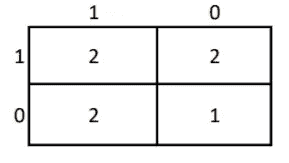

# 简而言之，混淆矩阵

> 原文：<https://medium.com/analytics-vidhya/a-z-of-confusion-matrix-under-5-mins-147c1b4467ab?source=collection_archive---------14----------------------->


从迷茫到清晰！(图片来自 [Pixabay](https://pixabay.com/photos/lens-camera-lens-focus-focusing-1209823/) )

当一个模型被创建时，为了部署它并基于这个模型做出业务决策，我们需要知道这个模型执行得有多好。这个问题涉及到性能指标。

一个简单的衡量标准是*。准确性就是模型正确预测的点数与性能测量数据集中的总点数之比。*

*那么 ***为什么不准确呢？****

*准确性有它自己的缺点。一个这样的缺点是，对于不平衡的数据，当模型预测每个点属于多数类标签时，精度会很高。但是，这个模型并不准确。在现实世界中，数据通常是不平衡的。*

*因此，我们需要另一个能够处理不平衡数据的指标。 ***混淆矩阵*** 来了。*

***在这篇博客中，我们将讨论混淆矩阵和基于混淆矩阵的各种度量标准；以及如何使用玩具数据集计算这些值。***

**内容:**

1.  *混淆矩阵*
2.  *精确度、召回率、F1 分数*
3.  *使用示例计算每个*
4.  *使用 Python 实现计算代码*

*什么是 ***混乱矩阵*** ？*

*混淆矩阵可用于我们已经知道实际目标变量的数据。这有助于我们可视化模型的性能。*

> *混淆矩阵是特定表格布局中预测结果的总结，其允许对二分类问题(2 类)或多分类问题(多于 2 类)的机器学习模型的性能测量进行可视化*

*让我们使用二进制分类来理解混淆矩阵，比如说，二进制分类的类标签是 0(或负)和 1(或正)。*

*混淆矩阵中的每一列将代表类别标签的实际值，每一行将代表类别标签的预测值。*

**

*二元分类问题的混淆矩阵*

*TP 表示**真正**。它可以被解释为模型预测的正类并且是真实的。*

*FP 表示**假阳性**。它可以被解释为模型预测的正类，但它是假的。*

*FN 表示**假阴性**。它可以被解释为模型预测的负类，但它是假的。*

*TN 表示**真负**。它可以被解释为模型预测的负类并且是真实的。*

*要记住的一个小技巧是每个单元格(比如 TP)的标签是:单元格中的第*项*是*预测的类名*(就像 TP 中的 P，正数)，单元格中的*第一项*是预测的正确性*即真或假(T，真表示 TP 中的实际和预测的类标签匹配)**

*找到混淆矩阵有助于我们找到各种性能指标，如**精确度、召回率和 F1 分数。***

****精度*** 是一个度量标准，它告诉我们，在模型预测为阳性的所有点中，有多少实际上是阳性的。*

**

*精度的数学公式*

****回忆*** 是一个指标，它告诉我们，在数据集中的所有阳性点中，模型正确预测了多少。*

**

*回忆的数学公式*

*当我们想要比较两个模型时，基于精确度和召回率的比较变得复杂。所以我们使用*一个基于精度和召回率的单一分数*来代替这些值本身。这个单值就是 ***F1 的分数*** 。
***F1 得分*** 简单来说就是召回率和精确度的调和平均值。*

**

*F1 分数的数学公式*

*让我们以一个**二元类分类问题**为例，计算混淆矩阵、精度、召回率、F1 评分。*

**

*这里，点的总数是 7，类标签为 0 的点是 3，类标签为 1 的点是 4。在 7 个点中，模型预测 3 个点为 0 级，4 个点为 1 级。*

*这里，我们来找 TP(真正)。有 4 个点被预测为 1(检查' *y 预测'*)，并且在这 4 个点中，只有 2 个点实际上属于类别 1(检查' *y'* )。所以 TP 是 2。*

**

*插入 TP 后的混淆矩阵*

*而被分类为类 1(检查' *y 预测'*)的剩余 2 个点实际上是类 0(检查' *y'* )。因此 FP 是 2。*

**

*插入 TP，FP 后的混淆矩阵*

*由于有 3 个点被分类为 0 级(检查' *y 预测'*)，因此只有 1 个点实际上属于 0 级(检查' *y'* )。因此 TN 是 1。*

**

*插入 TP，FP，TN 后的混淆矩阵*

*以及被分类为类 0(check ' *y pred'* )但实际上属于类 1(check ' *y'* )的剩余 2 个点。因此 FN 是 2。*

**

*插入 TP，FP，TN，FN 后的混淆矩阵*

*现在，计算*精度，召回，F1 分数:**

**

*计算精度*

**

*计算召回*

**

*计算 F1 分数*

*精确度、召回率、F1 分数范围在 0 和 1 之间。*

> *F1 分数越高，模型越好。*

*现在让我们了解如何使用 Python 一步完成所有这些，即使是海量数据。*

```
*y_actual = [0,1,0,1,1,0,1]
y_pred =[0,0,1,1,0,1,1]*
```

*我们在列表类型中使用上述数据。*

*实现一个**精确度分数**，*

```
*from sklearn.metrics import accuracy_score
print("Accuracy score ", accuracy_score(y_actual,y_pred))*
```

*输出:准确度分数 0.42857142855*

*同样的，让我们实现**混淆矩阵**，*

```
*from sklearn.metrics import confusion_matrix 
print("Confusion matrix ")
confusion_matrix(y_actual,y_pred)*
```

*输出:混淆矩阵
数组([[1，2]，
[2，2]]，dtype=int64)*

*现在，让我们在一行代码中实现计算精度、回忆和 f1 分数。*

```
*from sklearn.metrics import classification_report
print(classification_report(y_actual,y_pred))*
```

*输出:*

```
 *precision    recall  f1-score   support

           0       0.33      0.33      0.33         3
           1       0.50      0.50      0.50         4*
```

*是的，不管数据大小如何，只要一行代码就可以使用 sklearn。感谢 [sckit-learn](https://scikit-learn.org/stable/) ！*

*谢谢你的阅读。以后我会写更多初学者友好的帖子。请在[媒体](/@ramyavidiyala)上关注我，以便了解他们。我欢迎反馈，可以通过 Twitter [ramya_vidiyala](https://twitter.com/ramya_vidiyala) 和 LinkedIn [RamyaVidiyala](https://www.linkedin.com/in/ramya-vidiyala-308ba6139/) 联系我。快乐学习！*