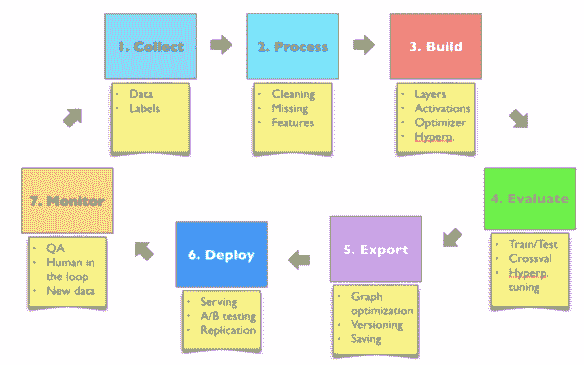
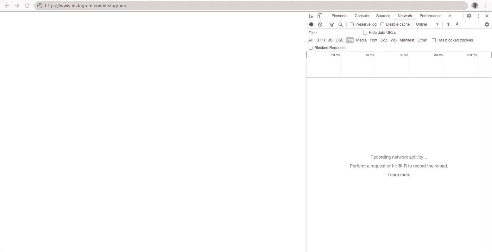
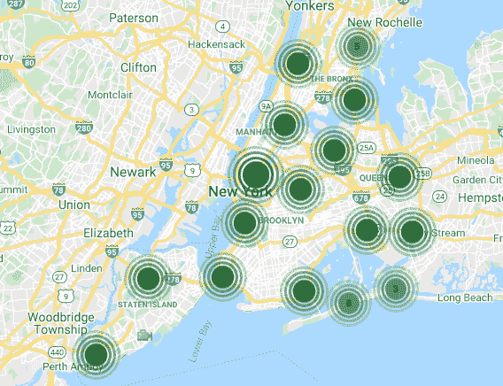
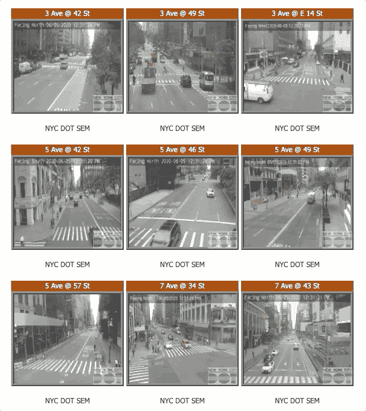
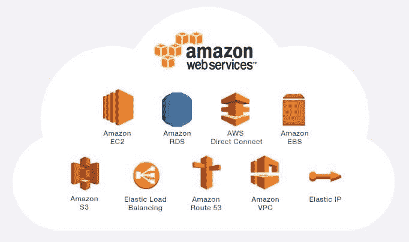
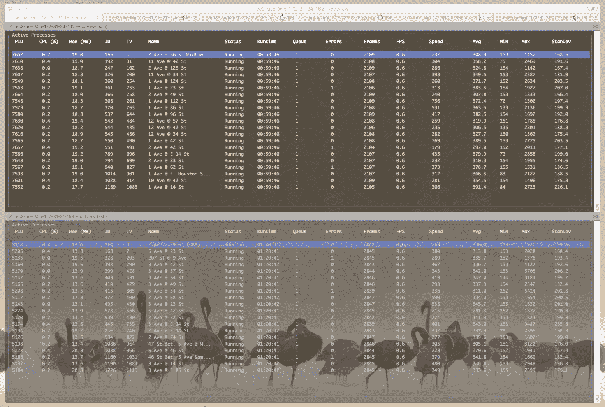
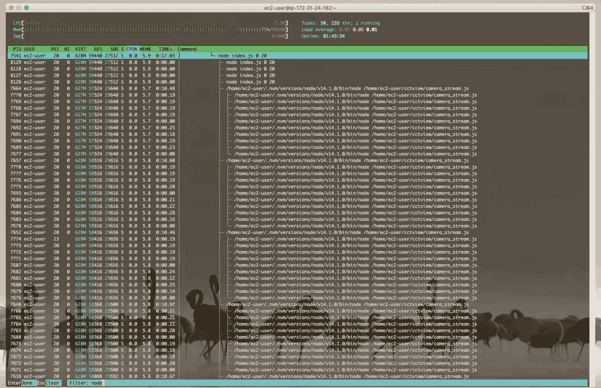

# 为深度学习开发收集数据

> 原文：<https://medium.com/analytics-vidhya/a1c43c7e8713?source=collection_archive---------16----------------------->

揭秘 Clearview AI 博客系列(第二部分)

## [目录](https://samdbrice.medium.com/fri-nov-6-2020-ae15374138b1)

## 上一篇:[面部识别简史](/@samdbrice/4ecd290aaab1)

## 接下来:[选择正确的物体检测模型](/@samdbrice/dcda0c8f6f70)

# 深度学习开发生命周期

深度学习开发可以被解释为一个由各种步骤组成的循环，从数据收集开始，最终向用户部署应用程序或服务。一旦部署了深度学习模型，监控其性能以及用户如何与其功能交互将告知应该收集哪些新数据或者应该实施哪些额外的处理来重建然后重新部署更高性能的模型。

作为深度学习开发生命周期的演示，我们将通过部署一个名为 CCTView 的车辆识别应用程序，使用纽约市交通局公开提供的 CCTV 摄像头馈送。在这个过程的每个步骤中，我将同时讨论从开发 Clearview 的面部识别应用程序的角度来看事情会是什么样子。

对于这个 CCTView 演示，我们将重点关注深度学习开发生命周期的前三个步骤。一旦我们的数据得到处理，检测模型已经建立，我们将进入应用开发生命周期，其中将涉及设计、实施和部署我们的深度学习支持的 CCTView 应用。

# 收集公开可用的数据

从网上收集公开可用数据的方法有很多种。在 Clearview 的案件中，他们承认从脸书和 Instagram 等网站抓取图片。这样的过程就像访问 [@instagram](https://www.instagram.com/instagram/) 的 Instagram 账号，从其 3.52 亿关注者中的每一个人递归下载图片一样简单。

你可以在你的 Chrome 浏览器上使用 [Chrome DevTools](https://developers.google.com/web/tools/chrome-devtools/) (在 Mac 上，按 **⌘ Cmd + ↑ Shift + J** )来手动检查网页的互联网流量，同时过滤图像。为了扩大到数百万和数十亿张图片，你需要雇用一组工程师，每个人都被分配了加入一个想要的社交媒体网络的任务，然后使用自动化程序下载这样的“公共”信息。

值得注意的是，一些网站明确禁止此类网络抓取作为其服务条款的一部分。例如，YouTube 的服务条款明确禁止收集可用于识别个人身份的数据。YouTube、谷歌、Twitter 和脸书都向 Clearview 发出了停止通知，要求他们删除从网站上收集的所有数据。2020 年 2 月，一名加州居民和一名伊利诺伊州居民也对 Clearview 提起了集体诉讼，指控其违反了《加州消费者隐私法》(CCPA)和《伊利诺伊州生物隐私法》(BIPA)。

在我们的例子中，CCTView 的闭路电视摄像是由纽约市交通局公开的。网站[webcams.nyctmc.org](https://webcams.nyctmc.org/)提供纽约市所有五个区的实时交通信息。网站上列出了 747 台摄像机。

对于 CCTView，我们将关注曼哈顿下城的大约 250 个摄像头。

# 在云中扩展数据流管道

使用简单的笔记本电脑传输 250 个摄像头是不可能的。实现和扩展这种管道的最佳方式是使用云服务。任何云提供商，如 Azure 或谷歌云平台，都可以。如果您注册了 AWS 帐户，您可以在 12 个月的免费期内每月使用 750 EC2 小时。

关于 DOT 网络摄像头，值得注意的一些有趣的事情是，提要有点类似，必须从服务器上获取。除了体积小(352x240)和分辨率低(100x100)之外，摄像机输入的最佳帧速率是每秒一帧。如此低的帧速率是不寻常的，但这是我们必须要做的，所以我们会尽力而为。

你可以发挥想象力，在你喜欢的云提供商上实现这样的管道。对于这个演示，我使用 AWS EC2 实现了一个 Node.js CLI 脚本，该脚本为每个摄像机派生一个子进程，然后使用 IPC 通道来跟踪和维护每个提要。Node.js CLI 脚本被证明非常简单，并且在使用一个 vCPU 和 1gb 内存运行的 AWS EC2 t2.micro 实例上运行良好。

由于每个实例有 21 个摄像头异步轮询，CPU 利用率达到了 8%，内存利用率稳定在 1 GiB 以下。

可能有更好的方法来做到这一点。但是，上述管道仅用了一天时间就在 EC2 自由层限制内实现和运行了。在 24 小时内，数据流管道收集了每台摄像机 60k 多一点的帧，总计超过 281 GiB 的未处理视频。

基本管道使用弹性块存储(EBS)存储数据，这是一种易于使用的存储服务，旨在与亚马逊弹性计算云(EC2)一起使用。Gizmodo 透露，Clearview 使用亚马逊简单存储服务(S3)存储数据，这是一种高性能的存储服务，通过网络界面提供数据访问。将闭路电视录像直接传送到 S3 是可能的；然而，由于涉及到额外的数据实验和处理，EBS 被证明更容易使用。

现在我们的数据可以轻松处理，下一步是根据可用数据和所需的应用用例选择正确的深度学习模型。

## [目录](https://samdbrice.medium.com/fri-nov-6-2020-ae15374138b1)

## 上一篇:[面部识别简史](/@samdbrice/4ecd290aaab1)

## 接下来:[选择正确的物体检测模型](/@samdbrice/dcda0c8f6f70)

# 参考

[我们发现了 Clearview AI 的黑幕人脸识别 App](https://gizmodo.com/we-found-clearview-ais-shady-face-recognition-app-1841961772)

[Clearview AI 被叫停](https://www.cnet.com/news/clearview-ai-hit-with-cease-and-desist-from-google-over-facial-recognition-collection/)

[Clearview AI 集体诉讼可能进一步考验 CCPA 的私诉权](https://www.jdsupra.com/legalnews/clearview-ai-class-action-may-further-14597/)

[NYC DOT 实时交通信息](https://webcams.nyctmc.org/)

[亚马逊网络服务(AWS)——云计算服务](https://aws.amazon.com/)

[Chrome 开发工具](https://developers.google.com/web/tools/chrome-devtools/)