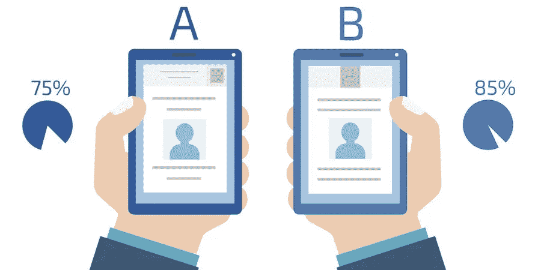
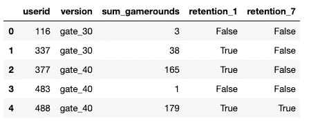
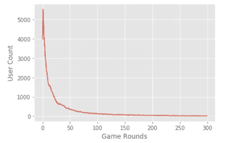
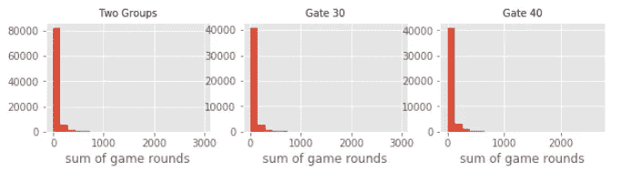
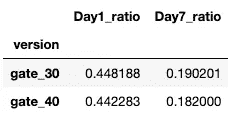
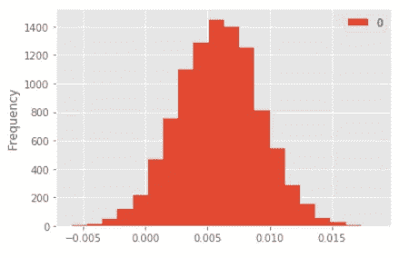

# 用 Python 在游戏中进行 AB 测试

> 原文：<https://medium.com/analytics-vidhya/ab-testing-in-game-analyze-using-pty-cb82927d8422?source=collection_archive---------10----------------------->

## 分析一款手机游戏 AB 测试结果，并提供建议。

资料来源:www.weidert.com

AB 测试是试验网站、游戏等变化的一种流行方式。我们可以在短时间内看到结果，并据此做出决定。

我最近参加了几个使用 Python 的统计学思考课程和一个关于设计和分析 AB 测试的课程。因此，我想把我的知识应用到这个项目中。

## 背景和问题陈述

数据集是关于手机游戏曲奇猫 pops 的。起初，玩家免费下载游戏。随着玩家在游戏中的进展，他们会遇到要求他们等待一段时间才能进入下一个游戏或进行购买以避免等待的关卡。因此，放置浇口的时机是一个重要的决策。

## 目标

目前，第一扇门在 30 层。公司想知道 30 级和 40 级第一道门的效果。这一变化会影响玩家的忠诚度吗？

## 过程

1.了解数据集
2。EDA 和数据可视化
3。假设检验——自举
4。结果和业务建议

下面，我将简要介绍该项目的主要发现和收获。你可以在这里获得完整的项目代码[。](https://github.com/thejasmine/ABtesting_game)

# 探索性数据分析

该数据集包含 90189 名球员的数据。有两个版本:gate_30、gate_40、玩家玩过的游戏总数，以及玩家是否在第 1 天和第 7 天之后重新登录游戏。

用户数与游戏回合数

很明显，大多数用户玩 1-100 个游戏。有趣的是，有大约 4000 人只是下载游戏，从来不玩。

Gate 30 版和 gate 40 版的游戏回合分布看起来差不多，两组留存率 Gate 30 分别为 44.8%和 19%，gate 40 分别为 44.2%和 18.2%。看起来很相似，我们对这种差异有信心吗？让我们从统计学的角度深入探讨一下。

# AB 测试

执行 AB 测试，查看两个版本之间是否有差异。

> 假设
> 
> H0:30 号门和 40 号门的版本没有区别。
> 
> H1:这两个版本是有区别的。
> 
> 使用保留意味着测试统计。

我想使用 bootstrapping 对数据重复重采样 10000 次，并获得样本的 1 天和 7 天保留率。

在此之前，我想分享一些我从 DataCamp 课程中学到的创建引导复制的有用函数。

第一个功能是从列表中随机选择值并重新采样。第二个是使用 for 循环创建复制并添加到 bs_rep 列表中。您可以指定要用测试统计函数替换 func 的随机样本数。

## 估计两组之间保留率的差异，并报告 95%的置信区间。

下面是代码片段，我会在最后分享结果。

boostrap 差异重复的直方图

## 结果呢

Day1 的差异均值为 0.6%，差异概率为 96%。

第 7 天的差异均值为 0.8%，差异概率为 99%。

## 假设检验

第 1 天的 p 值为 0.0065，第 7 天为 0.0069。结果，我否定了零假设。

# 结果

基于假设检验的结果，两组之间存在显著差异。在第一天和第七天，门 30 的保留率高于门 40。结果表明，我们有理由相信 gate 30 版本的第一天和第七天保留率高于 gate 40 版本。总之公司**不应该**把星门等级改成 40。

## 要点和建议

*   公司不应该转移到第 40 级，因为当第 30 级时，7 天保留时间更长。
*   六天内留存率从 44%下降到 18%。公司应该想办法维持他们的玩家基础。可能是玩家在第三天或第四天感到无聊，决定离开游戏。为了提高第一周的保留率，公司可以提供一些激励措施，如免费赠品、增加有趣的挑战等。

我希望你喜欢阅读这篇文章！