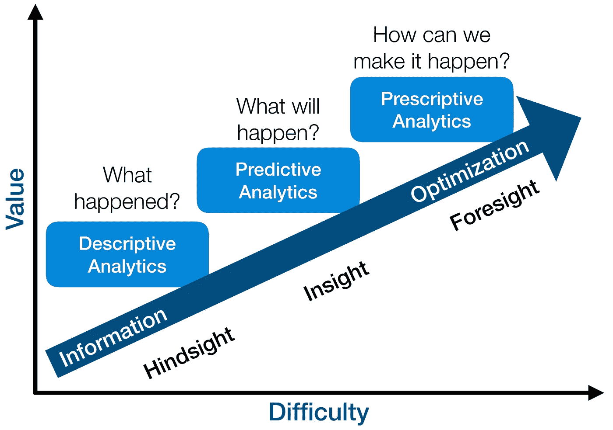

# 数据科学基础知识

> 原文：<https://medium.com/analytics-vidhya/abc-of-data-science-1a96fa32fa52?source=collection_archive---------6----------------------->

这一切都始于智慧

现在，我不想卷入数据成为新的石油或土壤的战斗中。许多人将数据称为新的石油，但我自豪地称之为新的土壤，因为它很丰富，有能力和潜力增长，提供并给你正确的结果，只要你做正确的事情。

我记得当我们在学校长大的时候，我们被教授英语，我们被要求理解语言的组成部分。正如其他语言所要求的那样，这一切都是从学习字母开始的……A 到 Z，我打赌你现在正在背诵。这是当时占主导地位的事情，理解它是多么简单，也需要你在其他方面很好地了解它才能进入下一个课程。它并没有就此结束，它转移到识别字母与单词，旁边的句子，缩放到比喻和更复杂的主题。然后，这是每个人都在努力的一步，以便更好地理解这门语言及其用法。

在我们今天的时代，数据和它的科学是在同样的相似性，其中字母充当的数据是随时可用的，是要被理解的。现在，科学伴随着你，把它用于描述、预测和规定的目的。

图片由 Gartner 提供

**数据的描述性分析**可以被视为报告“发生了什么”以及“为什么”会发生。你需要清楚地概述你所拥有的东西，它有多清晰，围绕它的统计数据，并给出关于它的见解。既然我们从英语语言的背景开始，你可以称之为基于历史数据的分析。因此，作为一名在组织中寻找工作的数据分析师，我想做的第一件事是收集他们丰富的数据，以了解现场发生了什么，正在发生什么，以及应该做些什么来确保连续性或变化。

**数据预测分析**将解释接下来会发生什么，你希望通过提供下一步行动和他们应该准备什么来给出价值。因此，如果我与电力、天然气等公用事业部门的天气预报团队合作，我应该能够根据可用的历史数据和特定地区的天气预测需求，让我的组织知道特定地区将有低/高需求，因为这将是一个冷/热季节。这些有很多应用，你可能还想多谈谈有多少人将作为员工或客户离开你的公司。我想你应该称之为理解未来，理解周围发生的事情。

**数据的规范性分析**基本上就是问自己“如何”利用所有这些东西来做出正确的商业决策和行动。它可以被视为描述性分析和预测性分析的结合，但您需要关注的是，说明性分析可以洞察未来决策的影响，以便在实际做出决策之前就可能的结果提出建议。在最好的情况下，说明性分析不仅预测将会发生什么，还预测为什么会发生，并提供关于将利用预测的行动的建议。

制造业、快速消费品、石油和天然气、银行、电信、医疗、娱乐等行业的数据驱动型组织在日常业务运营中使用数据。你可以很容易地挑出像特斯拉，谷歌，微软，亚马逊，甲骨文，IBM，三星，苹果，可口可乐，雪佛龙，壳牌，巴克莱，汇丰银行，第一银行，mPesa，Orange，T-Mobile，MTN，Airtel，网飞，脸书，Twitter 和许多其他公司，名单是无穷无尽的。您可能会有兴趣了解个人和企业使用的数据有多丰富，但这一切都始于您了解基础知识并从中获益。我们可以研究几个应用程序，但了解周围的一切都是由数据驱动的，这应该会让您更好地理解主题以及如何适应它。

为了帮助探索管理数据的能力，一些编程语言已经确立了自己作为本地冠军的地位，如 R、Python、Java、Julia、SQL、MATLAB。然而，有趣的是，所有这些工具都是可用的，它们是无穷无尽的，并且它周围的社区在不断改进它，它只会变得更好

我们可以重点介绍 ggplot2、Keras、PyTorch、SAS、Matplotlib、Tensorflow、Tableau、Hadoop、Scikit-learn、NLTK、BigML、Weka 和云计算平台，如微软 Azure 云解决方案、亚马逊 Web 服务、甲骨文云、阿里云、IBM 云等等——你可以看到这是多么势不可挡，所以如果你不小心，你可能会陷入做什么和选择哪一个的网络中。

但是为了帮助你更加清晰，并指导你完成所有你应该做和知道的事情，你可以订阅这个频道以获得更多的更新，随着时间的推移，将会发布更多的文章。你也可以在下面的评论区就你想了解的话题给出建议。