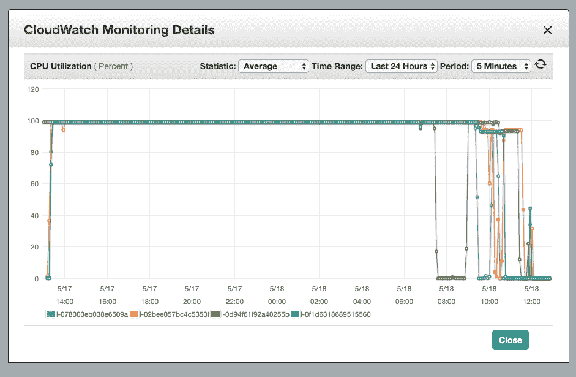
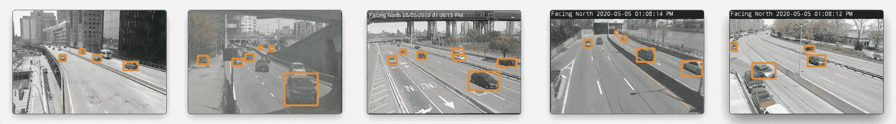

# 大规模运行对象检测和结构化数据

> 原文：<https://medium.com/analytics-vidhya/abc7d8d7b0c5?source=collection_archive---------10----------------------->

揭秘 Clearview AI 博客系列(第 4 部分)

## [目录](https://samdbrice.medium.com/fri-nov-6-2020-ae15374138b1)

## 上一篇:[为物体检测选择正确的模型](/@samdbrice/dcda0c8f6f70)

## 接下来:[用深度学习追踪车辆](/@samdbrice/de5842a75045)

在 EC2 计算密集型 [C5 上运行检测器。XLarge](https://aws.amazon.com/ec2/instance-types/c5/) 与基于 GPU 的 [P2。XLarge](https://aws.amazon.com/ec2/instance-types/p2/) 。

# 扩展云中的对象检测管道

类似于我们如何使用 AWS EC2 来扩展数据流管道，我们也可以使用 EC2 来扩展对象检测。鉴于这是我第一次深入体验 AWS EC2s，我犯了一些值得分享的关键错误。

自由层 EC2 **t2.micro** 实例对于运行 web 服务器之类的简单服务非常有用，但是对于任何有点严重或相当严重的任务几乎没有用处。尽管使用 EC2 获取数据几乎是“免费”的，但是一旦数据进入 AWS，就需要花费“一些东西”来处理。有一整个研究领域致力于基于现货或市场实例价格优化 AWS EC2 的成本和性能的艺术和科学。

对于 CCTView 而言，限制成本的主要手段归结为减少感兴趣的摄像机数量，从曼哈顿的所有 250 个减少到 FDR Drive 沿线的 5 个特定摄像机。我们将在第 5 部分讨论这些特定的 FDR 驱动摄像机背后的原因。

对象检测管道。

# 结构化和命名用于处理的数据

在 24 小时内，数据流管道收集了每台摄像机 60k 多一点的 JPEG 帧，总计超过 281 GiB 的未处理视频和图像。在对我们的数据运行任何检测管道之前，我们首先需要对原始数据进行一些简单的预处理。

[NYCDOT 交通摄像头视频——FDR @ Grand St 至 FDR @ E 53 St，每小时一次](https://github.com/samdbrice/cctview-data-videos--hourly)

处理如此庞大的数据集的第一步就是删除重复项。消除图像重复的最简单方法是使用 shasum 为每个图像生成唯一的哈希值，然后删除重复的哈希值。

在处理如此大的数据集时，文件格式和命名约定也是必不可少的，特别是考虑到数据将在文件系统上存储和索引。考虑到易编程性，文件的存储和命名必须包含尽可能多的上下文信息。

随着时间的推移，文件夹结构和文件命名方案发生了很大的变化。过于扁平的文件夹结构会导致叶节点中有太多文件，从而使扩展和分发变得更加复杂。一个简单的嵌套树被证明适合 CCTV 数据，基于年、月、日、小时、分钟和秒递归嵌套，使用基于时间戳的文件夹树格式**YYYY/MM/DD/HH/MM/ss/{ FileName }**。

文件命名需要包含尽可能多的上下文信息，除了时间戳，还包括摄像机 ID 和 CCTV 编号。原因是，如果文件放错了位置，或者树的整个分支被展平，文件名必须是唯一的，以免冲突。使用标准正则表达式或基于基本分隔符的拆分，从文件名中以编程方式分解所需的上下文信息也必须非常简单。

这在当时似乎并不明显；然而，方向是另一条信息，需要与摄像机 ID 和 CCTV 名称一起附上。原因还是为了更容易编程。例如，如果一辆车是向北行驶的，那么聚焦于朝南的摄像机是有意义的。在相机的复合 ID 中有这些信息，就不需要从外部来源查找了。

综上所述，CCTView 数据的文件命名约定演变为**ABC-XYZ-O—YYYY-MM-DD—HH.mm.ss.jpeg**—其中 ABC 是摄像机 ID，XYZ 是 CCTV 编号，O 是方向，其余是帧时间戳。

随着我们的数据得到适当的结构化和智能的组织，在云上分发和扩展就变成了时间和金钱的问题。更快的数据处理归结为同时运行更多的机器。

# 利用亚马逊机器映像

Amazon Machine Images (AMI)是 AWS EC2 中的一个特性，支持使用相同的配置启动多个实例。对于相对较小的数据集，您可以将所有内容加载到基本映像上，然后从正确配置的实例快照创建候选 AMI。

这种工作流的好处包括节省网络数据传输，以及易于将数据和实例功能从一个 AWS 区域复制到另一个 AWS 区域。后者被证明是极其重要的，因为它变得很明显，不同的地区有不同的 CPU 和 GPU 弹性基于底层分配和可变的利用率。

[深度学习 AMI](https://docs.aws.amazon.com/dlami/latest/devguide/what-is-dlami.html)

我发现的利用 EC2 AMIs 的最有效方法是简单地从亚马逊提供的深度学习 AMI 开始构建一个实例，将主题数据集上传到 EBS，配置 conda 环境，然后验证检测管道是否按预期运行。

一旦基于深度学习 AMI 的实例处于所需状态，您可以剪切由基础深度学习 AMI 组成的“自定义”AMI，包括上传到 EBS 的任何数据，以及在底层快照实例中进行的任何环境配置。

# CPU 与 GPU

这一部分主要是题外话，但是你可以从我的经验中学习……事实证明 GPU 实例的弹性非常低。

在 AWS EC2 上使用 GPU 不仅仅是在设置/创建时选择一个 GPU 实例的问题。要在所需的区域内使用 GPU，您必须首先从一个人(squishy 类型)那里请求分配。这个请求过程非常令人惊讶。这个过程花了大约 2-3 天，这是我的时间表中没有的。同时，最好的选择是在 CPU 实例上运行检测器管道。

试验不同的实例类型将使您大致了解如何最好地并行化检测管道，在平衡成本的同时尽可能完全地利用所需的实例。我首先试验了一些通用实例，然后很快转向计算优化实例。我最终选定了 c5.xlarge，它拥有 4gb 的内存，弹性块存储(EBS)，网络带宽高达 10 Gbps，EBS 带宽高达 4,750 Mbps。选拔过程不太科学；我在第一个实例中停下来，它展示了良好的 FPS 性能，同时尽可能地利用了更多的 CPU 和内存。

重用上面的数据流管道实用程序，我实现了一个 Node.js CLI 脚本，该脚本每小时为 CCTV 摄像机帧捕获分配独立的子进程。父脚本/进程与数据管道中使用的相同。对检测子流程进行了修改，以生成一个 Python 子流程，该子流程使用 IPC 运行 ImageAI 检测器脚本来监控进度。在 c5.xlarge 上同时运行五个检测器子进程产生了与我的笔记本电脑相似的性能，并且具有非常高的 CPU 和内存利用率。

运行检测器子流程。

EC2 C5。XL 大量利用

AWS CloudWatch 仪表板是一个优秀的工具，可以跟踪多个实例的利用率。

[CloudWatch 监控详情](https://aws.amazon.com/cloudwatch/)

当 GPU 最终分配到我的帐户时，我的大部分检测器工作已经完成。为了了解 CPU 与 GPU 之间的区别，我使用 p2.xlarge 实例来完成由 c5.xlarge 实例部分完成的批处理。加速计算 p2.xlarge 实例配有 1 个 GPU、4 个 vCPU、61 GiB 内存和 12 GiB GPU 内存。正如预期的那样，GPU 实例速度更快，是 CPU 实例的两倍，每帧不到一秒，而 CPU 实例超过两秒。这是一个非常温和的改进，没有任何优化，所以可能有办法大大提高性能。

# 重构对象检测输出

ImageAI 库的一个强大功能是对象提取。基于特征标志，ImageAI 将每个检测到的对象提取到单独的图像文件中。这意味着如果一个帧包含六辆汽车，在对一个帧运行检测模型后，ImageAI 将输出(1)原始图像的副本，每个检测都在它们的边界框内，(2)JSON 对象，其中有一个详细列出检测到的对象的列表，最后(3)六个单独的图像文件，每个检测到的汽车一个。这种对象提取意味着，根据检测到的对象数量，我们最终会从原始相机帧的单个图像文件中获得八个新文件。

上面的文件夹没有反映 ImageAI 输出的原始结构，非常裸露；它反映了设计用来最好地组织数据的最终系统。在文件名中，现在有一个“类别”(例如，原始、检测)。检测元数据 JSON 保存为地图，其中包含所有检测到的对象的摘要以及每个对象检测的详细信息。最后，提取的检测对象图像名称被修改以用作全局唯一 ID。

作为演示实现的最终优化，单独提取的对象图像已被重命名，以显示所有可用的元数据，包括 **percentage_probability** 和**bounding _ box**。这种命名约定进一步减少了向用户显示结果时对额外数据的需求。文件名包括与库元数据对象相同的细节级别。

上述结构的一个亮点是可以轻松地汇总检测细节元数据(例如，在 JSON 文件中)。具体来说，我们能够将所有“秒级时间”检测细节 JSON 汇总成一个“分钟级时间”检测细节 JSON。这种元数据汇总使获取摄像机或时间段的所有上下文信息变得更加容易，而无需运行多个数据查询。随着我们深入设计和开发面向用户的应用程序，这一点的效用将变得更加明显。

以下是在五个选定的 FDR 驱动摄像机上运行对象检测的结果。

使用对象检测处理目标摄像机并从每一帧中提取所有感兴趣的车辆后，我们现在准备实施图像识别模型。

## [目录](https://samdbrice.medium.com/fri-nov-6-2020-ae15374138b1)

## 上一篇:[为物体检测选择正确的模型](/@samdbrice/dcda0c8f6f70)

## 接下来:[用深度学习追踪车辆](/@samdbrice/de5842a75045)

# 参考

[亚马逊重新认知](https://aws.amazon.com/rekognition/)

[Azure 认知服务](https://azure.microsoft.com/en-us/services/cognitive-services/#api)

[什么是 AWS 深度学习 AMI？](https://docs.aws.amazon.com/dlami/latest/devguide/what-is-dlami.html)

[AWS 自由层限制](https://docs.aws.amazon.com/awsaccountbilling/latest/aboutv2/free-tier-limits.html)

[NYCDOT 交通摄像头视频——FDR @ Grand St 至 FDR @ E 53 St，每小时](https://github.com/samdbrice/cctview-data-videos--hourly)