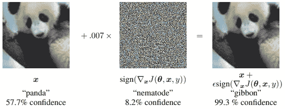
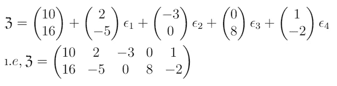
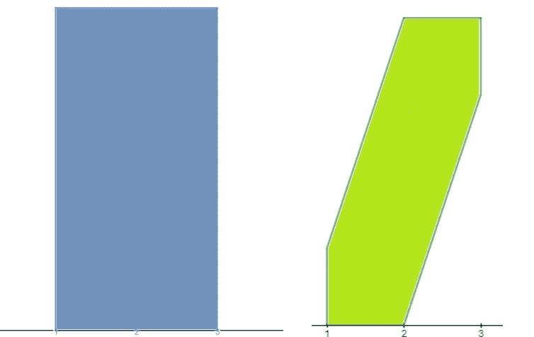
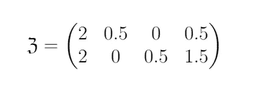

# 人工智能的抽象解释

> 原文：<https://medium.com/analytics-vidhya/abstract-interpretation-for-ai-cc52bc0ddec2?source=collection_archive---------10----------------------->

马克斯·兰格洛特在 [Unsplash](https://unsplash.com?utm_source=medium&utm_medium=referral) 上的照片

# **序幕**

> *世界的混沌特征抹去，
> 你就会看到它的美丽。
> —亚历山大·布洛克*

> **抽象解释(AbsI)** 是一种在一组可能的输入上近似设计程序属性的方法，甚至不需要执行程序。
> AbsI 的形式定义需要对一些离散的数学术语有深刻的理解，即偏序集、序、格、完备格等。鼓励感兴趣的读者查阅任何有关抽象代数的高级书籍来了解这些概念。

在这篇博客中，我将尝试给出这种形式分析技术背后的领域、基本思想、推理原则和动机的概述。

# 背景

在过去的几年里，*深度神经网络(DNNs)* 通过使用大量的数据，在大多数机器学习任务中实现了最先进的性能。然而，即使是高度精确的神经网络也容易受到敌对攻击，它们很容易被欺骗，通过稍微修改输入做出错误的决定。**换句话说，通过应用某些甚至人眼无法察觉的可察觉的扰动(改变亮度/颜色),可以欺骗网络对图像进行错误分类。这是由*塞格迪等人*首先发现的。**

**ImageNet 上针对 GoogLeNet 的对抗性攻击示例。通过添加其元素等于∇ₓ J 的符号(成本函数 J(θ，x，y)相对于输入的梯度)的难以察觉的小(ϵ=0.007)向量，改变了 GoogLeNet 对图像的分类。**

近年来， *DNNs* 也成为各种安全关键应用的组成部分，*即、*自动驾驶汽车、医疗诊断、飞机防撞检测等等。新技术的发展使无人驾驶汽车能够在复杂的环境中行驶，而另一方面，敌对的反例可能会让攻击者导致汽车采取不必要的行动。为了应对这一挑战，有大量的研究开始验证 *NNs* 的健壮性，并使其能够抵御此类攻击。研究人员已经开始调查验证技术的使用，这些技术可以大致分为**完整**或**不完整。**为了使网络免受*****病毒感染，还特别强调了*焦点在给定输入的邻域中。**完全验证器**是精确的*，即*它们没有误报，但是它们具有有限的可扩展性。基本上，验证器基于计算昂贵的方法*混合整数线性规划(MILP)、SMT 求解器、*等*。*然而，**不完整的验证器**可能会产生误报，但它们相对更具可扩展性。AbsI 是这种验证者使用的方法之一，也是今天讨论的主题。长话短说 **AbsI** 是****近似理论，它提供了一个计算程序行为过度近似的方法，同时保持了合理性。
**某些技术也可用于增强验证器的健壮性**，但这超出了讨论范围；下面有一些参考资料。********

# ****AbsI 框架****

****让我们从一些重要概念的顺序开始这一部分。这里 *i，k，m，n∈* [*ℕ*](http://mathworld.wolfram.com/NaturalNumber.html)****

*   *******仿射变换:*** 设*x，b* ∈ [*ℝ* ᵐ](http://www.owlnet.rice.edu/~fjones/chap1.pdf) ，任意映射 *f : ℝᵐ ↦ ℝᵐ* 在中形成 *f(x)=A x+b* 其中 *A* 为非奇异 *m × m* 矩阵，为仿射变换。
    在某些上下文中 *A* 是一个 *n× m* 矩阵，在这种情况下， *f* 是从 *ℝᵐ* 到 *ℝⁿ* ， *b ∈ ℝⁿ.的映射*这在文学上有个特别的名字，**条件仿射变换(CAT 函数)**。这些函数有许多有趣的性质，就像猫的构成又是一只猫。**基本上，CAT 代表整个 NNs 和 FC 层。**甚至 ReLU 及其整个家族也可以用猫的形式表现出来。****
*   *******仿射表示:*** 仿射算术(AA)是区间算术(IA)的扩展。它是一个非常好的复杂工具，旨在提供更多的信息和更紧密的约束，同时处理复杂和昂贵的计算。不深究技术细节，先说一个简单的例子:
    Let，*x∈【a，b】*那么在 AA 的术语中， *x* 也可以表示为 *(b+a)/2 +(b-a)/2 * ϵ* 对于某些 *ϵ ∈[-1，1】。* 在这种表象中没有什么新东西，这是显而易见的。但这是最基本的。再观察一次 *(b+a)/2* 是区间 *[a，b]的中点。*在文献中，ϵ被称为**噪声**变星。显式地，任何实数都可以用仿射形式表达 *𝔵* = *x₀ + x₁ ϵ₁+x₂ ϵ₂+…..+xₖϵₖ；* 一个线性多项式和 *ϵₙ's ∈ [-1，1]，n= 1，2，3，…，k.* 系数 *xₙ's* 是有限浮点数，称为*偏差值。* 倒过来想*【'𝔵】*也是一个函数 *ϵₙ's.* Let， *U=[-1，1]* 并定义 *ψ* : *Uᵏ ↦ ℝ* 这样 *ψ(ϵ₁,ϵ₂，…ϵ_ₖ)=𝔵.*这是一个著名的函数，叫做***仿射函数。* □** 一个重要的观察: *ψ(ϵ₁,ϵ₂，…ϵ_ₖ) = ψ(ξ)=一个ξ+x₀，*其中
    *ξ=【ϵ₁，ϵ₂，…。，ϵₖ]ᵗ* 是一个 *k× 1* 列*矩阵和*a =【x₁，x₂，…。，xₖ]* 是一个 *1× k* 的行矩阵。
    □一个重要的结果:让，*ρₓ=σₖ|xₙ|*然后*x∈【x₀–ρₓ，x₀ +ρₓ].换句话说，一旦知道了实数的仿射表示，就有可能构造出它所在的区间。******
*   *******抽象域(*ω*):***它是一个试图捕捉信息所有可能的必要特征的空间。基本上，投影是从信息空间到一个更小的空间。**但是要求是什么呢？**是这样的:每当分析器报告“no”时，这意味着 No，它保证坏的状态是不可达到的，但是如果它报告“Yes”呢！它有双重含义，坏的状态可能是可达到的，唯一开放的选项是提炼抽象，即关于基本特性的信息。***ω的概念来了。***
    是一类集合，配备了一个*抽象函数λ:*[*𝔓(ℝᵐ)*](http://mathworld.wolfram.com/PowerSet.html)*↦ω*和一个*具体化函数**λ:ω↦𝔓(ℝᵐ).*
    直观上它是由**抽象元素**组成的，抽象元素是一组点([可数或不可数](https://www.math.brown.edu/~res/MFS/handout8.pdf))，由一些逻辑约束来守护。例如，任何集合如: *{x ∈ ℝ | x < ∞}* 或 *{x ∈ ℝ | a≤ x ≤b}* 都可以是抽象元素。一些常见的例子有盒子、**带状图**、多面体等。其中**区带图谱**成功应用于神经网络分析。在这里，我们也将提供一个简短的描述，并向读者介绍这种讨论最多的人格。
    □让我们从一个简单的例子开始更详细地解释这些成分:考虑一个输入集 *φ={(1，0)、(1，2)、(2，0)、(2，3)、(3，3)、(3，4)} ∈ 𝔓(ℝ )* ，并假设*λ*将 *φ* 映射到一个盒子；
    *λ(φ)=【1，3】×【0，4】*即 *φ中[横坐标](http://mathworld.wolfram.com/Abscissa.html)的*【最小】，*φ中*横坐标的最大*， *φ中[纵坐标的【最小](http://mathworld.wolfram.com/Ordinate.html)*×*φ中，纵坐标的最大*φ中*。(见下图)* 观察过近似在这种情况下，对于相对较小的集合，它包括 *15 个*整数点，而 *φ* 只有 *6 个*点。接下来，想象一下，如果输入集非常大，并且这些点是离散分布的，那么过度近似会在什么范围内！*****
*   *******Zonotope:*** 考虑两个量 *α、β* 及其仿射形式:
    *α= 10+2****ϵ₁****–3ϵ₂+****ϵ₄****和*β= 16–5****ϵ₁****+8ϵ₃–2*从这个数据中，人们马上可以说 *α ∈ [-3，23]* 和 *β ∈ [1，31]。* 但最重要的是它们都包括**常见噪声*ϵ₁**ϵ₄***非零系数 ***。*** 此信息介绍了 Zonotope 的概念。
    形式上，一个 zono tope***ℨ****是一个多面体在 *ℝⁿ* 中可表示为一个有限集线段的 [*闵可夫斯基和*](https://www8.cs.umu.se/kurser/TDBAfl/VT06/algorithms/BOOK/BOOK5/NODE199.HTM) 。这些段被称为发电机，*即****ℨ****(𝔩****₁,𝔩₂,…𝔩ₖ****)=****𝔩₁****⊕𝔩****₂****⊕……⊕*从形状上看，它是一个中心对称的凸多面体。一个微不足道的例子是单位超立方体*【0,1]ⁿ.* ***𝔠***成为***ℨ****那么这个几何对象也可以参数化为***ℨ****=****𝔠+∑ₖ****ϵᵢ在缩写:****ℨ=(𝔠；g₁,g₂,….gₖ).*** 以为例，*********

**********

*****现在让我们回到我们的主要例子。在下图中，我们用一个方框(蓝色)和一个 zonotope(绿色)来抽象φ中的点*****

**********

*****用方框(蓝色)和带状图(绿色)提取要点*****

*****我们定义一个 zonotope， *𝔷 :[-1，1] ↦ℝ* 使得
*𝔷(ϵ₁,ϵ₂,ϵ₃)=(2+0.5ϵ₁+0.5ϵ₃，2+0.5ϵ₂+1.5ϵ₃).* 以参数化的形式:*****

**********

*****注意，在这种情况下，该区域只包含 *10* 个整数点，这确实是一个比盒子更精确的域！*****

# *****结论*****

*****现代研究表明，在经典的 AbsI 框架中分析 NNs 是验证其健壮性并确保人工智能系统安全性的一个有希望的步骤。解算器和传统数值域的结合为以更有效的方式修改网络架构提供了不可或缺的工具。尽管有所改善，但它仍然相当脆弱，在核不扩散制度的核查表现方面仍有许多工作要做。对更广泛的抽象域集的进一步探索可以显著提高 NNs 验证的可扩展性，并促进未来对安全关键系统开发的研究。*****

> *****写博客对表达我的想法非常有用，这是有效研究所必需的。我正努力培养这样一种兴趣，让我感到自在。根据读者的反应，我想在接下来的几周里写更多关于这个话题的文章。也欢迎任何批评、建议和提示。*****

# *******参考文献*******

1.  *****抽象代数，杜米特和福特*****
2.  *****抽象代数，亨格福德*****

 *****[## IEEE Xplore 全文 PDF:

### 编辑描述

ieeexplore.ieee.org](https://ieeexplore.ieee.org/stamp/stamp.jsp?tp=&arnumber=8418593)***** ***** [## [PDF]解释和利用对立的例子-语义学者

### 摘要:包括神经网络在内的几个机器学习模型总是错误地分类敌对的…

www.semanticscholar.org](https://www.semanticscholar.org/paper/Explaining-and-Harnessing-Adversarial-Examples-Goodfellow-Shlens/35734e8724559fb0d494e5cba6a28ad7a3d5dd4d) 

[http://www-ljk.imag.fr/membres/Antoine.Girard/Publications/hscc 2008 b . pdf](http://www-ljk.imag.fr/membres/Antoine.Girard/Publications/hscc2008b.pdf)*****