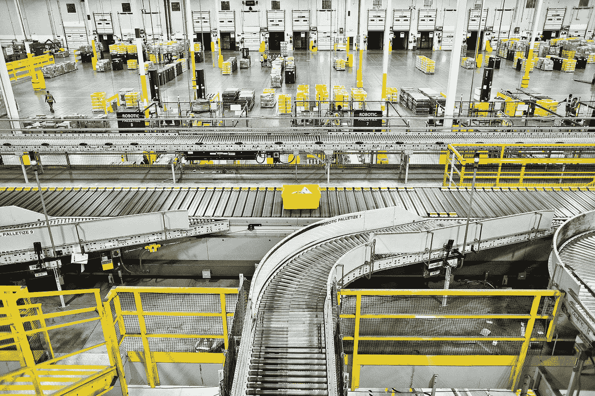

# 使用 NVIDIA Toolkit 加速您的深度学习管道

> 原文：<https://medium.com/analytics-vidhya/accelerate-your-deep-learning-pipeline-with-nvidia-toolkit-48155939db38?source=collection_archive---------9----------------------->

图片由纽约时报提供

任何深度学习模型都有两个阶段——训练和推理。这两个阶段同等重要。训练阶段是一个迭代的过程——我们迭代寻找最优的超参数、最优的神经网络架构、模型刷新和列表。这个迭代过程是计算密集型和耗时的。