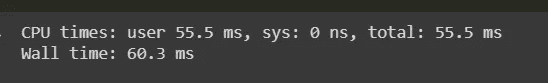
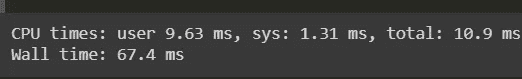

# 使用微软的蜂鸟加速 ML 模型

> 原文：<https://medium.com/analytics-vidhya/accelerating-ml-models-using-microsofts-hummingbird-1244036864d0?source=collection_archive---------11----------------------->

# 蜂鸟是什么？

Hummingbird 是一个用于将训练好的传统 ML 模型编译成张量计算的库。*蜂鸟*允许用户无缝地利用神经网络框架来加速传统的 ML 模型。

# 蜂鸟图书馆的好处:-

1.在神经网络框架中实现的所有当前和未来的优化；

2.原生硬件加速；

3.具有支持传统和神经网络模型的独特平台；

4.用户无需重新设计他们的模型就能从中受益。

5.一般来说，Hummingbird 语法非常简洁和直观。

这意味着 Hummingbird Library 将传统的 ML 模型转换为神经网络模型，并赋予特权来加快预测标签所需的时间。

# 蜂鸟库的局限性:-

1.  Python ≥ 3.5 支持蜂鸟。
2.  HummingBird 只能将 ML 模型转换为 PyTorch 框架，不支持 Keras。
3.  蜂鸟只能在基于树的 ML 回归和分类算法上工作。这包括决策树、随机森林、XGBoost、LightGBM 等。

# 蜂鸟库的实际实现:-

现在我正在用取自 [Kaggle](https://www.kaggle.com/uciml/data) 的二进制分类问题演示蜂鸟库的使用。问题陈述都是关于红酒质量好坏的分类。如果葡萄酒的质量高于 6.5，那么它就被认为是好的，否则它就是质量差的。

## 解决此问题的步骤陈述:-

1.  首先，我们需要根据您使用的操作系统，在命令提示符/终端中使用 pip 安装 hummingbird 库。

2.接下来，我们需要在 GPU 中运行 jupyter notebook。现在我们需要加载所有需要的库。

3.我们需要加载数据集，进行一些探索性的数据分析，然后我们需要将数据分成 75%用于训练，25%用于测试。

4.现在，我们需要实现一个随机森林分类器，并用训练数据拟合模型。

5.现在我们需要用测试数据预测模型性能，并测量性能指标。

预测测试数据的标签花费了将近 55.5 毫秒的时间。现在，如果我们看一下性能指标，准确率为 90.75%，这很好。

6.现在，我们的目标是加速我们使用微软的 hummingbird 库创建的 ML 模型，因为我们需要通过以下代码将模型转换为 PyTorch:

7.现在，我们需要使这个模型 GPU 兼容，因为我们需要通过应用 DNN 框架来改变它(例如:-英伟达的 CUDA)

8.现在我们的模型已经准备好预测测试数据的标签了。

我们观察到执行该预测所用的时间接近 10.9 毫秒，而之前是 55.5 毫秒，因此我们的模型被加速了。

在使用蜂鸟图书馆之前

使用蜂鸟库后

# 结论:-

这样，我们可以使用 hummingbird 库来加速 ML 模型，这有助于在实时部署中给出更快的结果。

感谢您阅读文章！如果你喜欢我的文章吗👏这篇文章。如果你想在 LinkedIn 上和我联系，这里有下面的链接:

 [## 赛·难近母·卡梅什·科塔| LinkedIn

### 查看赛·难近母·卡梅什·科塔在 LinkedIn 上的个人资料

www.linkedin.com](https://www.linkedin.com/in/saidurgakameshkota/)