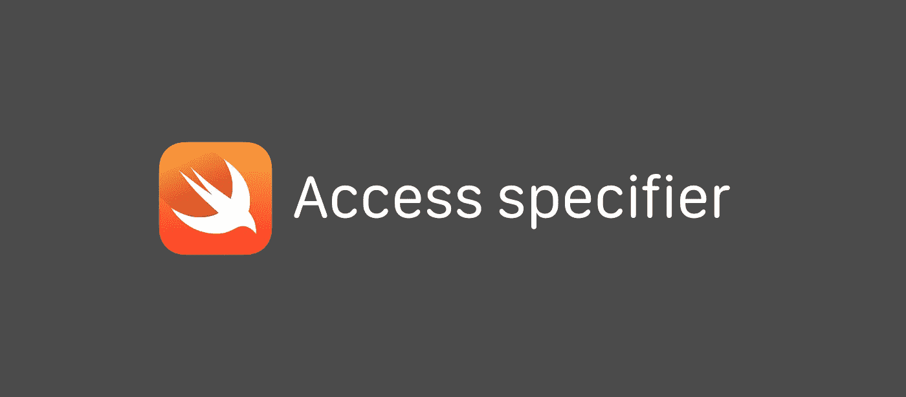

# Swift 中的访问说明符

> 原文：<https://medium.com/analytics-vidhya/access-specifier-in-swift-4c6698eb3577?source=collection_archive---------0----------------------->

## 控制代码的可访问性



## 什么是访问说明符？

访问说明符是帮助代码块的*访问控制的关键字。*访问控制*限制其他源文件和模块中的代码对您的代码部分的访问。*

> 封装是面向对象编程的一个支柱，访问说明符有助于封装。

**什么是封装？**

封装被定义为将数据包装在一个单元下。它是将代码和它所处理的数据绑定在一起的机制。考虑封装的另一种方式是，它是一个保护屏障，防止数据被屏障外的代码访问。

# swift 中的访问级别类型

## 1.开放和公开:

允许在定义模块(目标/框架)之外使用实体。当指定框架的公共接口时，通常使用`open`或`public`访问。

然而，`**open**` **访问只适用于类和类成员**，它与`public`访问的区别如下:

*   `open`类和类成员可以在定义模块(目标/框架)内外被子类化和覆盖。
*   `public`类和类成员只能在定义模块(目标/框架)内被子类化和覆盖。

> 像开放访问级别一样，公共访问级别允许在定义模块(目标)之外使用实体。但是开放访问级别允许我们从另一个模块中继承它，而在公共访问级别，我们只能从定义它的模块中继承或重写它。

```
//First.framework – A.swiftopen class A {}//First.framework – B.swiftpublic class B: A {} // ok//Second.framework – C.swiftimport First
internal class C: A {} // ok//Second.framework – D.swiftimport First
internal class D: B {} // error: B cannot be subclassed
```

## 2.私人:

将实体的使用限制在其封闭声明中。当那些细节仅在单个声明中使用时，通常使用`private` access 来隐藏特定功能的实现细节。

```
// First.framework – A.swiftinternal struct A {
  private static let x: Int internal static func doSomethingWithX() {
    x // ok
  }
}A.x // error: x is unavailable
```

## 3.文件私有:

将实体的使用限制在其定义源文件中。当在整个文件中使用这些细节时，通常使用`fileprivate` access 来隐藏特定功能的实现细节。

```
// First.framework – A.swiftinternal struct A { fileprivate static let x: Int}A.x // ok// First.framework – B.swiftA.x // error: x is not available
```

## 4.内部:

允许在定义模块(目标)中使用实体。在定义应用程序或框架的内部结构时，通常会使用`internal` access。

```
// First.framework – A.swiftinternal struct A {
  fileprivate static let x: Int
}// First.framework – A.swiftinternal struct A {}// First.framework – B.swiftA() // ok // Second.framework – C.swiftimport First
A() // error: A is unavailable
```

**注意:**swift 中的默认访问说明符是**内部，**那么 **final** 怎么样我们来读一下这篇[文章](/@anilkotur/final-in-swift-625b534b2412)。

感谢您的阅读👏🏻。请点赞并分享，让更多工程师了解这一点。