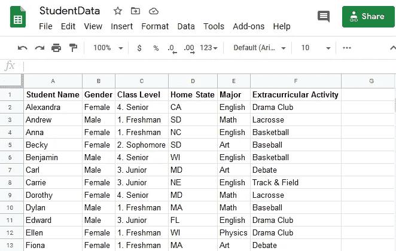

# 使用 Python 访问 Google Sheets

> 原文：<https://medium.com/analytics-vidhya/accessing-google-sheets-using-python-2ceb3b5cd3ab?source=collection_archive---------11----------------------->

使用熊猫数据框架读/写 Google 工作表


在本文中，我将解释使用 python 读写 google sheets 的选项。Google Sheets API 允许我们读取和修改电子表格的任何方面。使用 Python 访问此功能并链接到 Python 数据帧有助于我们实现自动化并进行更多的数据分析。

## 安装所需的软件和库:

在进入实现这一目标的步骤之前，我们需要具备以下条件:

*   Python 2.6 或更高版本:我更喜欢安装 [Anaconda 个人版、](https://docs.anaconda.com/anaconda/install/)，因为它有 Python 发行版和 [pip](https://pypi.python.org/pypi/pip) 包管理工具。创建 Python 开发环境的说明可以在我的[上一篇文章](/@nsanka/create-development-environment-with-vs-code-fe66f3892159)中找到。
*   Pandas 和 Google 客户端库:一旦我们有了 Python 和 pip，我们就可以在终端/命令提示符下安装所需的库，如下所示:

```
pip install --upgrade pandas
pip install google_spreadsheet google-auth-oauthlib
```

## Google 云平台和 Google Sheets API

因为我们需要启用作为谷歌云平台(GCP)一部分的谷歌工作表 API，首先我们需要激活 GCP。访问 [GCP 控制台](https://console.cloud.google.com/)页面，使用您的谷歌帐户登录，并接受条款以激活您的帐户。激活您的 GCP 帐户后，点击左侧菜单中的“API&服务”,并选择 OAuth 同意屏幕。根据您的选择选择内部或外部，然后单击创建。输入应用程序名称并保存。我们需要创建凭证来使用 API。单击左侧菜单中的“凭据”，然后单击“创建凭据”并选择“OAuth 客户端 ID”。选择“桌面应用程序”作为应用程序类型，并输入应用程序的正确名称。当您按下创建按钮，它将显示客户端 ID 和客户端密码，我们将在稍后使用。单击 Credentials 页面中的 download 按钮，保存 JSON 文件。

## 获取 Google 工作表 ID

我们安装了所需的库并启用了 Google Sheets API。我们需要获得想要在 Python 代码中访问的 Google Sheet ID。在浏览器窗口中打开 Google Sheet，然后单击绿色的 share 按钮。



这将打开权限页面，根据您的需要更改权限以允许任何人查看或编辑链接。从生成的链接中复制工作表 ID，该链接在下图中突出显示(黄色)。


我们完成了所有需要的步骤，现在我们可以开始编写 Python 代码了。

## 使用 Python 阅读 Google Sheet

复制下面的代码，并相应地更新用户输入部分之间的代码。

```
import os
import sys
import pickle
import pandas as pd
from __future__ import print_function
from googleapiclient.discovery import build
from google_auth_oauthlib.flow import InstalledAppFlow
from google.auth.transport.requests import Request# If modifying these scopes, delete the file token.pickle.
SCOPES = ['[https://www.googleapis.com/auth/spreadsheets'](https://www.googleapis.com/auth/spreadsheets')]# Get the script path
srcDir = os.path.abspath(os.path.dirname(sys.argv[0]))#### USER INPUT ####
credentialFile = os.path.join(srcDir, 'credentials.json')
# The ID and range of a sample spreadsheet.
sheetID = '1KuUE8Ifhh6HoOg_tXGIlc3_LcZyrHkTMBLvlFffqMTM'
dataRange = 'Sheet1!A1:F31'
#### END USER INPUT ####def Create_Service(client_secret_file, api_service_name, api_version, *scopes):
    SCOPES = [scope for scope in scopes[0]]
    print(SCOPES)

    cred = None
    # The file token.pickle stores the user's access and refresh tokens, and is
    # created automatically when the authorization flow completes for the first
    # time.
    if os.path.exists('token.pickle'):
        with open('token.pickle', 'rb') as token:
            cred = pickle.load(token)
    # If there are no (valid) credentials available, let the user log in.
    if not cred or not cred.valid:
        if cred and cred.expired and cred.refresh_token:
            cred.refresh(Request())
        else:
            flow = InstalledAppFlow.from_client_secrets_file(client_secret_file, SCOPES)
            cred = flow.run_local_server()with open('token.pickle', 'wb') as token:
            pickle.dump(cred, token)try:
        service = build(api_service_name, api_version, credentials=cred)
        print(api_service_name, 'service created successfully')
        return service
    except Exception as e:
        print(e)
        return Nonedef get_google_sheet_data():
    """Shows basic usage of the Sheets API.
    Retruns the Google Sheet data as Pandas DataFrame.
    """
    service = Create_Service(credentialFile, 'sheets', 'v4', SCOPES)# Call the Sheets API
    sheet = service.spreadsheets()
    result = sheet.values().get(spreadsheetId=sheetID, range=dataRange).execute()
    values = result.get('values', [])if not values:
        print('No data found.')
        return None
    else:
        df=pd.DataFrame(values[1:], columns=values[0])
        return dfif __name__ == '__main__':
    sheet_df = get_google_sheet_data()
```

在您的 python 环境中运行这段代码将从 Google 工作表中读取数据，并创建一个数据帧‘Sheet _ df’。我们可以用令人惊奇的熊猫数据框来分析这些数据。如果我们观察这个代码，我们在这个代码中所做的一切如下:

1.  导入必要的模块/库。
2.  定义范围，这将使我们只能读取或读/写工作表。
3.  为要运行的代码定义用户输入，例如 Google Sheet API 凭证 JSON 文件、Google Sheet ID 和 Google Sheet 中的数据范围。
4.  验证 Google API。当我们运行代码时,“Create_Service”功能将在浏览器中打开 Google 身份验证 URL，要求我们使用我们的帐户登录并接受权限。这些凭据保存在“token.pickle”文件中以供下次使用，该文件将在它们过期时更新。
5.  调用 Google Sheet API 来读取所需的数据。
6.  创建熊猫数据帧，并将其返回供进一步分析。

## 使用 Python 编写 Google Sheet

为了写入 Google 工作表，首先我们需要通过更改共享首选项使工作表可编辑，并选择“编辑器”而不是“查看器”,然后复制工作表 ID。

将以下代码添加到 python 文件中，并根据您的要求更新值。

```
def append_google_sheet_data(values, value_input_option):
    body = {
        'values': values
    }
    service = Create_Service(credentialFile, 'sheets', 'v4', SCOPES)# Call the Sheets API
    sheet = service.spreadsheets()
    result = sheet.values().append(spreadsheetId=sheetID, range=dataRange, valueInputOption=value_input_option, body=body).execute()
    print('{0} cells appended.'.format(result \
                                           .get('updates') \
                                           .get('updatedCells')))values = [
    ["Name1", "Male", "4\. Senior", "CA", "English", "Basketball"],
    ["Name2", "Female", "3\. Junior", "MA", "Math", "Baseball"],
]
append_google_sheet_data(values, "RAW")
```

调用“append_google_sheet_data”函数会将值追加到工作表现有数据的末尾。请访问 [Google Sheet API 文档](https://developers.google.com/sheets/api/guides/values#python_4)了解更多选项。

## 参考资料:

*   [谷歌工作表 API Python 快速入门](https://developers.google.com/sheets/api/quickstart/python)
*   [为 Google API 构建服务实例的函数](https://learndataanalysis.org/create-a-function-to-construct-service-instance-for-google-api/)