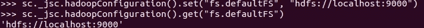
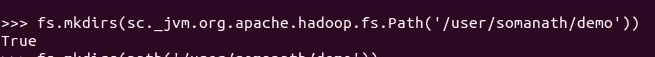
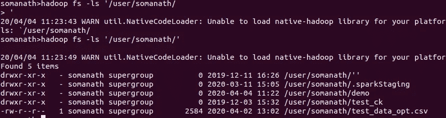
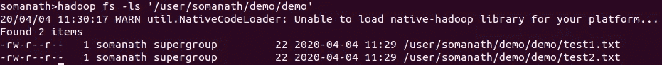
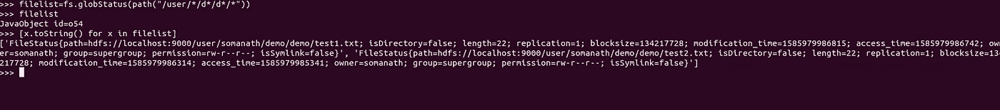
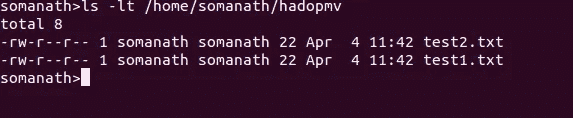

# 用 PYSPARK 访问 HADOOP 文件系统 API

> 原文：<https://medium.com/analytics-vidhya/accessing-hadoop-filesystem-api-with-pyspark-29cff901de51?source=collection_archive---------5----------------------->

这是我在《火花深潜》中的一个故事

[](/@somanathsankaran) [## 索玛纳特·桑卡兰培养基

### 阅读索马纳特·桑卡兰在媒介上的作品。对 python 和 spark 感兴趣的大数据开发者。每天，索马纳特…

medium.com](/@somanathsankaran) 

Spark 是一个并行处理框架，位于 Hadoop 文件系统之上。因此，很少有需要处理 hadoop 文件系统的常见用例。让我们详细看看下面的内容

1.  Hadoop 文件系统 API
2.  用 Pyspark 访问 Hadoop 文件系统 API
3.  Hadoop 文件系统 API 的常见用例

**Hadoop 文件系统 API:**

它是 Java 中的一个抽象类，可用于访问分布式文件系统。

 [## 文件系统(Apache Hadoop 主 2.8.2 API)

### 所有可能使用 Hadoop 分布式文件系统的用户代码都应该编写为使用文件系统对象…

hadoop.apache.org](https://hadoop.apache.org/docs/r2.8.2/api/org/apache/hadoop/fs/FileSystem.html) 

因为它是一个抽象类，所以它有一个 get 方法，该方法需要文件系统的配置，并且它返回一个静态文件系统类，该类将用于访问 hadoop 文件系统，我们将使用它来做一些常见的操作，如 ls、copyToLocalFile

```
public static [FileSystem](https://hadoop.apache.org/docs/r2.8.2/api/org/apache/hadoop/fs/FileSystem.html) get([Configuration](https://hadoop.apache.org/docs/r2.8.2/api/org/apache/hadoop/conf/Configuration.html) conf)
                      throws [IOException](http://docs.oracle.com/javase/7/docs/api/java/io/IOException.html?is-external=true)
```

**使用 Pyspark 访问 Hadoop 文件系统 API**

在 pyspark 中，不像在 scala 中，我们可以直接导入 java 类。

在 pyspark 中，它在 Py4j.java_gateway JVM 视图下可用，在 sc 下可用。_jvm

**第一步:导入抽象类**

我们可以导入抽象类


**第二步:创建静态类**

在传递 hadoop conf 之前，我们必须检查 spark 与 hadoop uri 的集成是否正确


例如，在我的例子中，这不是指向 hadoop 文件系统。因此，我将把它设置为 hadoop 文件系统(这是可选的，因为在大多数生产系统中它将被设置)



下一步是通过传递这个 hadoop conf 对象来创建静态类


**Hadoop 文件系统 API 的常见用例**

让我们看看下面的用例

1.  制作目录
2.  从本地复制文件
3.  列出 hdfs 目录

4.复制到本地

制作目录

我们可以用 mkdirs 来制作 dir

```
public boolean mkdirs([Path](https://hadoop.apache.org/docs/r2.8.2/api/org/apache/hadoop/fs/Path.html) f)
               throws [IOException](http://docs.oracle.com/javase/7/docs/api/java/io/IOException.html?is-external=true) 
```

我们也将从同一个 jvm 中导入路径类



并用 hadoop fs -ls 进行了验证



**从本地复制文件**

```
public void copyFromLocalFile([Path](https://hadoop.apache.org/docs/r2.8.2/api/org/apache/hadoop/fs/Path.html) src,
                     [Path](https://hadoop.apache.org/docs/r2.8.2/api/org/apache/hadoop/fs/Path.html) dst)
                       throws [IOException](http://docs.oracle.com/javase/7/docs/api/java/io/IOException.html?is-external=true) 
```

因为我们需要从本地文件复制，所以使用了:///文件


检查文件是否存在



**列出 hdfs 目录**

我们可以使用 glob status 来匹配所有带有 glob 模式的目录，如下所示。

```
public [FileStatus](https://hadoop.apache.org/docs/r2.8.2/api/org/apache/hadoop/fs/FileStatus.html)[] globStatus([Path](https://hadoop.apache.org/docs/r2.8.2/api/org/apache/hadoop/fs/Path.html) pathPattern)
                        throws [IOException](http://docs.oracle.com/javase/7/docs/api/java/io/IOException.html?is-external=true)
```

这将返回一个 java 对象，我们可以使用列表理解来获取文件的属性



**复制到本地**

```
public void copyToLocalFile([Path](https://hadoop.apache.org/docs/r2.8.2/api/org/apache/hadoop/fs/Path.html) src,
                   [Path](https://hadoop.apache.org/docs/r2.8.2/api/org/apache/hadoop/fs/Path.html) dst)
                     throws [IOException](http://docs.oracle.com/javase/7/docs/api/java/io/IOException.html?is-external=true)
```


检查它是否被复制到本地



今天就到这里吧！！:)

Github 链接:[https://github . com/SomanathSankaran/spark _ medium/tree/master/spark _ CSV](https://github.com/SomanathSankaran/spark_medium/tree/master/spark_csv)

***请把我在 spark 中必须涉及的话题发给我，并给我提供改进写作的建议:)***

**学习并让别人学习！！**