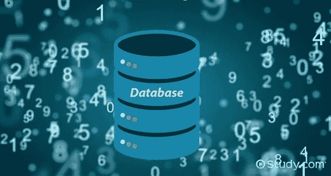

# 从 Python 程序访问 MySQL 数据库

> 原文：<https://medium.com/analytics-vidhya/accessing-mysql-database-from-a-python-program-a948823d08a8?source=collection_archive---------21----------------------->

数据库是存储在计算机系统中的数据集合，通常使用电子技术进行访问。数据库管理系统是用来控制这些数据库的。

MySQL 是许多 web 开发人员中流行的数据库管理系统。大多数虚拟主机提供商已经在他们的 web 服务器上安装了 MySQL，因为它是 LAMP (Linux、Apache、MySQL、PHP / Python)堆栈的一部分，LAMP 是一套开源软件，可用于创建网站和 web 应用程序。在这里，我将展示一些从 python 程序访问数据库的基础知识。

## **安装 MySQL**

如果你已经安装了 MySQL，可以跳过这一部分。

首先，你必须转到以下链接。

 [## MySQL::下载 MySQL 安装程序

### MySQL 安装程序为您的所有 MySQL 软件需求提供了易于使用、基于向导的安装体验…

dev.mysql.com](https://dev.mysql.com/downloads/installer/) 

然后你可以选择合适的软件包下载。

下载文件后，您必须在合适的目录中找到它，并创建一个配置文件，如下所示。

创建此文件并另存为。ini 文件

然后以管理员身份运行命令提示符。

首先使用命令提示符获取 bin 文件并初始化服务器。

如果成功，您将获得一个临时密码。

然后，您应该使用以下命令安装服务器。要使用此安装命令，您必须以管理员身份运行 cmd，否则您将得到一条错误消息。

您应该检查服务器是否作为服务运行。如果没有，你必须运行它。

然后，您可以使用上述临时密码，并连接到服务器。

最后，您可以使用下面的 alter user 命令为服务器设置一个新密码。

您可以使用命令“show databases”来测试该过程如上。

你现在都准备好了。

## **创建数据库**

我们必须创建一个数据库，并使用以下代码创建一个表。

之后，使用下面的命令在表中存储一些数据。

## 从 python 程序访问 MySQL

要访问 MySQL 数据库，您的系统上应该有 connector/python 包。如果你没有这个包，你可以从下面的链接下载。

【https://dev.mysql.com/downloads/ 

或者您可以在 cmd 上使用这个命令。

**C:\ Users \ Your Name \ AppData \ Local \ Programs \ Python \ Python 36–32 \ Scripts>Python-m pip install MySQL-connector-Python**

然后将连接器文件放在程序文件中的 MySQL 文件夹中。

从这篇文章中你可以找到知识，

*   创建数据库，
*   创建表格，
*   插入数据，
*   检索数据。

在 python 程序中尝试以下代码，并检查连接器是否正常工作。

如果连接器工作正常，我们可以创建一个数据库。

在 python 程序中使用该数据库。

之后，您可以向数据库添加一些表。然后将数据插入表中。

然后，您可以通过 python shell 查看您的表。

最后，您可以使用以下代码打印添加到表格中的数据。