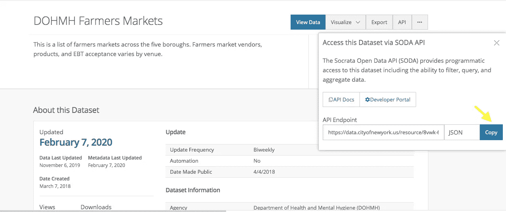

# 使用应用程序令牌访问纽约开放数据 API

> 原文：<https://medium.com/analytics-vidhya/accessing-nyc-open-data-apis-with-application-tokens-6b004f8a27c8?source=collection_archive---------20----------------------->


[https://opendata.cityofnewyork.us/](https://opendata.cityofnewyork.us/)

纽约市开放数据收集了来自该市各机构和组织的近 23，000 个(并且还在不断增加)免费公共 API。从餐馆的字母等级到公共绿地和公园，我们在日常城市生活中遇到的许多信息都被组织成数据。在这里，我们将介绍如何开始访问这些数据。

# **入门**

前往[open data . cityofnewyork . us](http://opendata.cityofnewyork.us)

搜索您感兴趣的数据集(例如，地铁入口、流行的婴儿名字、空地公园)。


在纽约开放数据上搜索“农贸市场”API

在“搜索结果”页面上，选择所需的数据集，这将带您了解有关所选数据集的其他信息。在右上角，选择“API”选项卡。


[opendata.cityofnewyork.us/](https://opendata.cityofnewyork.us/)

在那里，您将看到更多信息，包括通过 Socrata 开放数据 API (SODA)到该数据集的 API 文档和开发人员门户的链接。SODA 基本上为开发者和研究人员提供了大量与政府和非盈利组织相关的文档(就像你一样！)更容易地访问数据。你以后会感谢他们的。

您应该看到返回 JSON 数据的 API 端点。复制并粘贴到一个新的浏览器窗口:



复制端点！


瞧啊。您将拥有完整的数据集。从这里，您可以进行获取、ajax 调用等。来开始用这些数据编码。但是首先…

# **应用令牌**

现在，在你制作一个对这个 API 有大量请求的应用程序之前，你应该考虑一个应用程序令牌。

如果没有**应用程序令牌**，SODA 会限制您可以向 API 发出的请求数量。但是对于应用程序令牌，节流限制要高得多——高达每小时 1000 个请求——所以您不太可能被切断。

你可以[在这里](https://dev.socrata.com/docs/app-tokens.html)阅读更多关于应用令牌的信息。一旦你创建了一个账户，你就可以[注册你的应用](https://dev.socrata.com/register)(免费且简单——只需给你的应用一个名字和描述)。保存它，您将在那里看到您闪亮的新应用程序令牌。我们一会儿就会回到那个令牌。

# 使用应用程序令牌

复制您最初使用的 API 端点，并向其中添加以下内容:

```
?$$app_token=YOUR_TOKEN_HERE
```


在您的 _TOKEN_HERE 处，粘贴您的特定应用程序令牌。现在，所有这些看起来应该是这样的:


这不是真正的令牌，不要试图使用它:)

瞧啊。结果与第一次相同，但是这一次您几乎没有受到节流限制的限制。

*资源*

[*opendata . cityofnewyork . us*](http://opendata.cityofnewyork.us)

[*https://dev.socrata.com/*](https://dev.socrata.com/)