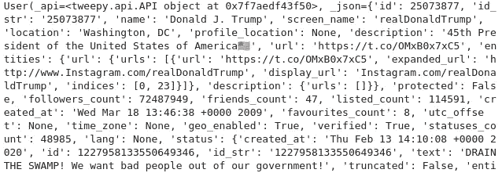
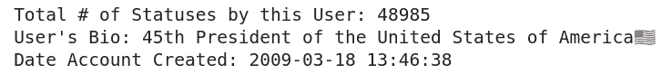
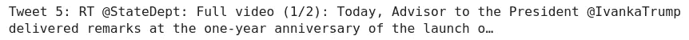

# 使用 Tweepy 访问 Twitter API

> 原文：<https://medium.com/analytics-vidhya/accessing-the-twitter-api-with-tweepy-8421329afc5c?source=collection_archive---------17----------------------->

Twitter 每天收集 12tb 的数据，每年大约 4.3，这是一个很大的数据量。事实上，每分钟有 45.6 万条推文。并非所有这些数据都对公众开放，但事实证明，数量惊人。有几种不同的方法可以访问这些数据，但是我发现对我来说最简单的方法是使用包 [Tweepy](http://docs.tweepy.org/en/v3.5.0/api.html) 访问 Twitter API。

通过这个包，可以很容易地访问用户数据或特定的 tweet 数据，并将其引入 python 以便于分析。这篇文章将引导你完成访问 Twitter API 的步骤。

## **1。申请访问 Twitter API &入门**

在使用 Twitter API 之前，您需要获得访问权限。遵循这些步骤。

1.  创建一个 [Twitter](https://twitter.com/home) 账户(如果你还没有的话)。
2.  前往开发者推特网站申请一个开发者账户。Twitter 花了大约一天半的时间批准了我的申请。
3.  一旦获得批准，您将不得不建立自己的开发环境，然后您将能够开始访问 API。

## 2.获取令牌和密钥/在 Python 中访问它们

为了访问 API，您将需要 4 个不同的令牌/密钥，您可以在开发环境的“密钥和令牌”选项卡中找到它们。

让我们通过导入必要的库来看看这一点。我将令牌保存在我电脑上的 JSON 文件中，以便隐藏它们。

```
import json # Define a function to open the json
def get_keys(path):
    with open(path) as f:
        return json.load(f)# Using the function to open and load all keys in that file 
access_token_get = get_keys("/home/twitter_access_token.json")
access_secret_get = get_keys("/home/twitter_secret_access_token.json")
consumer_key_get = get_keys("/home/twitter_api_consumer_key.json")
consumer_secret_get = get_keys("/home/twitter_api_secret_consumer_key.json")# Setting tokens/keys as variables
ACCESS_TOKEN = list(access_token_get.values())[0]
ACCESS_SECRET = list(access_secret_get.values())[0]
CONSUMER_KEY = list(consumer_key_get.values())[0]
CONSUMER_SECRET = list(consumer_secret_get.values())[0]
```

现在，每个令牌/密钥都存储在变量中。我们现在准备开始使用 [Tweepy](http://docs.tweepy.org/en/v3.5.0/api.html) 来获取一些数据。

## 3.使用 Tweepy 抓取数据

Tweepy 是一个免费的 Twitter 库，提供对整个 twitter RESTful API 方法的访问。我强烈建议查阅文档，因为不同的方法访问不同类型的数据，并且根据您的需要，一种方法可能比另一种更好。出于今天的目的，我将演示如何使用“get_user”方法获取特定用户的数据。具体来说，我们来看看唐纳德·特朗普的推特取乐。

```
#Tweepy Package
import tweepy#Connecting to the API
auth = tweepy.OAuthHandler(CONSUMER_KEY, CONSUMER_SECRET)
auth.set_access_token(ACCESS_TOKEN, ACCESS_SECRET)
api = tweepy.API(auth)#Accessing my account information
user = api.get_user(screen_name = 'realDonaldTrump')
print(user)
```



在短短几行代码中，你就有了相当多的用户数据。上面是使用“get_user”方法时捕获的一些用户数据的示例。现在让我们解析数据的几个部分。Tweepy 使得在这个 API 中获取特定数据变得非常容易——让我们看几个例子:

```
print('Total # of Statuses by this User:', user.statuses_count)
print("User's Bio:", user.description)
print("Date Account Created:", user.created_at)
```



很好，但现在让我们看看如何使用“user_timeline”方法获取用户的实际 tweet 数据。为此，您只需要两个参数，用户和您想要的 tweets 数量。让我们来看看特朗普最近的 10 条推文:

```
user_tweets = api.user_timeline(screen_name = 'realDonaldTrump', count = 10)#Print the 5th tweet
print('Tweet 5:', user_tweets[5].text)
```



这就是了。现在，您应该能够访问 Twitter 用户数据以及用户的特定推文。为了让这些数据容易地进入 eval 方法，你将不得不做一些循环，但是总的来说，这至少可以帮助你使用 Tweepy 包访问 Twitter 数据。