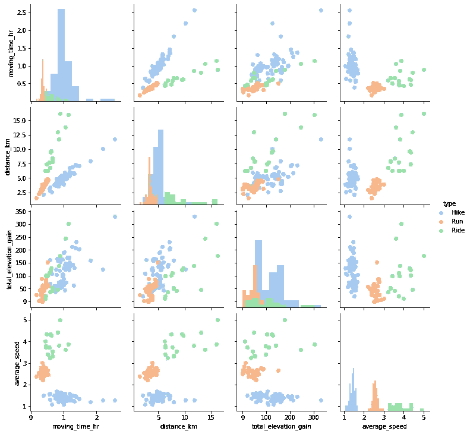
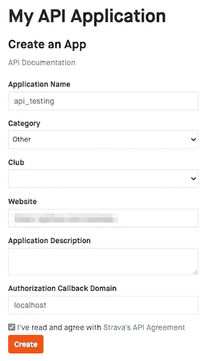
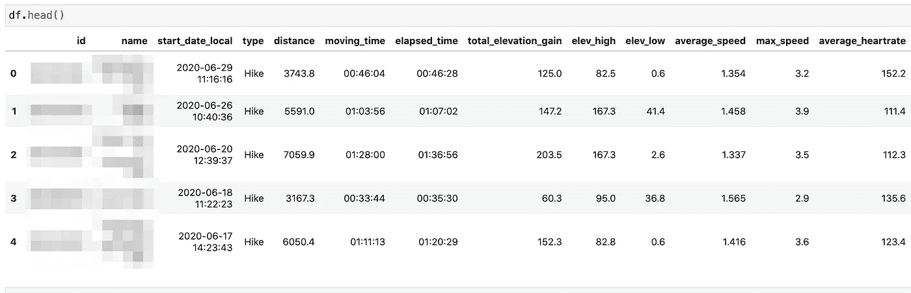
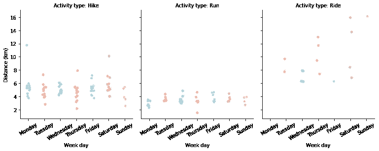

# 使用 stravalib 通过 Strava API 访问用户数据

> 原文：<https://medium.com/analytics-vidhya/accessing-user-data-via-the-strava-api-using-stravalib-d5bee7fdde17?source=collection_archive---------2----------------------->


由[在](https://unsplash.com/@toomastartes?utm_source=medium&utm_medium=referral) [Unsplash](https://unsplash.com?utm_source=medium&utm_medium=referral) 上拍摄的香椿果

对从 Strava API 获取数据感兴趣吗？在这篇博客中，我介绍了使用`stravalib` python 库访问 Strava 用户数据的过程；然后使用 pandas 和 seaborn 库进行一些初步分析。

在 github repo:[https://github.com/mandieq/strava_related](https://github.com/mandieq/strava_related)中可以找到 Jupyter 笔记本的代码

多年来，我一直使用 Strava 记录各种活动:跑步、骑自行车和徒步旅行。要明确的是，没有什么太硬核，但我总是有兴趣看看我做得有多好(或不好)!Strava 应用程序免费为您提供一些很好的见解，但我热衷于更详细地探索我的数据，使用 Strava API 下载它进行分析和可视化。



与直接使用 API 相反，我利用了 [stravalib](https://pythonhosted.org/stravalib/) python 库。起初，我在驯服 Strava 的 [OAuth 2.0](https://developers.strava.com/docs/getting-started/#oauth) 认证过程时遇到了一些问题——自从一些关于这个主题的博客(比如 Linda Farczadi 的 [this one](/epfl-extension-school/using-the-strava-api-and-python-d93d480490ef) )发表以来，这个认证过程已经发生了变化。Ryan Baumann 分享的代码对工作很有帮助。因此，我写了这篇短文来分享我的解决方案，以帮助其他有兴趣的人。

## 斯特拉瓦里图书馆

首先，简单介绍一下如何设置 stravalib 库。我通常使用 Anaconda 来管理我的 python 环境，但是通过 conda 获得的 stravalib 版本非常旧。所以我需要使用 pip 来代替:`pip install stravalib`。

## Strava 开发者帐户和 API 应用程序注册

流程的第一步是按照 [Strava 入门指南](https://developers.strava.com/docs/getting-started/)在[https://developers.strava.com/](https://developers.strava.com/)获得一个开发者账户。



接下来是创建一个 API 应用程序，您将使用它来执行 API 查询。您只需要最少的信息来创建它(参见示例)。网站字段是必填的，但可以是任何内容。

因为我只打算使用这个应用程序通过 API 访问我的数据，所以我将授权回调域设置为`localhost`。

一旦创建完成，你就拥有了一个客户端 ID 和你闪亮新应用的密码。我将这些复制到一个名为`client.secret`的文本文件中(都在一行上，用逗号分隔，没有空格)，需要时可以通过我的代码访问。

## 身份验证—一次性步骤

现在是“有趣”的部分！根据 [Oauth 文档](https://developers.strava.com/docs/getting-started/#oauth)，Strava 用户(又名“运动员”)有一个一次性认证流程，以批准应用程序访问他们的数据。因为我只打算访问我自己的数据，所以我通过一些一次性的手动步骤实现了这一点。

首先，导入 stravalib 库，创建一个`Client`实例，并读入之前保存的客户端 ID 和密码。

```
from stravalib.client import Client
client = Client()MY_STRAVA_CLIENT_ID, MY_STRAVA_CLIENT_SECRET = open('client.secret').read().strip().split(',')print ('Client ID and secret read from file'.format(MY_STRAVA_CLIENT_ID) )
```

接下来是一次性认证。为运动员创建一个 URL，用于批准从应用程序访问他们的数据。这里使用的`scope`真的很重要*(并且没有很好的文档记录！).如果您想要访问某个运动员的所有细节，那么您需要将此指定为`client.authorization_url`调用的一部分，否则`scope`默认为`public`。这取决于你的运动员的隐私设置，可能根本不会给你带来什么…

```
url = client.authorization_url(client_id=MY_STRAVA_CLIENT_ID, redirect_uri='[http://127.0.0.1:5000/authorization'](http://127.0.0.1:5000/authorization'), scope=['read_all','profile:read_all','activity:read_all'])
```

然后把这个网址分享给你的目标运动员(当然也可能是你自己)。然后，系统会提示运动员登录 Strava 网站，并同意其申请。然后是一个稍微手动的，但只有一次的步骤。如果你像我一样使用`localhost`,一旦同意，就会返回一个不会去任何地方的 URL。但这并不重要，因为它包括一个授权代码和运动员接受的范围的细节。

它看起来会像下面这样，您需要获取以粗体显示的授权代码(对我来说很好的老式复制和粘贴工作，而不是花费时间自动化这个步骤):

```
http://127.0.0.1:5000/authorization?state=&**code=xxxxxxxxxxxxxxxxxxxxxxxxxxxxxxxxxxxxxxx**&scope=read,activity:read_all,profile:read_all,read_all
```

记住——这是唯一的一步！这也是检查范围是否如您所料的好时机。否则，您的数据分析可能会非常有限…

此授权码需要与访问令牌进行交换。从这一点开始，这个持续 6 小时的访问令牌将成为您访问数据所需要的。因此，我们将其保存在本地，以便根据需要重新读取和刷新:

```
CODE = 'xxxxxxxxxxxxxxxxxxxxxxxxxxxxxxxxxxxxxxx'access_token = client.exchange_code_for_token(client_id=MY_STRAVA_CLIENT_ID, client_secret=MY_STRAVA_CLIENT_SECRET, code=CODE)with open('../access_token.pickle', 'wb') as f:
    pickle.dump(access_token, f)
```

## 访问数据—令牌加载和刷新

所以我们到了好的部分，那就是访问数据。一旦一次性身份验证完成(按照前面的部分)，我们只需加载运动员的访问令牌，如果过期，则进行刷新。

首先，从文件中打开令牌:

```
with open('../access_token.pickle', 'rb') as f:
    access_token = pickle.load(f)

print('Latest access token read from file:')
access_token
```

然后检查它何时到期，并在需要时刷新，同时将刷新后的版本保存到文件中以备将来使用。

```
if time.time() > access_token['expires_at']:
    print('Token has expired, will refresh') refresh_response = client.refresh_access_token(client_id=MY_STRAVA_CLIENT_ID, client_secret=MY_STRAVA_CLIENT_SECRET, refresh_token=access_token['refresh_token'])
    access_token = refresh_response with open('../access_token.pickle', 'wb') as f:
        pickle.dump(refresh_response, f)
    print('Refreshed token saved to file') client.access_token = refresh_response['access_token']
    client.refresh_token = refresh_response['refresh_token']
    client.token_expires_at = refresh_response['expires_at']

else:
    print('Token still valid, expires at {}'
          .format(time.strftime("%a, %d %b %Y %H:%M:%S %Z", time.localtime(access_token['expires_at'])))) client.access_token = access_token['access_token']
    client.refresh_token = access_token['refresh_token']
    client.token_expires_at = access_token['expires_at']
```

现在事情变得令人兴奋。让我们看看运动员的一些基本信息，比如姓名和位置，以检查一切是否正常(这里还有很多其他信息，使用`athlete.to_dict()`将其全部转储):

```
athlete = client.get_athlete()
print("Athlete's name is {} {}, based in {}, {}"
      .format(athlete.firstname, athlete.lastname, athlete.city, athlete.country))
```

## 访问数据—活动

然后我们可以开始观察我们运动员的活动；我们请求最近的 1000 项活动，然后列出前 10 项:

```
activities = client.get_activities(limit=1000)
list(activities)[0:10]
```

我们可以用这些活动的细节创建一个熊猫数据框架。首先定义数据集中感兴趣的字段——同样，您可以使用`.to_dict()`函数查看下载的活动中有哪些可用的字段。

```
my_cols =['name',
          'start_date_local',
          'type',
          'distance',
          'moving_time',
          'elapsed_time',
          'total_elevation_gain',
          'elev_high',
          'elev_low',
          'average_speed',
          'max_speed',
          'average_heartrate',
          'max_heartrate',
          'start_latitude',
          'start_longitude']
```

接下来遍历活动并创建一个包含细节的数组。我还为每个活动添加了`id`,因为我在后面的分析中使用它来绘制路线:

```
data = []
for activity in activities:
    my_dict = activity.to_dict()
    data.append([activity.id]+[my_dict.get(x) for x in my_cols])

# Add id to the beginning of the columns, used when selecting a specific activity
my_cols.insert(0,'id')
```

最后，编写数据框架，并进行一些数据操作，以创建一些感兴趣的新字段，并为绘图的日期和持续时间获取正确的数据类型:

```
df = pd.DataFrame(data, columns=my_cols)# Make all walks into hikes for consistency
df['type'] = df['type'].replace('Walk','Hike')# Create a distance in km column
df['distance_km'] = df['distance']/1e3# Convert dates to datetime type
df['start_date_local'] = pd.to_datetime(df['start_date_local'])# Create a day of the week and month of the year columns
df['day_of_week'] = df['start_date_local'].dt.day_name()
df['month_of_year'] = df['start_date_local'].dt.month# Convert times to timedeltas
df['moving_time'] = pd.to_timedelta(df['moving_time'])
df['elapsed_time'] = pd.to_timedelta(df['elapsed_time'])# Convert timings to hours for plotting
df['elapsed_time_hr'] = df['elapsed_time'].astype(int)/3600e9
df['moving_time_hr'] = df['moving_time'].astype(int)/3600e9
```

现在你知道了！提取感兴趣的见解的绝佳起点:



生成的数据帧的示例(在此视图中许多列不可见)

例如，在一周的特定日子里，我的活动距离更远吗？显然在某种程度上骑自行车，徒步旅行和跑步不多。

```
day_of_week_order = ['Monday', 'Tuesday', 'Wednesday', 'Thursday', 'Friday', 'Saturday', 'Sunday' ]g = sns.catplot(x='day_of_week', y='distance_km', kind='strip', data=df, order=day_of_week_order, col='type', height=4, aspect=0.9, palette='pastel')(g.set_axis_labels("Week day", "Distance (km)")
  .set_titles("Activity type: {col_name}")
  .set_xticklabels(rotation=30));
```



按类型和星期几划分的活动距离

## 访问数据-绘制路线

最后，每个活动都有各种各样的可用数据(显然取决于您在进行实际活动时选择的小工具记录的内容):

```
'time', 'distance', 'latlng', 'altitude', 'velocity_smooth', 'moving', 'grade_smooth'
```

所以使用`folium`绘制路线就像下面这样简单。首先为感兴趣的活动请求数据流——使用`get_activity_streams()`函数。在本例中，我们选择最新的活动。请注意，这需要之前添加到数据帧中的活动的`id`。

```
activity_number=0types = ['time', 'distance', 'latlng', 'altitude', 'velocity_smooth', 'moving', 'grade_smooth']activity_data=client.get_activity_streams(df['id'][activity_number], types=types)
```

然后将输出绘制到地图上。轻松点。

```
map = folium.Map(location=[df['start_latitude'][activity_number], 
                 df['start_longitude'][activity_number]],
                 zoom_start=14,
                 width='100%'
                )folium.PolyLine(activity_data['latlng'].data).add_to(map)
map
```

正如前面提到的，这段代码可以在下面的 Jupyter 笔记本中找到: [stravalib_sample.ipynb](https://github.com/mandieq/strava_related/blob/master/stravalib_sample.ipynb)

还有更多可用的功能；这个帖子只是为了帮助其他人快速入门，所以看看吧，了解更多！感谢阅读。