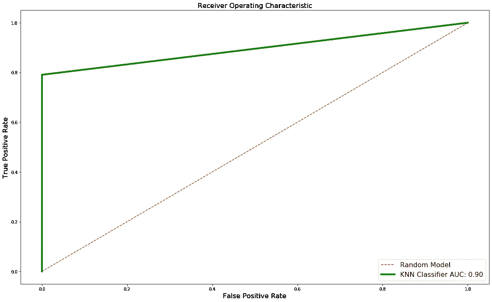

# 信用卡欺诈检测中的准确性谬误

> 原文：<https://medium.com/analytics-vidhya/accuracy-fallacy-in-credit-card-fraud-detection-146abafb54bf?source=collection_archive---------0----------------------->

## 了解用于分类的指标


在发布我上一个项目的第二部分之前，[分类器](/@harjotspahwa/the-classifier-part-1-2-18f3c70d01fe)我想我应该写一下用于分类的度量标准，以及为什么一个模型尽管有 99%的准确率却可能毫无用处。现在，这个准确性谬误是什么，应该使用什么度量来评估模型？在我回答这些问题之前，让我们先来探索一下数据。这里，我使用了一个经典的例子，我们预处理了信用卡交易的数据。数据集没有空值，并且已经进行了要素缩放。所以我只是在绘制了热图之后，从数据中提取了有用的特征。


最初，数据集中有 31 列，在分析数据后，只剩下 12 列，其中 1 列是包含交易是否欺诈的类变量。

```
new_features =['V1' ,'V3' ,'V4' ,'V7' ,'V10' ,'V11' ,'V12' ,'V14' ,'V16','V17','V18','Class']
```

现在，我使用新功能再次绘制了热图:


我们看到类的行和列更暗，更亮。这意味着我们新数据集中的所有变量都有显著的影响。现在，让我们将数据分成测试集和训练集:

```
from sklearn.model_selection import train_test_split
x_train, x_test, y_train, y_test = train_test_split(x, y, test_size = 0.25, random_state = 0)
```

此外，让我们看看在我们的测试和训练集中欺诈和安全案例的数量:

```
#Let's see how many safe and fraudulent cases are there in training set 
safe_train=(y_train==0).sum()
fraud_train=(y_train==1).sum()
print("Safe: {} \nFraud: {}".format(safe_train,fraud_train))Output:
Safe: 213242 
Fraud: 363#Let's see how many safe and fraudulent cases are there in test set 
safe_test=(y_test==0).sum()
fraud_test=(y_test==1).sum()
print("Safe: {} \nFraud: {}".format(safe_test,fraud_test))Output:
Safe: 71073 
Fraud: 129
```

**剧透警告:**你看到欺诈案件数量和安全案件数量之间的巨大差异了吗？

让我们尝试使用逻辑回归:

```
from sklearn.linear_model import LogisticRegression
from sklearn.metrics import accuracy_score,classification_report, confusion_matrix#Using Logistic Regression 
clf = LogisticRegression(random_state = 0)
clf.fit(x_train, y_train)
```

之后，让我们预测和评估我们的模型:

```
#Let's evaluate our model 
y_pred = clf.predict(x_test)
print("Training Accuracy: ",clf.score(x_train, y_train))
print("Testing Accuracy: ", clf.score(x_test, y_test))
cm = confusion_matrix(y_test, y_pred)
print(cm)
print(classification_report(y_test,y_pred))Output:
Training Accuracy:  0.9991432784813089
Testing Accuracy:  0.9991432824920649
[[71069     4]
 [   57    72]]
              precision    recall  f1-score   support

           0       1.00      1.00      1.00     71073
           1       0.95      0.56      0.70       129

    accuracy                           1.00     71202
   macro avg       0.97      0.78      0.85     71202
weighted avg       1.00      1.00      1.00     71202
```

你看到了什么？

如果我们看看测试集上的准确度，它接近 0.99914，即超过 99.9%的准确度。这是否意味着我们的模型是非凡的？不要！在此之前，让我告诉你二元分类的混淆矩阵代表什么我们在实际值和预测值之间建立了一个矩阵，所以行代表实际值，列代表预测值。现在你知道了什么是行和列，让我们理解每个单元格代表什么，因此:

1.  [0][0] ->真阳性，即我们的模型正确预测了多少个安全案例。这里 71069 是正确预测的安全病例数。
2.  [0][1] ->假阴性，即有多少安全案例是我们的模型预测错误的。这里有 4 个错误分类的安全案例。因此，4 个保险箱被误归类为欺诈。这种做法潜在的危险较小，因为最好在欺诈可能性极小的情况下停止一些安全的交易。
3.  [1][0] ->误报，即有多少欺诈案例是我们的模型预测错误的。这里有 57 个错误分类的欺诈案例。这里有 57 个欺诈案例被误归类为安全案例。这是非常危险的，因为我们让欺诈案件通过。这会给组织带来巨大的损失。
4.  [1][1] ->真正的否定，即我们的模型正确预测了多少欺诈案例。这里有 72 个被正确预测的欺诈案例。


我们可以看到，尽管准确率超过 99.9%，但我们的模型错误地预测了 57 起欺诈案件(近 44%)。这就是我所说的准确性谬误。这通常发生在数据分布不均匀的情况下。从上面的代码中，我们意识到训练集中欺诈案例的数量仅为 363，而安全案例的数量为 213242。这是非常不均匀的分布，将提供很大的准确性，但错误分类的危险类别。

为了给你一个视角，让我把所有的欺诈案例进行错误分类。让我们预测每种情况都是安全的，因此我们测试集的混淆矩阵如下:

```
[[71073     0]
 [129       0]] 
```

因此，新的准确度= 71073/(71073 + 129) = 0.9981，接近 99.8%的准确度。**再次伟大的准确性，可怕的表现。**

# 那么我们如何衡量模型性能呢？

答案是精度、召回率、f1 评分、AUC-ROC 曲线。让我们一个一个来看:


图片来源:维基百科

**精度:**精度是指相关结果的百分比，计算方法如下:

```
True Positives/(True Positives + Flase Positives)
```

**:召回:**召回是指被你的算法正确分类的相关结果占总结果的百分比，计算方法如下:

```
True Positives/(True Positives + False Negatives)
```

**F1 得分:**它是精确度和召回率的调和平均值，计算方法如下:

```
(2 x Precision x Recall)/(Precision + Recall)
```

*因此 F1 分数越高，模型越好*

**AUC-ROC 曲线(曲线下面积-受试者操作特征曲线):**真阳性率(TPR)是分类器预测概率相对于假阳性率(FPR)的图。然后，计算地块下的面积。曲线下的面积越大，我们的模型就越好。

```
TPR is also knowns as recall and hence = True Positives/(True Positives + False Negatives)FPR is negation of specificity = 1 - Specificity = 1- True Negatives/(True Negatives + False Positives)Hence FPR = False Positives/(True Negatives + False Positives)
```

让我们绘制 ROC 曲线并找出 AUC:


我们看到 AUC 为 0.78，这还不错，不是很大，但足够公平。

让我们试试监督异常检测算法 KNN。我用异常检测算法来寻找数据中不寻常的模式。由于数据很不平衡，数据中一定有一些不寻常的模式，让我们试试 K 最近邻算法

```
from sklearn.neighbors import KNeighborsClassifier
clf = KNeighborsClassifier(n_neighbors = 5, metric = 'minkowski', p = 2)
clf.fit(x_train, y_train)
y_pred = clf.predict(x_test)
print("Training Accuracy: ",clf.score(x_train, y_train))
print("Testing Accuracy: ", clf.score(x_test, y_test))
cm = confusion_matrix(y_test, y_pred)
print(cm)
print(classification_report(y_test,y_pred))Output:
Training Accuracy:  0.9996161138550128
Testing Accuracy:  0.9995084407741356
[[71065     8]
 [   27   102]]
              precision    recall  f1-score   support

           0       1.00      1.00      1.00     71073
           1       0.93      0.79      0.85       129

    accuracy                           1.00     71202
   macro avg       0.96      0.90      0.93     71202
weighted avg       1.00      1.00      1.00     71202
```

这款车的 f1 得分很高，为 0.93，这意味着它是一款相当不错的车型。让我们尝试绘制 ROC 并找到 AUC:



我们看到 AUC 为 0.90，这很好，不同的数据随机状态可能会得到不同的 AUC。我曾经通过使用随机种子混洗数据达到 0.94。虽然在混洗数据集时，我为随机状态保留了一个常量种子，但是您可以随意处理那个:D

你可以在我的 Kaggle 和 Github 档案中找到完整的代码:

https://www.kaggle.com/retroflake

github:[https://github.com/retroflake](https://github.com/retroflake)

欢迎在 LinkedIn 上联系我:[https://www.linkedin.com/in/harjot-singh-492375154/](https://www.linkedin.com/in/harjot-singh-492375154/)