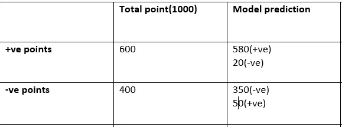
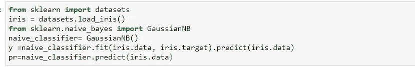
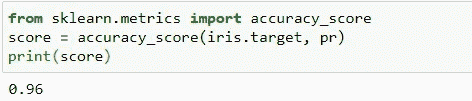

# 机器学习的准确性

> 原文：<https://medium.com/analytics-vidhya/accuracy-in-machine-learning-bb3ddbc984b?source=collection_archive---------18----------------------->

在机器学习领域，性能是我们想知道的衡量标准之一*我们的模型表现如何。*衡量模型性能的技术有很多。今天我们将讨论准确性。

准确率定义为***测试集上被正确分类的点的总数。***

> **准确度= #正确分类的点数/测试集中的总点数**

假设我们有 1000 个数据点，其中 600 个是正的，400 个是负的。我们的模型预测了 580 个正数据点和 20 个负数据点，对于负数据点，预测了 350 个正数据点和 50 个负数据点。



这里正 580 分，负 350 分分类正确。阳性 20 分，阴性 50 分被错误分类

> **正确分类的总点数=930**
> 
> **错误分类的总点数= 70**

> **准确率= 930/1000 = 93%**

代码:



在这里，我已经使用虹膜数据集，并执行高斯 NB，然后让我们看看如何测量精度



[**笔记本链接**](https://github.com/namratesh/Machine-Learning/blob/master/Performance.ipynb)

```
#***importing dataset***
from sklearn import datasets #**Loading datset**
iris = datasets.load_iris()#**performing Gaussian** **Naive Bayes**
from sklearn.naive_bayes import GaussianNB
naive_classifier= GaussianNB()
y =naive_classifier.fit(iris.data, iris.target).predict(iris.data)
pr=naive_classifier.predict(iris.data)#**accuarcy measure**
from sklearn.metrics import accuracy_score
score = accuracy_score(iris.target, pr)
print(score)
```

## 要记住的几点:

*   容易理解
*   总是仅根据测试数据进行测量
*   永远不要在不平衡的数据集上测量精度

感谢阅读！！！

## 参考资料:

[](https://scikit-learn.org/stable/modules/generated/sklearn.metrics.accuracy_score.html) [## sk learn . metrics . accuracy _ score-sci kit-learn 0 . 22 . 1 文档

### sci kit-learn:Python 中的机器学习

scikit-learn.org](https://scikit-learn.org/stable/modules/generated/sklearn.metrics.accuracy_score.html) 

appliedaicourse.com