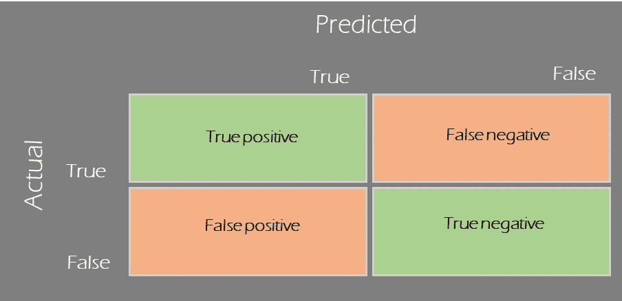
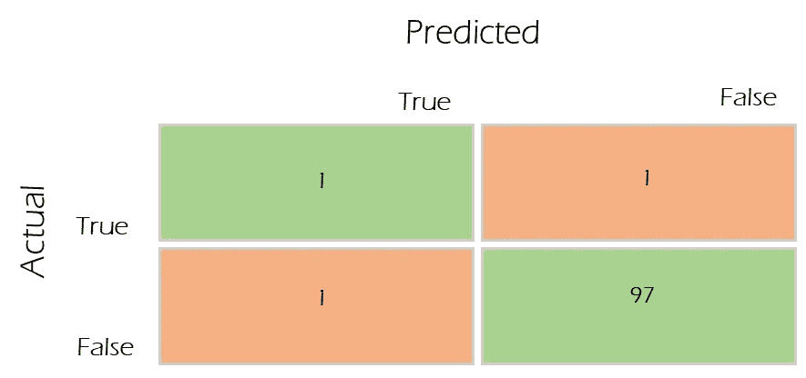

# 二元分类中的准确性度量

> 原文：<https://medium.com/analytics-vidhya/accuracy-metrics-in-binary-classification-7fb1ceae2e8a?source=collection_archive---------26----------------------->

当我们试图预测/评估一个特定的观察/对象是否符合其真实性质时，二元分类就是问题。

二元分类的经典例子有:

*   医疗诊断
*   员工流失预测
*   或者任何其他的判断，我们试图传递给某人或某事，基于他们的行为，这属于两种状态，对或错:)

因此，由于我们试图预测一些观察结果是真还是假，我们的预测可以分为以下四类。

以上称为**混淆矩阵，**，它有助于容易地理解每个**【预测】**在**【实际】**真或假状态的上下文中落在何处。

混淆矩阵中的每个单元表示我们预测的一个重要的精度度量，我们需要更关注哪个精度度量取决于应用。

**精度**

此指标代表我们预测结果的准确程度；真观察为真，假观察为假。

准确度=(真阳性+真阴性)/总观察值

虽然准确性非常直观，并且是预测性能的常用衡量标准，但当我们的观测样本有很大偏差时，它将不是一个足够的参数。

例如:交易欺诈预测:

欺诈交易，作为计数代表< 2% of total transactions in general circumstances.

We develop a model to predict fraudulent transactions, and we get a confusion matrix like below, for 100 samples that are tested.

while the model accuracy remains at 98% [(1+97)/100], we clearly can see that out of the actual 2 fraudulent transactions, the model misses one.

this is when we try to refine our focus towards how many are predicted accurately based on our focus.

**真实阳性率(或模型召回)—越高越好**

真实阳性率是模型在捕捉“真实”结果时的准确程度。

如果我们的重点主要是捕捉“真实”的结果，那么真实的肯定率/模型召回率是一个很好的指标。

然而，一个普遍的现象是，当我们试图增加模型召回率时，假阳性率也增加了。

**误报率(或误报)——越低越好**

如果假警报代价高昂，这就是我们需要关注的指标。

以欺诈性交易为例，如果我们试图使用我们的预测来确定和阻止欺诈性交易，并且如果我们的模型具有很高的假阳性率；这意味着我们也阻止了大量的真实交易。

这将对用户体验造成损害。

假阳性通常是代价最大的结果。

*   被诊断患有癌症并正在接受化疗的健康人
*   无罪，被判有罪
*   向一个无论如何都要和你在一起的客户提供奢侈的防止流失服务。

**假阴性率(失误)——越低越好**

这评估了我们错过了多少。

*   如果我们不想错过任何一笔欺诈交易
*   如果我们不想收件箱里有一封垃圾邮件
*   如果我们不想让任何一个 COVID 19 阳性的人不被发现

我们需要尝试让这个指标更接近于零。

这可以通过提高模型召回率(一个好模型)或让我们付出更多错误警报的代价(一个坏模型)来实现。

**结论**

在评估模型性能时，我们需要关注哪个指标主要取决于业务应用程序。

虽然准确性是一个很好的衡量标准，但它看起来更像是一个没有人真正关心的参数；而准确性大部分可以由‘真否定’构成。