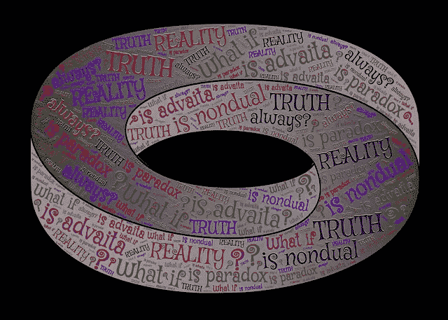
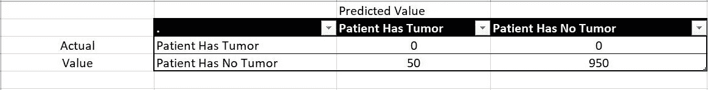

# 分类模型中的准确性悖论

> 原文：<https://medium.com/analytics-vidhya/accuracy-paradox-in-classification-models-d55a2884410?source=collection_archive---------9----------------------->

悖论

在某些情况下，机器学习行话中的二元分类器的准确性可能是欺骗性的。准确度将正确识别的元素与元素总数进行比较。

在深入研究之前，让我们先了解几个术语:

## 真阳性:

这意味着我们预测的东西是相关的，而且实际上是相关的。

## 真阴性:

这意味着我们预测的东西是不相关的，实际上是不相关的。

## 假阳性(I 型错误):

这意味着我们预测的东西是相关的，但实际上是不相关的。

## 假阴性(第二类错误):

这意味着我们预测的东西是不相关的，但实际上是相关的。我认为这很危险。我们用一个案例来了解一下。

## 个案研究

ABC 医院有一个分类模型来预测患有脑部疼痛的患者是否会在晚期发展成脑瘤。

他们的模型有 95%的准确性，也就是说，在 1000 个案例中，模型预测了 950 个正确的预测和 50 个不正确的预测。他们开始将患者的报告放入分类器中，并告诉患者他们正在经历轻微的头痛，并给他西红花苷或其他药片以减轻疼痛。几年后，几乎 30%被医院证明没有肿瘤的病人开始死亡，报告显示所有的死亡都是由于大脑中存在肿瘤。

现在医院陷入了严重的困境，上层管理人员成立了数据科学家团队来处理这种情况。数据科学家开始寻找为什么分类器预测错误的结果，但仍然有 95%的准确率。

然后有趣的事情发生了。他们发现这个模型是有偏见的。

假设真阴性是患者没有肿瘤的正确预测，真阳性是患者有肿瘤的正确预测，假阳性是患者有肿瘤的不正确预测，假阴性是患者没有肿瘤的不正确预测。

根据给定的方案，50 由于患者没有肿瘤而做出不正确的预测，即假阴性= 50，950 由于患者有肿瘤而做出正确的预测，即真阳性= 950。

精确度的公式是:

**准确度= (TP + TN) / (TP + FP + FN + TN)**

根据这个公式，

**精度**=(950+0)/(950+0+50+0)= 950/1000 = 0.95 = 95%

> 但是这个模型显然是有偏见的，因为在任何情况下都是说 ***患者没有肿瘤。***

因此，准确性不是确定模型性能的可靠指标。

> **这就是它被称为悖论的原因，因为凭直觉，你会认为精确度更高的模型是最好的模型，但精确度悖论告诉我们，有时情况并非如此。**

感谢您的阅读。希望有帮助！！

***参考文献:*** *1。*[https://towardsdatascience . com/accuracy-paradox-897 a 69 e 2 DD 9 b](https://towardsdatascience.com/accuracy-paradox-897a69e2dd9b)
2 .[https://en.wikipedia.org/wiki/Accuracy_paradox](https://en.wikipedia.org/wiki/Accuracy_paradox)3。[https://www . ut wente . nl/en/EEM cs/trese/graduation _ projects/2009/abma . pdf](https://www.utwente.nl/en/eemcs/trese/graduation_projects/2009/Abma.pdf)
4 .[https://www.youtube.com/watch?v=mP4gaO4IC5A](https://www.youtube.com/watch?v=mP4gaO4IC5A)
5。[https://www . udemy . com/course/machine learning/learn/lecture/5773388 #备注](https://www.udemy.com/course/machinelearning/learn/lecture/5773388#notes)