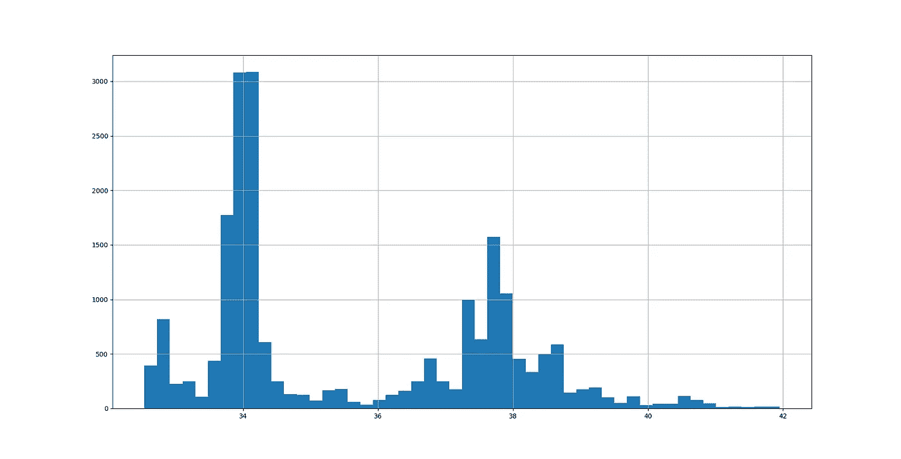
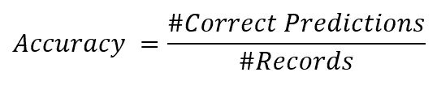
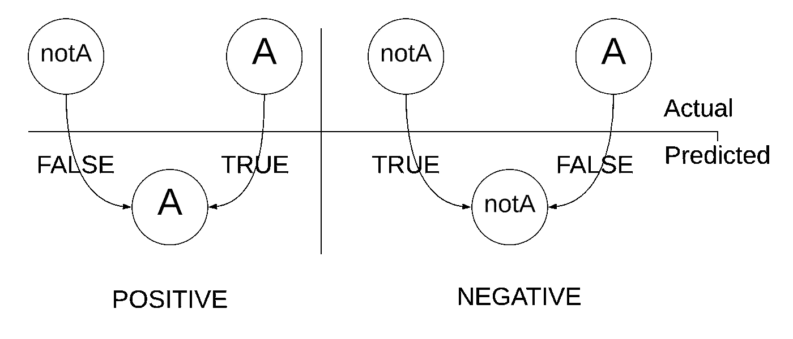
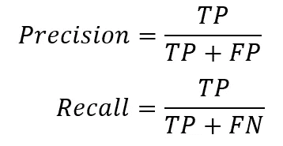
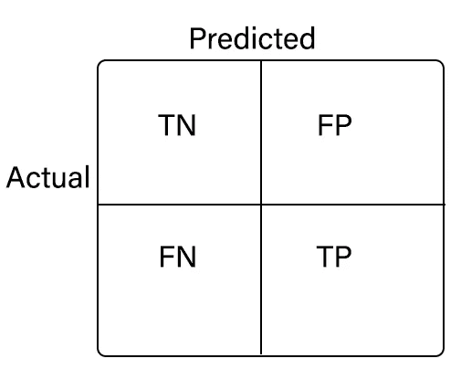

# 机器学习分类中的准确度、精确度和召回率

> 原文：<https://medium.com/analytics-vidhya/accuracy-precision-and-recall-in-machine-learning-classification-ae84004e86a1?source=collection_archive---------5----------------------->

*老派精度在大部分时间里不再适用于机器学习分类问题。但是为什么呢？下面是解释。*

# 倾斜数据集

这意味着在相同的数据集中，一些记录比其他记录有更多的可用性。因此，大多数数据集在记录数量上是不平衡的。假设您有一个蛇分类数据集。一些蛇的数量可能比其他的多。因此，数据可用性可能会在人群中有所偏差。

有偏差的数据集

# 准确(性)

这个等式包括所有标签(目标)。假设分类有三个名为“A”、“B”和“C”的目标，分别有 200、30 和 20 条记录。如果预测给出 180，20，10。最终准确率会达到 84%。但是你可以看到，准确率并没有给出“B”和“C”预测有多差的图像，因为它们的准确率分别是 66%和 50%。你可能认为机器学习模型有 84%的准确率，它适合预测，但事实并非如此。

# 混淆矩阵

*不要被混淆，混淆矩阵减少了关于模型争议的混淆*😊*。*

从这以后，每一种标签都被认为是问题的一部分。在谈论混淆矩阵之前，你需要了解一些关键词。那些是“真的”、“假的”、“消极的”和“积极的”。

让我们以此为例，想象上述精度场景并取“A”(如我之前所说，将评估单个标签类型)。当模型说它是“A”时，它被称为“正面”结果，或者预测说它是“notA ”,它将是“负面”结果。并且如果“A”被识别为“notA ”,或者反之亦然，将是“假”结果。因此，可以识别四种类型的类。

形成四个等级(FP、TP、TN、FN)

# 精确度和召回率

Precision 返回标签的正预测准确性，Recall 返回标签的真实正率。

因为精度和召回的权衡。一些技术如 F1 值也可以计算。大多数时候我们想弄清楚如何设置精度值和召回值。如果有人问“我想要这个精度值”，你应该反问“在什么召回值”。这个争议是另一个应该在后面讨论的事情。