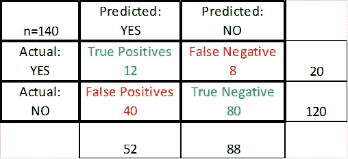
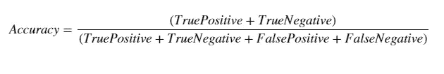
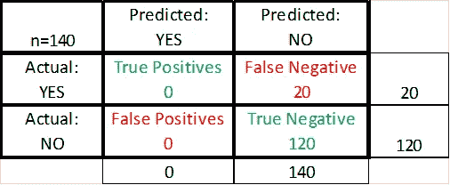
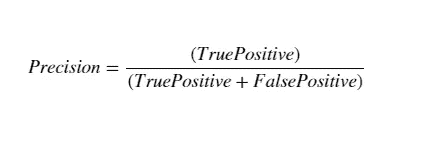
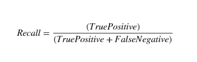

# 准确度-精确度-召回率等等

> 原文：<https://medium.com/analytics-vidhya/accuracy-precision-recall-and-many-more-what-the-heck-9ea99fef7016?source=collection_archive---------13----------------------->

## 了解哪一个是分类问题的最佳度量。

为什么在处理不平衡数据集时，准确性并不总是首选？

阿斯温·阿南德在 [Unsplash](https://unsplash.com?utm_source=medium&utm_medium=referral) 上的照片

# 普遍误解

在构建任何分类模型时，许多人默认以准确性作为衡量标准。但这是一个错误。为了更清楚，让我们试着理解什么是*精度*

准确性:它是对正确分类的结果的度量，与类别无关。它也被称为整体成功率。让我们举一个二元分类的例子——检测信用卡欺诈。假设我们建立了一个模型(姑且称之为 M1 ),结果如下:是=欺诈，否=良好交易

M1 模型的混淆矩阵

上述模型(M1)的准确率为 **67.8%。**以下公式用于计算。

现在让我们尝试建立一个简单的模型，不需要任何复杂的算法。我们的模型(M2)会把一切都归类为好的交易。混淆矩阵将如下所示:

M2 模型的混淆矩阵

模型 M2 的准确率为: **85.8%。**无需任何复杂的算法，我们就可以提高模型的准确性。是不是很棒！！

> 当然错了，不是计算错了，而是选择的度量标准错了。我们不应该使用准确性作为该数据集的衡量标准。但是为什么呢？这个数据集不平衡。在该数据集中，实际欺诈案例仅占 14%，其余都是真实交易(86%)。

我们需要选择正确的指标来解决这个问题。现在让我们看看对于这种不平衡数据集和二元分类有什么可用的度量

# 精确

这也被称为*阳性预测值(PPV)* 。这可以认为是**正面预测值中，有多少是相关的**(有多少实际上是正面的)？其计算公式如下

# 回忆

又称*灵敏度*、*命中率或真阳性率。*我们可以将此视为**实际阳性病例中有多少被我们的模型检测到。**用以下公式计算。

# 选择哪一个

根据业务需要，*精度、召回率或准确度*可用作评估模型*的指标。让我们用一些例子来试着理解。*

**例 1** :推荐系统，根据用户的浏览历史，向用户推荐产品。让我们试着理解术语。

**商业案例**:用户正在浏览大量时尚商品，模特推荐其他相关商品进行购物

**TruePositives** —模型推荐的产品与用户相关。例如眼线、漂亮的裙子。

**虚假陈述** —型号推荐产品，但用户不喜欢。
例如手机或杂货

假阴性——这是一次失误。它与用户相关，我们的模型不推荐它。例如名牌鞋

**哪个指标？**为了决定哪一种更适合这种情况，我们需要回顾并回答用户更能忍受哪一种？*假阳性*或*假阴性*。在我们的例子中，我认为与看到不相关的推荐相比，用户可以容忍错过一个相关的项目。所以，更可容忍的术语是 FlaseNegative。在这种情况下，建议的度量将是**精度**。

**例 2** :让我们回到最初检测信用卡诈骗的例子。让我们探讨一下这种情况下的术语

**业务案例:**基于历史数据，模型应预测交易过程中可能出现的信用卡欺诈

**TruePositives** —一笔交易被检测为欺诈，事实证明确实如此。

**虚假陈述** —交易被检测为欺诈，但最终证明是真实交易。用户可能会被要求进一步的问题，以证明身份。

**假阴性**——一次失误。欺诈性交易未被模型检测到，并且用户毫无问题地完成了欺诈

**哪个指标**？如前所述，我们需要了解在这种情况下什么是可以容忍的？好的交易被检测为欺诈，并且与错过以捕捉欺诈交易相比，应该容忍向用户询问更多的问题。因此，假阳性是宽容的，模型应该惩罚假阴性。因此，在这种情况下，建议的指标将是**回忆一下**

# 摘要

在本文中，我们只涉及了几个指标。但是还有更多可以考虑的。要记住的一件事是——并不是总有一个指标对现实世界的问题最有效。此外，对于不平衡的数据集，我们需要格外小心。最重要的是，在确定评估和测试模型的正确指标时，要记住业务案例