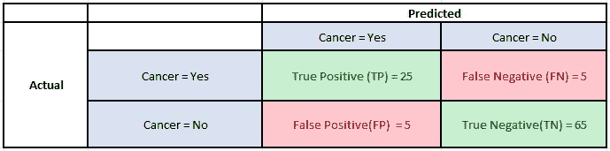

# 准确度与 F1 分数

> 原文：<https://medium.com/analytics-vidhya/accuracy-vs-f1-score-6258237beca2?source=collection_archive---------0----------------------->

约书亚·埃克斯坦在 [Unsplash](https://unsplash.com?utm_source=medium&utm_medium=referral) 上拍摄的照片

一旦你建立了一个分类模型，你需要评估这个模型的预测有多好。那么，你如何定义“好的”预测呢？

有一些性能指标可以帮助我们改进模型。让我们针对一个二元分类问题来探讨它们之间的差异:

考虑以下分类问题的混淆矩阵，该分类问题预测 100 名患者是否患有癌症:

混淆矩阵

以下是上述数据的基本指标:

**1 —精度**:隐含为从所有预测的阳性案例中正确识别出阳性案例的度量。因此，当假阳性的成本很高时，它是有用的。

精确

**2 —回忆**:它是从所有实际阳性案例中正确识别出阳性案例的度量。当假阴性的成本很高时，这一点很重要。

回忆

**3 —准确性:**更明显的度量之一，它是所有正确识别的案例的度量。当所有的类都同等重要时，它最常用。

准确(性)

现在，对于我们上面的例子，假设只有 30 名患者真正患有癌症。如果我们的模型确定其中 25 人患有癌症呢？

在这种情况下，精确度= 90%,这是一个足够高的数值，可以认为模型是“精确的”。然而，有 5 名患者实际上患有癌症，而模型预测他们没有癌症。显然，这是一个过高的成本。我们的模型应该尽量减少这些假阴性。

对于这些情况，我们使用 F1 分数。

**4—F1-得分:**这是精确度和召回率的调和平均值，比精确度指标更好地衡量了错误分类的情况。

f1-分数

我们使用调和平均值，因为它不利于极值。

总结 F1 分数和准确性之间的差异，

*   当真阳性和真阴性更重要时使用准确度，而当假阴性和假阳性至关重要时使用 F1 分数
*   当类别分布相似时，可以使用精确度，而当存在不平衡的类别时，F1-score 是更好的度量，如上例所示。
*   在大多数现实生活的分类问题中，存在不平衡的类别分布，因此 F1-score 是评估我们的模型的更好的度量。