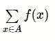
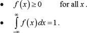
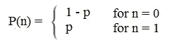
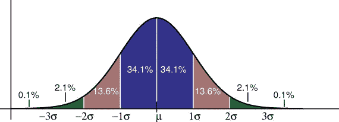
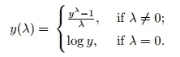
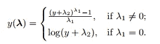

# 面试中的概率统计

> 原文：<https://medium.com/analytics-vidhya/ace-probability-and-statistics-in-interviews-8c0f0e3fc338?source=collection_archive---------6----------------------->

大家好，

在参加任何数据科学面试时，您是否在努力寻找正确答案？

这是正确的地方！！

这里我把这个概率统计领域的所有主要问题都整理出来了！！

1.  **什么是随机变量？**

答:随机变量是一个值未知的变量，或者是一个为每个实验结果赋值的函数。随机变量通常用字母表示，可以分为[离散](https://www.investopedia.com/terms/d/discrete-distribution.asp)，即具有特定值的变量，也可以分为连续变量，即可以在连续范围内具有任何值的变量。

随机变量通常用于计量经济学或回归分析，以确定彼此之间的统计关系。

# 关键要点

*   随机变量是一个值未知的变量，或者是一个为每个实验结果赋值的函数。
*   随机变量出现在各种计量经济学和金融分析中。
*   随机变量可以是离散型的，也可以是连续型的

**2。函数是概率质量函数的条件是什么？**

Ans:离散随机变量 X 的概率质量函数 f(x) = P(X = x)具有以下性质:

1.  所有概率都是正的:fx(x) ≥ 0。
2.  分布中的任何事件(例如“得分在 20 和 30 之间”)发生的概率在 0 和 1 之间(例如 0%和 100%)。
3.  所有概率之和为 100%(即 1 为小数):σFX(x)= 1。
4.  通过将事件 A 中的 X 值相加，可以得到个体概率。P(XεA)= 1

**3。函数是概率密度函数的条件是什么？**

答:概率密度函数是为连续随机变量定义的概率函数。概率密度函数也称为概率分布函数或概率函数。它用 f (x)表示。

有效概率密度函数的条件:

设 X 是具有密度函数 f (x)的连续随机变量。因此，

.

**4。什么是条件概率？**

答:条件概率是一个事件与一个或多个其他事件发生某种关系的概率。例如:

*   事件 A 是外面在下雨，今天有 0.3 (30%)的几率下雨。
*   事件 B 是你需要到外面去，那有 0.5 (50%)的概率。

条件概率将考虑这两个事件的相互关系，例如**天正在下雨的概率*和*你需要外出的概率。**

> 条件概率的公式是:
> P(B|A) = P(A 和 B) / P(A)
> 也可以改写为:
> P(B|A) = P(A∩B) / P(A)

5.两个随机变量独立和条件独立的条件是什么？

答:独立并不意味着有条件的独立:例如，独立的随机变量很少在和或最大值上是有条件独立的。

条件独立并不意味着独立:例如，均匀分布在(0，u)(0，u)上的条件独立随机变量(其中 uu 均匀分布在(0，1)(0，1)上)是不独立的。

**6。什么是伯努利分布？**

答:伯努利分布是[伯努利试验](https://www.statisticshowto.datasciencecentral.com/bernoulli-distribution/#trial)的[离散概率分布](https://www.statisticshowto.datasciencecentral.com/discrete-probability-distribution/)——一个只有两种结果(通常称为“成功”或“失败”)的随机实验。例如，抛硬币时获得正面(成功)的概率是 0.5。“失败”的概率是 1 — P (1 减去成功的概率，掷硬币也等于 0.5)。它是 n = 1 的[二项分布](https://www.statisticshowto.datasciencecentral.com/probability-and-statistics/binomial-theorem/binomial-distribution-formula/)的特例。换句话说，它是一个二项分布，只有一次尝试(例如，一次抛硬币)。

失败的概率在 x 轴上标记为 0，成功标记为 1。在下面的伯努利分布中，成功的概率(1)是 0.4，失败的概率(0)是 0.6:

该分布的[概率密度函数(pdf)](https://www.statisticshowto.datasciencecentral.com/probability-density-function/) 为 px (1 — p)1 — x，也可以写成:

来自伯努利分布的随机变量 X 的[期望值](https://www.statisticshowto.datasciencecentral.com/probability-and-statistics/expected-value/)为:
E[X] = p.
例如，如果 p = .04，则 E[X] = 0.4。

一个伯努利随机变量的[方差](https://www.statisticshowto.datasciencecentral.com/probability-and-statistics/variance/)为:
Var[X] = p(1 — p)。

**7。什么是正态分布？**

答:[正态分布](https://www.statisticshowto.datasciencecentral.com/probability-and-statistics/normal-distributions/)，有时被称为钟形曲线，是一种在许多情况下自然出现的分布。例如，在 SAT 和 GRE 这样的考试中可以看到钟形曲线。大部分学生将获得平均分，而少数学生将获得 B 或 d。更少比例的学生获得 F 或 a。这就形成了一个类似于钟的分布(因此有了这个昵称)。钟形曲线是对称的。一半的数据会落在[均值](https://www.statisticshowto.datasciencecentral.com/probability-and-statistics/statistics-definitions/mean-median-mode/#mean)的左边；一半会倒向右边。许多团体都遵循这种模式。这就是为什么它被广泛应用于商业、统计和政府机构，如 [FDA](https://www.fda.gov/default.htm) :

*   人的高度。
*   测量误差。
*   血压。
*   考试的分数。
*   智商分数。
*   薪水。

[经验法则](https://www.statisticshowto.datasciencecentral.com/empirical-rule-2/)告诉你，你的数据有多少百分比落在从[均值](https://www.statisticshowto.datasciencecentral.com/mean)到[标准差](https://www.statisticshowto.datasciencecentral.com/probability-and-statistics/standard-deviation/)的一定数量内:
68%的数据落在[均值](https://www.statisticshowto.datasciencecentral.com/mean)的一个[标准差](https://www.statisticshowto.datasciencecentral.com/probability-and-statistics/standard-deviation/)内。
95%的数据落在[平均值](https://www.statisticshowto.datasciencecentral.com/mean)的两个[标准差](https://www.statisticshowto.datasciencecentral.com/probability-and-statistics/standard-deviation/)内。
99.7%的数据落在[平均值](https://www.statisticshowto.datasciencecentral.com/mean)的三个[标准差](https://www.statisticshowto.datasciencecentral.com/probability-and-statistics/standard-deviation/)内。

标准差控制着分布的范围。较小的标准偏差表示数据紧密地聚集在平均值周围；正态分布会高一些。较大的标准差表明数据分布在[平均值](https://www.statisticshowto.datasciencecentral.com/mean)附近；正态分布会更平更宽。

**8。什么是中心极限定理？**

Ans:在概率论的学习中，中心极限定理(CLT)指出，样本均值的[分布近似正态分布(也称为“钟形曲线”)，随着样本大小变大，假设所有样本大小相同，且不考虑总体分布形状。](https://www.investopedia.com/terms/s/sampling-distribution.asp)

换句话说，CLT 是一种统计理论，它指出，给定来自具有有限方差水平的总体的足够大的样本量，来自同一总体的所有样本的均值将近似等于总体的均值。此外，所有样本将遵循近似的[正态分布](https://www.investopedia.com/terms/n/normaldistribution.asp)模式，所有方差近似等于总体的[方差](https://www.investopedia.com/terms/v/variance.asp)除以每个样本的大小。

尽管这个概念是由亚伯拉罕·德莫佛在 1733 年首先提出的，但直到 1930 年，著名的匈牙利数学家乔治·波利亚正式称之为中心极限定理，它才被正式命名。

理解中心极限定理(CLT)

根据中心极限定理，不管数据的实际分布如何，随着样本量的增加，数据样本的平均值将更接近所讨论的总体的平均值。换句话说，无论分布是正态还是异常，数据都是准确的。

一般来说，等于或大于 30 的样本量被认为足以支持 CLT，这意味着样本均值的分布是正态分布。因此，取样越多，绘制的结果越呈正态分布。

中心极限定理展示了样本均值和标准差的平均值等于总体均值和标准差的现象，这在准确预测总体特征方面极其有用。

# 关键要点

*   中心极限定理(CLT)指出，随着样本量的增加，样本均值的分布接近正态分布。
*   等于或大于 30 的样本量被认为足以支持 CLT。
*   CLT 的一个重要方面是样本均值和标准差的平均值等于总体均值和标准差。
*   足够大的样本量可以准确地预测总体的特征。

**9。协方差和相关的区别是什么？**

答:就协方差和相关性之间的差异而言，以下几点值得注意:

1.  一种用来表示两个随机变量协同变化程度的方法称为协方差。用于表示两个随机变量相关程度的一种度量，称为相关性。
2.  协方差只不过是相关性的度量。相反，相关性指的是协方差的缩放形式。
3.  相关值出现在-1 和+1 之间。相反，协方差的值介于-∞和+∞之间。
4.  协方差受标度变化的影响，即如果一个变量的所有值都乘以一个常数，而另一个变量的所有值都乘以一个相似或不同的常数，则协方差会发生变化。与此相反，相关性不受尺度变化的影响。
5.  相关性是无量纲的，即它是变量之间关系的无单位度量。与协方差不同，协方差的值是通过两个变量单位的乘积获得的。

# 结论

两者都只度量两个变量之间的线性关系，即当相关系数为零时，协方差也为零。此外，这两个度量不受位置变化的影响。

相关性是协方差的一种特殊情况，可以在数据标准化时获得。现在，当要做出选择时，这是两个变量之间关系的一个更好的衡量标准，相关性优于协方差，因为它不受位置和尺度变化的影响，也可用于比较两对变量。

**10。Box-Cox 变换有什么用途？**

答:Box Cox 变换是一种将非正态[因变量](https://www.statisticshowto.datasciencecentral.com/dependent-variable-definition/)变换成正态形状的方法。正态性是许多统计技术的重要假设；如果您的数据不正常，应用 Box-Cox 意味着您能够运行更多的测试。

博克斯考克斯变换是以统计学家乔治·博克斯和 T2·大卫·罗克斯比·科克斯的名字命名的，他们在 1964 年合作完成了一篇论文并开发了这项技术。

## 运行测试

Box Cox 变换的核心是一个指数 lambda (λ),它在-5 到 5 之间变化。考虑λ的所有值，并为您的数据选择最佳值；“最佳值”是产生正态分布曲线的最佳近似值的值。Y 的[变换](https://www.statisticshowto.datasciencecentral.com/transformation-statistics/)具有以下形式:

这个测试只对阳性数据有效。然而，Box 和 Cox 提出了第二个公式，可用于负 y 值:

这些公式看似简单。手工测试所有可能的值是不必要的劳动强度；大多数软件包都包含一个 Box Cox 变换选项，包括:

*   **R** :使用命令 **boxcox(object，…)。**
*   **Minitab** :点击**选项**框(例如，拟合回归模型时)，然后点击 Box-Cox 变换/最优λ。

**11。你所理解的机器学习背景下的假设是什么？**

答:假设检验的过程是通过对样本进行一些统计检验，对总体或数据进行推断或得出一些结论。我将在本教程中讨论通过 T-test 对不同的机器学习模型得出相同的推论。

为了得出一些推论，我们必须做出一些假设，这些假设导致了在假设检验中使用的两个术语。

*   零假设:它是关于没有异常模式的假设或根据所做的假设相信。
*   交替假设:与零假设相反，表明观察是真实效果的结果。

## p 值

也可以说是零假设或机器学习算法的证据或显著性水平。这是预测值对目标的重要性。

一般情况下，我们选择 5 %的显著性水平，但这也是一些情况下讨论的话题。如果您对数据功能有很深的了解，您可以决定重要性的级别。

与此相反，如果在机器学习模型中 p 值相对于独立变量小于 0.05，则该变量被考虑，这意味着存在与目标的异质行为，这是有用的并且可以通过机器学习算法学习。

假设检验涉及的步骤如下:

*   假设一个零假设，通常在机器学习算法中，我们认为目标和自变量之间没有异常。
*   收集样本
*   计算测试统计数据
*   决定是接受还是拒绝零假设

## 计算检验或 T 统计

为了计算 T 统计量，我们创建了一个场景。

假设有一家集装箱制造公司声称每个集装箱的重量是 1000 公斤，不多也不少。嗯，这种说法看起来可疑，所以我们继续收集数据并创建一个样本。

在收集了 30 个集装箱的样本后，我们发现集装箱的平均重量为 990 千克，标准偏差为 12.5 千克。

所以计算测试统计数据:

T =(平均值-索赔)/(标准偏差/样本 Size^(1/2))

也就是把所有数字放在一起后的-4.3818。

现在我们计算 0.05 显著性和自由度的 t 值。

注意:`Degree of Freedom = Sample Size - 1`

`From T table the value will be -1.699.`

经过比较，我们可以看到生成的统计量小于期望显著性水平的统计量。所以我们可以驳回索赔。

你可以使用`scipy`库的`stats`类的`stats.t.ppf()`函数来计算 t 值。

## 错误

因为假设检验是在数据样本上进行的，而不是由于数据方面的资源不可用而在整个群体上进行的。由于推断是根据样本数据得出的，假设检验可能会导致错误，错误可分为两部分:

*   第一类错误:在这个错误中，当零假设为真时，我们拒绝它。
*   第二类错误:在这个错误中，当假设为假时，我们接受零假设。

## 其他方法

现在有很多不同的方法来对两个模型进行假设检验，比如根据我们可用的功能创建两个模型。一个模型包含所有功能，另一个则少一个。所以我们可以测试个别特征的重要性。然而，特性间相互依赖会影响这些简单的方法。

在回归问题中，我们一般遵循 P 值规则，去除违反显著性水平的特征，从而迭代改进模型。

每种算法都有不同的方法来测试不同特征的假设。