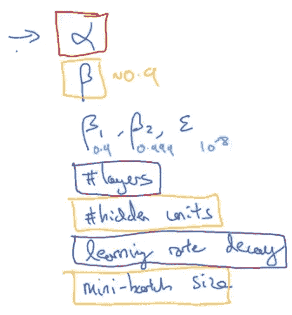
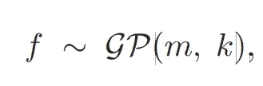
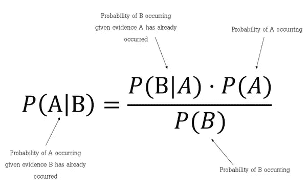
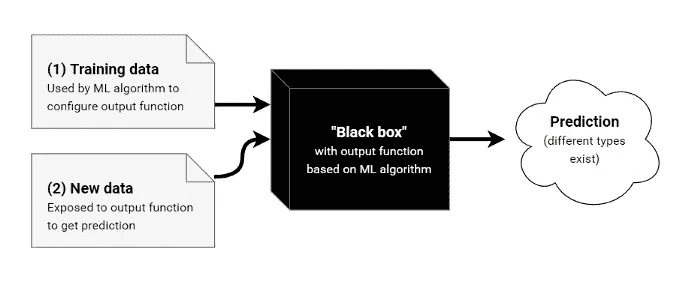
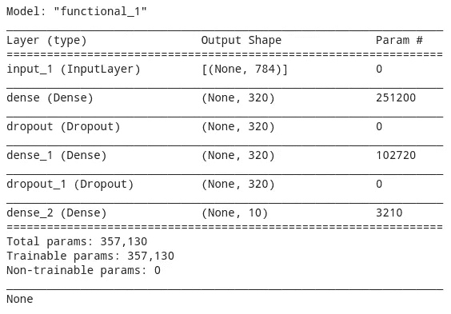
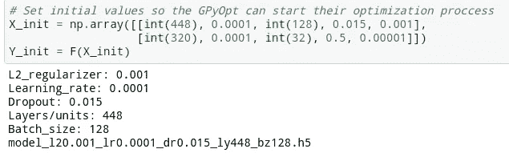
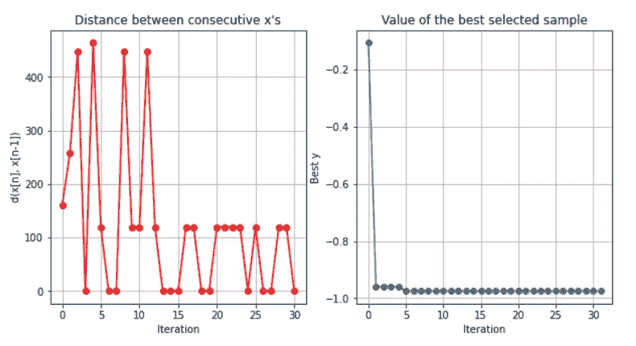
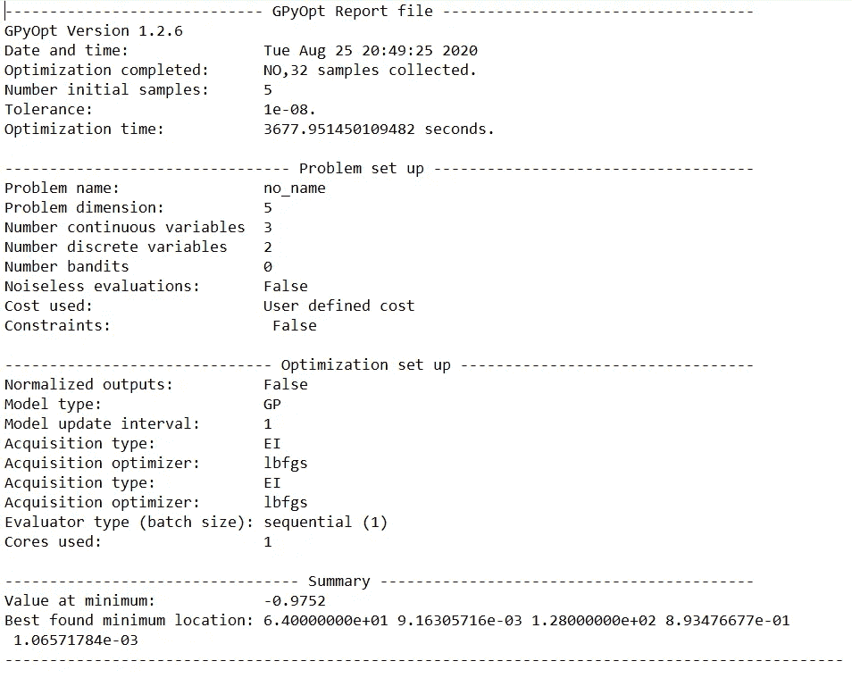
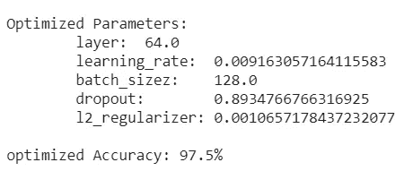
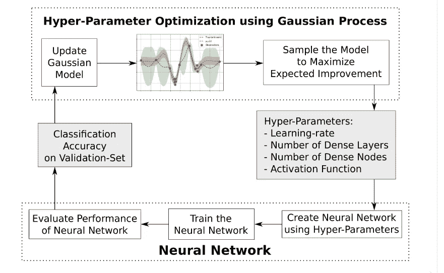

# 实现用于调整超参数的贝叶斯优化

> 原文：<https://medium.com/analytics-vidhya/achieve-bayesian-optimization-for-tuning-hyper-parameters-df1aad6cb49a?source=collection_archive---------15----------------------->

> *使用深度神经网络 GPyOpt 库的贝叶斯优化理解超参数优化的综合指南*

图片来源:斯科特·亚当斯

如果你是机器学习或深度学习领域的新手，我建议你首先阅读我以前的一些 [*文章*](/@edward0rtiz/machine-learning-101-part-2-366bb5607ef8) ，在这些文章中，我给出了这里涉及的一些概念的方法。尽管如此，如果你想在接下来的几分钟里玩得开心，让我们开始机器学习领域的旅程

# **概要**

我第一次开始使用神经网络时，我曾基于试错法或基于其他同行在调整中的发现来调整我的机器学习模型的超参数。但是，如果您希望对神经网络模型有更多的控制，并搜索一个可以减少不确定性的值来实现数据的可靠准确性，该怎么办呢？

事实上，当设计和实现你的神经网络时，这个问题很有吸引力，也许你会想“我想这样做，但这似乎很难”。嗯，部分是。但是，在这篇文章中，我们将有一个友好的方法来实现超参数优化，而不是失败的方式。一旦你理解了这一点，相信我，无论是这种技术还是你想用来优化超参数的其他技术，它都会成为你成功建立更好的神经网络的最好朋友。

## 什么是超参数？

当你建立一个神经网络来解决一个实际问题时，你会遇到一个叫做超参数的概念。根据你如何调整这些参数，你的网络会给你一个目标精度的近似值。把参数看作是决定你的网络结构和训练方式的变量。例如，你的神经网络有多少层？我的网络在训练时会有学习率变量吗？

尽管超参数的定义可能听起来很简单，但重要的是要注意它们不同于模型参数。模型参数是由分类器或其他机器学习模型在训练期间学习的训练数据的属性。例如，对于神经网络，模型中连接的权重是参数，因为它们对于每个实验是不同的，并且取决于输入数据的类型。

超参数。deeplearning.ai

而超参数是那些不能在训练期间学习但是预先设置的参数。例如，在神经网络中，隐藏层的数量和大小、权重初始化、学习速率、下降和梯度、批量大小可以被定义为超参数。

您可以选择调整一些超参数，以便正确训练和评估您的模型。不存在最佳—最差超参数，您只需要测试哪一个会在很大程度上影响您的模型，从而过度拟合/欠拟合您的数据，得到有噪声的数据，甚至是不合适的结构。

# 技术

一旦确定了机器学习模型中的超参数，现在你可以采取三种方法:

1.  根据之前对您使用的其他模型进行的调整，选择超参数。
2.  基于其他成功实现的模型调整您的超参数
3.  找出您的特定模型的最佳调整值。

从这三个选项中，最好选择第三个选项，该选项基于以下假设:除非您决定使用相同的数据集、网络结构并解决该模型的相同问题，否则您的模型永远不会与其他神经网络模型相同。

之后，沿着搜索最佳超参数以及这些参数的最佳调谐值的路径，下一步是选择实施哪个工具来评估该问题。以下是超参数优化最常用的技术:

1.  *手动搜索*
2.  *网格搜索*
3.  *随机搜索*
4.  *贝叶斯优化*

# 实施优化技术

根据这个场景和本文的标题，为调整和优化神经网络模型的超参数而选择的工具将是贝叶斯优化。

## 高斯过程

在进入神经网络示例的实际贝叶斯优化实现之前，简要定义高斯过程概念是很重要的。高斯过程是高斯概率分布的推广。概率分布描述的是标量或向量(对于多元分布)的随机变量，而随机过程控制着函数的性质。

将一个函数想象成一个很长的向量，向量中指定函数值 *f(x)* 的每个条目都有一个特定的输入 *x* 。现在，如果你在一个神经网络模型中工作，你也会意识到，例如计算该模型的层将是计算上昂贵的，以获得超参数中的最佳调谐值。

> 然后，高斯过程框架是易处理的，使得神经网络中的核心计算工作成为可能。高斯过程的正式定义是:“随机变量的集合，其中任意有限个具有(一致的)联合高斯分布。”

高斯过程公式

上面的公式定义为 *f* 为*函数分布为 *GP* 具有均值函数 *m* 和协方差函数 *k* 。这个协方差函数也被称为核函数，它决定了 GP 的几乎所有泛化属性，并且它可以被定义为两个对象之间的相似性得分。*

## 贝叶斯优化

贝叶斯优化是一种技术，它来自于贝叶斯定理及其对测量变量的随机过程的处理方法，计算它们的事件概率和不确定性事件。

贝叶斯定理

这种技术可以被视为高斯过程的替代。此外，贝叶斯优化使得包括许多超参数的复杂预测模型的搜索时间较短，同时保持预测模型的准确性。

> *贝叶斯定理，本质上是这样陈述的:(稍微简化)给定证据(或数据，或观察值)的模型(或理论，或假设)的后验概率***【M】*****E***与给定的****E*M*乘以* **M 的先验概率【P(M|E)【成正比*******

**当机器学习中出现优化问题时，贝叶斯优化将 ***f(x)*** 函数作为黑箱处理。这个黑盒术语来自计算科学中的定义，即拥有一个可以根据其输入和输出来查看的对象，而无需了解其内部工作原理。**

****

**黑盒图示例**

**因此，当查看 NN 的示例时， *f(x)* 函数没有解析表达式，并且函数的评估仅限于在点 x 采样并获得可能的响应。**

**在贝叶斯优化技术中要考虑的另一件事是，我们需要提出采样点来开始算法中的探索。这就是所谓的*获取函数，它是根据我们目前的模型*来判断一个点的可取性的启发式函数**

> **贝叶斯优化的思想是为超参数构建另一个搜索空间模型。**

**通过这一点，我们可以推断贝叶斯优化也试图在最少的步骤中找到全局最优，现在是进入实际实现的时候了。**

**下图显示了该技术的算法实现。**

****

**形象信用。埃里克·布罗休、弗拉德·科拉和南多·德弗雷塔斯**

**我强烈建议，如果你想更多地了解这种超参数优化技术的数学直觉，请查看文章 [*“昂贵成本函数的贝叶斯优化教程，应用于主动用户建模和分层强化学习”*](https://arxiv.org/abs/1012.2599) *。*鉴于本文旨在为您提供动力，以增强您在建模机器学习模型方面的工作流程，并且拥有当今强大的工具，如 GPyOpt、Scikit-opt 和其他工具，如果您理解了这一概念的数学直觉，相信通过实施贝叶斯优化或其他技术，您调整超参数的标准决策将更加有效**

# **神经网络贝叶斯优化的实现**

**对贝叶斯优化有了基本的理解，对这种技术如何工作有了一些概念上的直觉，现在是在神经网络中实现它并看到结果的时候了。**

**对于神经网络的情况，我们将使用一个简单的神经网络模型使用 MNIST 数据集。下表显示了基本型号。此时，下一步是通过应用贝叶斯优化修改超参数来开始训练，以找出对于这些超参数来说什么是最佳精度的最佳配置。**

****

**在本例中，他们接受了 5 个待评估的超参数；L2 正则化，神经网络的层数，网络的批量大小，辍学，最后是学习率。为了初始化贝叶斯优化，有必要插入两个初始样本 X_init 和 Y_init，以便算法可以开始在每个超参数的给定边界上迭代 n 次。**

****

**通过使用库 GPyOpt，执行贝叶斯优化，并且该优化的结果将存储哪些超参数为给定模型提供了最佳精度。重要的是，这种技术也可以被修改以根据有效损失进行优化，这意味着贝叶斯优化将对其损失最低的模型的超参数进行优化。**

****

**带红线的图表显示了每次迭代中计算的 x 值(超参数)的距离。这意味着该算法接受训练模型的批次大小的定义范围 x 点，并开始评估模型的准确性。记住，这个例子用在 f(x)中，需要计算 5 个超参数。然而，距离并没有给出关于我们优化的超参数的足够信息。**

**然后，通过查看右边的图表，该图表的行为是给定使用贝叶斯优化技术优化的超参数的准确性。这意味着，在使用贝叶斯优化技术进行 5 次迭代后，精度会有微小的变化，但是要了解关于哪个模型是最佳模型的更多信息，可以像下图一样保存报告。**

****

**这是 GPyOpt 打印的优化过程给定洞察数据的报告，其中最佳精度和最佳超参数位于报告末尾的摘要部分。此外，在这个例子中，一个友好的定制报告被打印出来，这样用户就可以在过程完成后看到贝叶斯优化的最佳值。**

****

# **最后的想法**

**超参数优化是一种计算量很大的实践，但一旦你能够掌握它，就会让你对模型的开发有更好的见解，我在本文开始时说过，机器学习工程师将面临独特数据的独特问题。通过实施这些技术，不仅模型，而且该训练和评估模型的结果将减少不确定性因素，并且基于具有精确超参数的精确模型的策略开发比具有随机调整超参数的模型更可靠。**

**超参数优化有许多技术，贝叶斯优化是其中之一，可能是最复杂的技术之一，但我希望通过这个解释，你有动力尝试一下，不仅理解这种方法背后的数学直觉，而且理解使用这种特定技术可以获得的积极结果。**

**最后，最后一张图是 Magnus Erik Hvass Pedersen 开发的流程图，它很好地描述了高斯过程中超参数优化的行为，但请记住，贝叶斯优化是 GP 的替代，因此该流程图将有助于理解贝叶斯优化技术。**

****

**超参数优化流程图。图片来源:Hvass-Labs**

# **奖金**

**如果你想知道更多关于这个例子的代码，我会分享下面的代码，这样你就可以玩了。**

**基于 MNIST 数据集和 GyOPT 的神经网络超参数贝叶斯优化**

# **参考**

 **[## 昂贵成本函数的贝叶斯优化教程，应用于活跃用户…

### 我们提出了一个关于贝叶斯优化的教程，这是一种寻找昂贵的成本函数的最大值的方法。贝叶斯…

arxiv.org](https://arxiv.org/abs/1012.2599)** ** [## 内核食谱

### 如果你曾经问过自己:“我如何选择高斯过程的协方差函数？”这是…的页面

www.cs.toronto.edu](https://www.cs.toronto.edu/~duvenaud/cookbook/)  [## 机器学习的高斯过程:目录

### 卡尔爱德华拉斯穆森和克里斯托弗 K. I .威廉姆斯麻省理工学院出版社，2006 年。ISBN-10 0-262-18253-X，ISBN-13 978-0-262-18253-9…

www.gaussianprocess.org](http://www.gaussianprocess.org/gpml/chapters/)  [## hvass-Labs/tensor flow-教程

### permalink dissolve GitHub 是超过 5000 万开发人员的家园，他们一起工作来托管和审查代码，管理…

github.com](https://github.com/Hvass-Labs/TensorFlow-Tutorials/blob/master/19_Hyper-Parameters.ipynb)  [## 探索贝叶斯优化

### 许多现代机器学习算法都有大量的超参数。为了有效地使用这些算法，我们…

蒸馏. pub](https://distill.pub/2020/bayesian-optimization/)  [## 高斯过程

### 本文是高斯过程笔记本的导出，它是贝叶斯机器学习报告的一部分

krasserm.github.io](http://krasserm.github.io/2018/03/19/gaussian-processes/)  [## 机器学习 101 第二部分

### 解释优化技术背后的机制

medium.com](/@edward0rtiz/machine-learning-101-part-2-366bb5607ef8)  [## Edward A . Ortiz-机器学习工程师-霍尔伯顿学校| LinkedIn

### ML 软件工程师，有 7 年以上项目管理经验。专注于排列数据工程…

www.linkedin.com](https://www.linkedin.com/in/ortizedward/)**