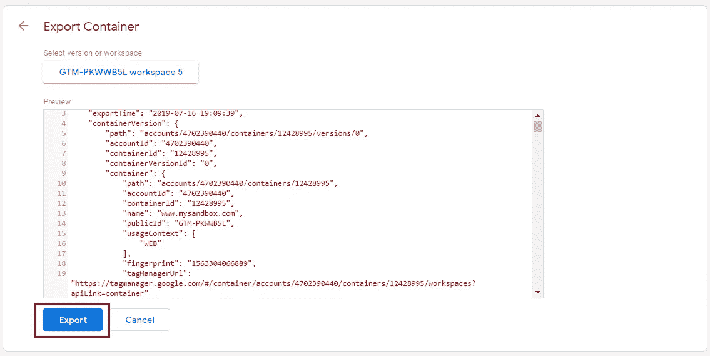
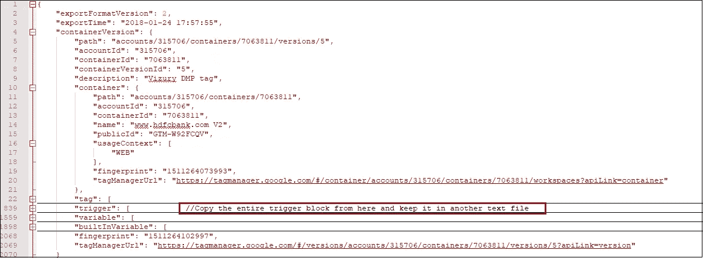

# 通过 Google Tag Manager 导入/导出实现事半功倍

> 原文：<https://medium.com/analytics-vidhya/achieve-big-with-less-via-google-tag-manager-import-export-ed693f8db381?source=collection_archive---------1----------------------->

谷歌标签管理食谱

oogle Tag Manager 是为了简化我们的分析实施而推出的，拥有许多独特的功能。然而，很多时候，我们忽略了这些特性和功能。如果你像我一样经常使用谷歌标签管理器，你可能正在寻找新的方法来提高你的网站性能，更快地捕捉错误，并以更高的效率和准确性提供结果。

一个困扰业余爱好者和有经验者的问题:我们如何在 Google Tag Manager 容器中批量编辑/更新标签或触发器？我们大多数人生活在禁欲主义的信仰中，认为在 GTM 中我们只能手动地一个接一个地编辑/更新触发器或标签。这往往导致相同任务的重复，扼杀了我们的兴趣和效率。

这让我想起了我们面临的挑战，当时我们不得不推出相同的更改，以适应 GDPR，跨多个容器达到 400 多个触发器！用户权限是关键因素，必须加以考虑，以适应整个站点标记的 GDPR，关键特征是能够决定用户权限获取变量是否设置为真。至少可以说，一想到 30-40 个小时乏味、忙乱和单调的手工工作就令人生畏。

所以这个问题的答案是，GTM 或任何第三方工具都没有为批量更新触发器或标签提供任何内置的解决方案。幸运的是，我们有 JavaScript 来拯救我们。让我们看看如何，

# **《救世主》**

尽管没有任何可用的内置特性，但这并不意味着不可能在 GTM 中进行批量修改。因此，我们编写了一个定制的解决方案，使用模板脚本代码来编辑/更新 GTM 标签/触发器。

**快速总结解决方案:**
第一步:导出你的 GTM 容器，
第二步:在触发器或标签中写下你要做的修改，
第三步:分别从容器文件中复制标签/触发器块，
第四步:*Script Magic*，
第五步:在 GTM 中导入更新后的容器文件，*瞧！结束了。*

这篇文章是根据我自己的经验写的，我使用了一小段脚本和 GTM 的高级特性，在 GTM 中自动批量更新/编辑标签/触发器。开始讨论解决方案之前的一些先决条件

# **该如何？**

**步骤 1:导出您的 GTM 容器:** 自动化过程的第一步是导出您的 GTM 容器。导出容器时，请确保选择了正确的工作空间。

这是您的 Google 标签管理器容器导出屏幕的外观

**第二步:编写/复制你想要添加的触发条件(JSON 格式):** 在所有的触发器中编写你想要更新的附加过滤条件。新的过滤条件应该是 JSON 格式，因为 GTM 导入/导出使用 JSON 格式。

您还可以从任何现有的触发器中复制过滤条件，[下面是如何复制触发条件](https://github.com/analytics-jiten/gtm_bulk_update/blob/master/create_new_trigger_condition)的方法。

GTM 触发条件滤波器模块

**第三步:提取触发块，过滤条件:**

在高级文本编辑器(如 notepad++)中打开下载的容器文件。GTM 容器文件的结构如下:

-账户设置
-标签块
- **触发块
-** 变量块
-文件夹块

从导出的 GTM 容器文件中复制触发器块，并将其与您编写的过滤条件一起保存在另一个文本文件中。

**步骤 4:自动化更新:**

现在，打开 Java Script IDE，将复制的触发器块分配给一个变量，将过滤条件分配给另一个变量。

将触发器过滤条件和触发器块分配给 JS 变量

“_triggerObj”变量将返回 JSON 对象，可以使用以下命令在 IDE 或浏览器控制台上检索该对象的元素:

*_triggerObj.trigger[0]。<任意元素>*

现在获取触发器的长度，并运行一个循环，直到它的长度。检查每个触发器中的过滤器是否存在，如果存在，则在过滤器对象的末尾添加新的过滤条件。下面的代码应该可以解决这个问题:

在 GTM 触发器中批量编辑/添加新条件的模板脚本

**第五步:更新并导入容器文件。**

一旦脚本成功执行，检查控制台上更新的触发器，您应该能够看到所有触发器中添加的过滤条件。忽略通过 else 块返回的触发器，因为这些触发器要么是自动触发器，要么是没有任何逻辑条件/过滤器的空白触发器。

使用“*JSON . stringify(_ trigger obj)*”将更新后的触发器对象字符串化。复制触发器块，使用任何 JSON 格式编辑器在线缩进它，并将其粘贴到您先前下载的同一个容器文件中。现在将更新的容器文件导入到您的 GTM 帐户中。

继续将容器文件导入 GTM 之前的清单:

1.  确保选择正确的工作空间，因为它将影响未发布的更改
2.  选择容器导入的方法。我建议覆盖现有的容器。
3.  监控标签、触发器和变量更新/计数，以留意记录的重复。

# **结尾注释**

最后，这就是我们如何在最少人工干预的情况下实现 GTM 标签或触发器的批量更新，从而节省数小时的繁琐工作。本文是基于触发器上的批量编辑/更新编写的。发布的脚本可以作为模板使用，只需稍作修改，就可以与标签和变量兼容。

有没有任何改进批量更新自动化的建议，请在下面的评论中留下。