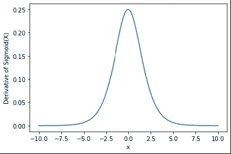

# 激活函数 Sigmoid

> 原文：<https://medium.com/analytics-vidhya/activation-function-sigmoid-7673dc0efcbe?source=collection_archive---------17----------------------->

> “S 形函数”

# 乙状结肠是什么？

sigmoid 函数也称为**逻辑函数，**传统上是神经网络非常流行的激活函数。

# 乙状结肠是做什么的？

Sigmoid 将一个实值作为输入，并对其进行转换以输出另一个介于 0 和 1 之间的值**。**比 1 大得多的输入被转换为值 1，同样，比 0 小得多的值被捕捉到 0。

# 谁发明了乙状结肠？

1838 年至 1847 年间， **Pierre Francios Verhulst** 在一系列三篇论文中引入了 sigmoid 函数，他通过调整指数增长模型，将 sigmoid 函数设计为一个**人口增长模型**。在阿道夫·凯特莱的指导下。

来源:维基百科

# 乙状结肠长什么样？

所有可能输入的函数形状是一个从 0.0 到 0.5 到 1.0 的 S 形

sigmoid 函数:

Sigmoid 方程

s 代表 sigmoid 函数，z 代表需要计算 Sigmoid 的数字

sigmoid 函数的导数:

Sigmoid 方程的导数

# 实施

**导入** matplotlib.pyplot **为** plt

**导入** numpy **作为** np

**导入**数学

x = np.linspace(-10，10，100) # X 轴从-10 到 10 开始

z = 1/(1+NP . exp(-x))#σ函数公式

y = z *(1-z)# Sigmoid 函数的导数

plt.plot(x，z)

plt.xlabel("x ")

plt.ylabel("Sigmoid(X)")

plt.show()

# 输出:

Sigmoid 函数

s 形函数的导数

# 为什么还要？

很长一段时间，直到 20 世纪 90 年代初，它都是神经网络中使用的**默认**激活函数。它很容易操作，并且拥有激活功能的所有好的属性。意思是，它:

1.  是非线性的。
2.  是连续可微的。
3.  就是单调。
4.  具有固定的输出范围。

# 有哪些局限性？

1.  这引起了**消失梯度**的问题。
2.  在 sigmoid 函数的两端，Y 值对 x 值的变化响应很小。
3.  其输出**不在零中心**。这使得梯度更新在不同的方向上走得太远。
4.  这使得优化更加困难
5.  网络有时拒绝进一步学习或者速度非常慢。
6.  Sigmoids 饱和并消除梯度。

# 了解更多关于 sigmoid 的信息:

机器学习词汇表(ml-cheatsheet.readthedocs.io)上的激活函数。

Sigmoid 函数:维基百科