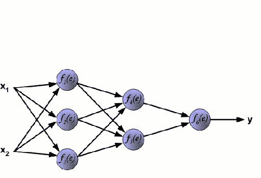

# 激活函数和深度学习

> 原文：<https://medium.com/analytics-vidhya/activation-functions-and-deep-learning-de78cc6a66c?source=collection_archive---------12----------------------->

***什么是深度学习和神经网络？***

嗯，为了理解什么是“激活功能”，我们首先需要对神经网络及其与深度学习的相关性有一个基本的概念。

上面说的深度学习基本上是一个更一般的人工智能领域的子集，叫做*机器学习*，它基于这种从例子中学习的思想。在机器学习中，我们不是教计算机一大套规则来解决问题，而是给它一个模型，它可以用它来评估例子，以及一个小指令集，当它出错时修改这个模型。然而，使用复杂的训练程序和数学算法，这些模型是在一次又一次地训练大量数据后建立的。这整个过程被认为是深度学习。

因此，很明显，与各种深度学习网络和算法相关联的学习过程在某种程度上类似于人脑。当一个人决定学习某样东西时，他/她会一遍又一遍地浏览那条信息，最终将它保留在他/她的大脑中，并非常准确地给出与此相关的答案。在深度学习的情况下也会发生同样的事情，在深度学习中，使用一系列基于复杂数学方程的算法，使用数百个数据训练计算机，这些数据可能或多或少相似或彼此完全不同，以在接受用户输入时给出准确的结果。在生成模型之前用于训练机器的大量数据称为训练数据集。然后，该模型接受来自用户的输入，该输入基本上决定了该模型是否准确以及它是否能够服务于我们的目的。这被称为测试数据集。

*神经元和人工神经网络*

人脑的基本单位被称为神经元。在其核心，神经元被优化以接收来自其他神经元的信息，以独特的方式处理这些信息，并将结果发送给其他细胞。神经元从称为树突的各种分支结构接收信息。接收到的信息的总和由细胞体处理，输出沿着轴突传播。

互联神经元

上图显示了一系列相互连接的神经元，其中信息在中心称为细胞体的球状物质中汇总，并沿其长度传播，然后传播到下一个神经元。

我们可以将大脑中神经元的功能理解转化为一个我们可以在计算机上表现的人工模型。就像在生物神经网络中一样，我们的人工神经元接受一些输入， *x1，x2……xn* ，每个乘以特定权重， *w1，w2…..wn* 。然后将这些加权输入相加在一起，产生神经元的逻辑，***z = w1x 1+w2x 2+……wnxn***。然后这个输出通过函数 f 产生输出 ***y= f(z)*** 。这样获得的输出可以传递给其他神经元。

神经网络

上图非常有效地解释了如上所述的过程，其中输入特征与其权重相乘并相加，以生成净输入函数 *z* ，然后通过特定的**激活函数**并生成输出 y。

人工神经网络的工作

整个训练过程包括正向传播和反向传播。输入特征 x1 和 x2 通过随后的隐藏层发送，在隐藏层中，它们与它们的权重相乘，求和，并且在对和应用激活函数之后，产生输出。这称为正向传播。然而，可以看出，在这种情况下会产生大量的误差。因此，对于这种反向传播，我们从输出层移回到隐藏层，以相应地更新权重，这有助于减少之前获得的误差。向前和向后传播的整个过程包括一个*时期*

***什么是激活功能，我们为什么需要激活功能？***

激活函数是人工神经网络的一个重要特征。它们基本上决定了一个神经元是否应该被激活。神经元正在接收的信息是否与给定信息相关，或者应该被忽略。

所接收的输入信号通过激活函数达到非线性，然后所获得的输出被进一步发送到训练过程中。

如前所述，在将激活函数 f 应用于权重和输入特征以及偏差的总和输出之后，获得输出 y=f(z)。

激活函数方程

现在问题来了。**为什么我们需要激活功能**？

如果没有激活函数，向前传播期间唯一的数学运算将是输入向量和权重矩阵之间的点积。因为单个点积是线性运算，所以连续的点积只不过是一个接一个重复的多个线性运算。*连续的线性操作可以被认为是一个单一的操作。因此，基本上神经网络的目的实际上并没有发挥作用，因为该过程变得类似于线性回归。*

为了能够计算像图像这样真正有趣的东西，神经网络必须能够逼近从输入特征到输出标签的非线性关系。通常，我们试图从中学习的数据越复杂，要素到输出标注的映射就越非线性。

没有任何激活功能的神经网络将无法在数学上实现如此复杂的映射，也无法解决我们希望网络解决的任务。因此，由于这个原因，我们实际上需要激活函数。

***激活功能有哪些类型？***

目前最常用的激活函数是 Sigmoid、Tanh、ReLU 和 Softmax。

***乙状结肠激活功能***

Sigmoid 激活函数定义如下

Sigmoid 激活函数

sigmoid 函数基本上将输入映射到 0 和 1 之间的范围，如下所示。

Sigmoid 激活图

然而，现在不再使用 Sigmoid 激活函数，因为它有一些缺点。第一个是，当值在 1 或 0 饱和时，它会终止下降。第二个是因为它是非零中心的，这使得更新权重值更加复杂，并且需要更多的步骤。

***Tanh 激活功能***

深度学习中使用的另一个非常常见的激活函数是 Tanh 函数，其映射如下:

双曲正切激活函数映射

根据下面的等式，双曲正切函数的值被映射在[-1，1]的范围内。

Tanh 激活函数

与 sigmoid 函数一样，神经元对于大的负值和正值饱和，并且函数的导数变为零。但与 sigmoid 不同，它的输出以零为中心。

因此，在实践中，*双曲正切非线性总是优于 sigmoid 非线性。*

***整流线性单元(ReLU)***

激活的阈值简单地为零: *R(x) = max(0，x)，即如果 x < 0，R(x) = 0，并且如果 x > = 0，R(x) = x*

ReLU 的映射以下列方式完成

ReLU 映射

ReLU 现在被普遍使用，因为与其他激活函数相比，它加速了梯度下降向损失函数的全局最小值的收敛。这是由于它的线性、不饱和特性。

此外，其他激活函数(tanh 和 sigmoid)涉及计算量非常大的运算，例如指数运算等。另一方面，ReLU 可以通过简单地将值向量的阈值设定为零来容易地实现。

***Softmax 激活功能***

Softmax 仅在最后一层应用，并且仅在我们希望神经网络在分类任务期间预测概率得分时应用。

简单来说，softmax 激活函数强制输出神经元的值取 0 到 1 之间的值，因此它们可以表示概率得分。

我们必须考虑的另一件事是，当我们将输入要素分类为不同的类时，这些类是互斥的。这意味着每个特征向量 ***x*** 只属于一个类别。这意味着作为狗的图像的特征向量不能以 50%的概率表示狗类，也不能以 50%的概率表示猫类。这个特征向量必须以 100%的概率代表狗类

此外，*在互斥类的情况下，所有输出神经元的概率分数总和必须为 1。*只有这样，神经网络才代表一个适当的概率分布。

Softmax 激活功能根据以下等式工作

Softmax 激活功能

我们可以看到，特定神经元的每个值 ***y*** 不仅取决于神经元接收的值 ***z*** ，还取决于向量 ***z*** 中的所有值。这使得一个输出神经元的每个值 ***y*** 都是一个介于 0 和 1 之间的概率值。所有输出神经元的概率预测总和为 1。这样，输出神经元现在表示互斥类标签上的概率分布。