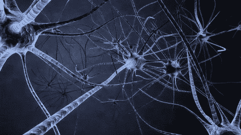
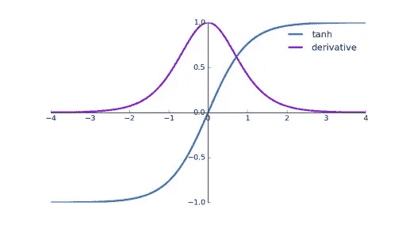
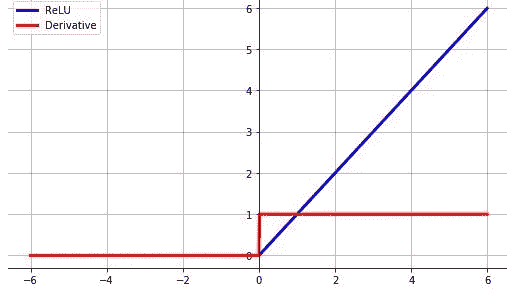
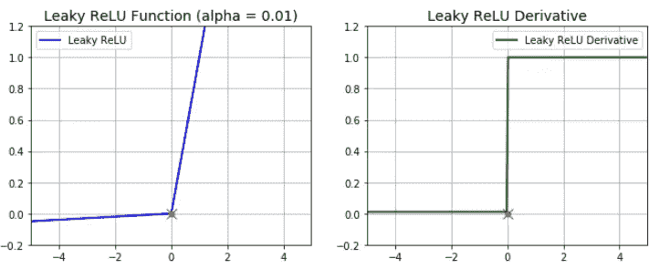
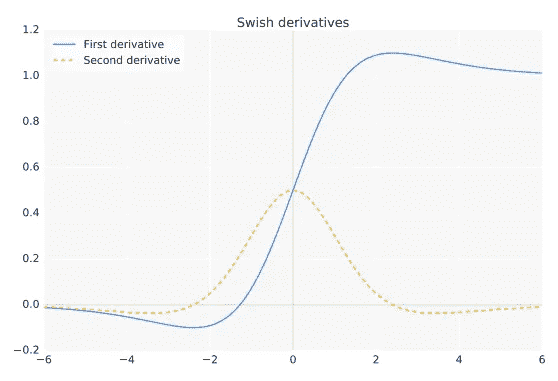
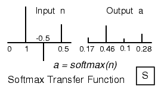
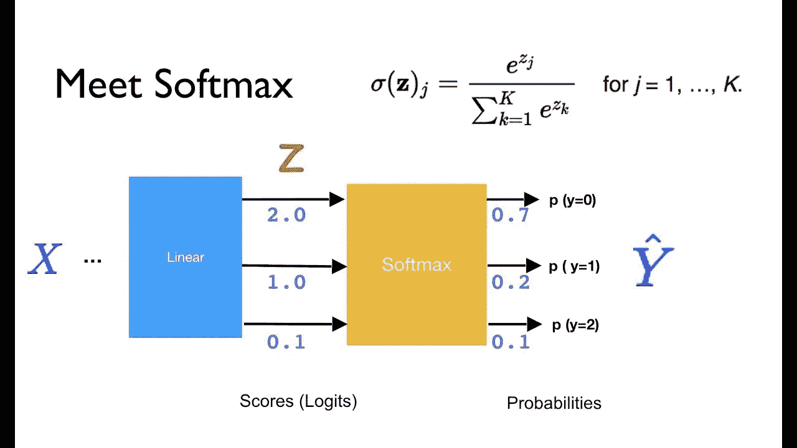

# 激活功能|深度学习模型的决策者

> 原文：<https://medium.com/analytics-vidhya/activation-functions-cd3efd0ea0a?source=collection_archive---------31----------------------->

你想看这篇文章吗？要么**是**要么**否**你刚刚做了一个决定，在做这个决定时，你只是借助了**激活功能**。

你想知道怎么做吗？向下滚动。


由 [Max Kleinen](https://unsplash.com/@hirmin?utm_source=medium&utm_medium=referral) 在 [Unsplash](https://unsplash.com?utm_source=medium&utm_medium=referral) 拍摄的照片

所以让我先解释一下我在描述中提出的问题。你知道题目激活功能(+ve)或者你可能不知道题目(-ve)这些都是你思想的输出。但是当你对这篇文章感兴趣并想到是或不是时，你只是激活了你的输出..多么简单。所以让我们来看看这些。



嗨，我是塔潘，今天在这篇文章中，我们将探讨激活功能。

你将在这篇文章中获得关于激活函数的所有知识。

*让我们开始吧……*

1.  它们是什么？有多少？
2.  它们是用来做什么的？
3.  他们是如何进入画面的？
4.  如何在深度神经网络中使用它们。
5.  所有神经网络的优缺点？所以你将使用哪个激活功能，在哪里使用。

# 它们是什么？有多少？

激活函数是确定神经网络输出的数学方程。这只是一个触发功能，告诉你，你会不会把你的信息向前。这可以根据您的数据和模型预测来激活或不激活。

这些对于归一化 0 到 1 或-1 到 1 之间的数据也很有用。

这些激活函数主要有两种类型，即线性激活函数和非线性激活函数，也称为二元函数。

## 线性激活函数

Y = mx

这看起来眼熟吗..是..

这是唯一一个线性激活函数。这会返回每个神经元的输入*权重。此函数创建多个输出，我们不能在任何分类模型中使用它，因此它在回归应用程序中提供了非常好的性能。

## **非线性激活功能**

有一些非线性激活函数，这些是。

1.  Sigmoid 函数也称为逻辑函数。
2.  双曲正切函数
3.  整流线性单位
4.  泄漏 Relu

> **Sigmoid 函数，也称为逻辑函数**


乙状结肠位于 0 到 1 之间。这是以前广泛使用的非线性激活函数之一。sigmoid 的数学函数是:

```
f(x) = 1/(1+e^-x)
```

在 Python 程序中:

```
import numpy as np
def sigmoid_function(x):
    z = (1/(1 + np.exp(-x)))
    return z
```

*优点:*

1.  作为绑定到 0 和 1 的函数..该值不会跳出边界。因此它将其输出值归一化到 0 到 1 之间。

*缺点*:

1.  计算开销很大。
2.  输出不是以零为中心。
3.  造成渐变消失的问题。这取决于 x 的值，如果 x 值变低，会导致渐变消失的问题。因为所有的计算都只是链乘法。所以如果 x 很低。在一些迭代之后，(让我们假设数据将是 0.1x 10–8)，因此没有模型可以学习的任何东西..所以这是一个巨大的缺点。

> **双功能**



零中心函数。这是数学术语。

```
tanh(x) = 2/(1+e^(-2x)) -1
```

在 Python 程序中:

```
def tanh_function(x):
    z = (2/(1 + np.exp(-2*x))) -1
    return z
```

*优点:*

1.  以零为中心，这样有助于塑造那些拥有强大

*缺点*:

1.  计算开销很大。
2.  这确实造成了渐变消失的问题。和乙状结肠一样。

> **ReLU(整流线性单元)**

你问的是什么？？简单。不允许这么简单的否定。



```
f(x)=max(0,x)
```

在 Python 程序中:

```
def relu_function(x):
    if x<0:
        return 0
    else:
        return x
```

*优点:*

1.  计算成本不高，因为这是一个非常简单的函数，神经网络收敛速度非常快。

*缺点*:

1.  这也产生了渐变消失的问题。如果输出非常非常低..但是大多数时候我们不会面对这个问题。
2.  不在零中心
3.  因为它不取任何-ve 值，取所有正值，所以会发生爆炸梯度问题，因为链乘法每次都可以得到更高的值。

> **泄漏的 ReLU**

只不过是向着 ReLu 又迈进了一步。与其不考虑所有的..这里我们将在小范围内。



```
f(x)= 0.01x, x<0
    =   x, x>=0
```

在 Python 程序中:

```
def leaky_relu_function(x):
    if x<0:
        return 0.01*x
    else:
        return x
```

*优点:*

1.  计算成本不高，因为这是一个非常简单的函数，神经网络收敛速度非常快。
2.  它有一手更好的牌，它也认为有价值。它防止了“死亡再路”问题

*缺点*:

1.  泄漏的 relu 给出不一致的输出。
2.  不在零中心

> **唰**



```
f(x) = x/(1-e^-x)
```

在 Python 程序中:

```
def swish_function(x):
    return x/(1-np.exp(-x))
```

1.  计算开销不大，因为这与 relu 非常相似。一些其他的选择是 swish 和 h-swish。

> **Softmax**

softmax 函数只是多个 sigmoids 的组合。



```
def softmax_function(x):
    z = np.exp(x)
    z_ = z/z.sum()
    return z_
```



*优点:*

1.  处理多个类。它将输出标准化，并以概率形式给出结果。所有的输出加起来是 1。
2.  大多数情况下，softmax 用于输出图层，用于多分类问题。

我想我已经回答了我的问题..但是还有一个。那就是..

> ***这些是如何用于深度神经网络的。***

因为这需要对深层神经网络及其工作原理有所了解..所以我将把它放在另一篇文章中。但是现在，如果你想看看 Keras 的情况..它在这里..

[](https://keras.io/api/layers/activations/) [## Keras 文档:层激活函数

### 激活既可以通过激活层使用，也可以通过所有转发支持的激活参数使用…

keras.io](https://keras.io/api/layers/activations/) 

那都是男生！

感谢您阅读这篇文章。如果你喜欢，请鼓掌。请关注以获得关于机器学习和深度学习的酷文章。

这是我在 Android 应用程序和深度卷积神经网络上的端到端项目部署。如果你想从头到尾看看事情是如何运作的。别忘了去看看。