# 激活功能——神经元如何触发

> 原文：<https://medium.com/analytics-vidhya/activation-functions-how-should-the-neurons-trigger-1349a383ffeb?source=collection_archive---------16----------------------->

我们都知道，神经网络是一种信息处理范式，其灵感来自科学家能够观察到的大脑中的生物过程。因此，人工神经元通常包括输入、输出和决定神经元是否应该被激活的激活函数。

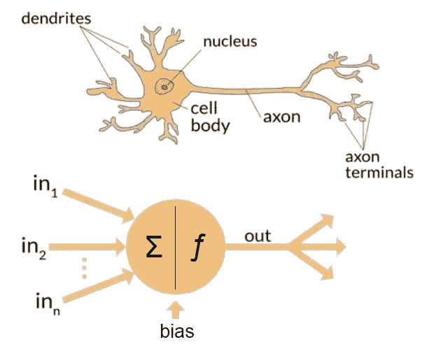

一个生物神经元和一个人工神经元

基本上，激活函数的重要性在于**将非线性**引入神经元的输出。

> 当一个人不小心触摸到一个**热物体**时，他们会不假思索地自动把手抽走。当脊髓运动神经元被激活并向大脑发送信号时，就会发生这种情况。

# 为什么激活函数很重要？

让我们考虑一个神经元，其净输入为

现在，这个净输入的值可以是从-inf 到+inf 的任何值。神经元并不真正知道如何绑定到值，因此无法决定触发模式。因此，激活函数是神经网络的重要组成部分。它们基本上决定了一个神经元是否应该被激活。因此，它限制了净投入的价值。

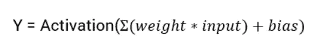

# 非线性的重要性

我们知道，激活函数是一种非线性转换，在将输入发送到下一层神经元或最终作为输出之前，我们对输入进行转换。但是引入非线性的必要性是什么呢？

如果你把几个线性变换链接起来，你得到的只是一个线性变换。例如，假设 f(x) = 2 x + 3，g(x) = 5 x — 1，那么将这两个线性函数链接起来，就会得到另一个线性函数:f(g(x)) = 2(5 x — 1) + 3 = 10 x + 1。因此，如果层与层之间没有一些非线性，那么即使是很深的一堆层也相当于一个单层:你无法用它来解决非常复杂的问题。

同样，如果我们看到一个简单线性函数 p(x)=ax 的表示

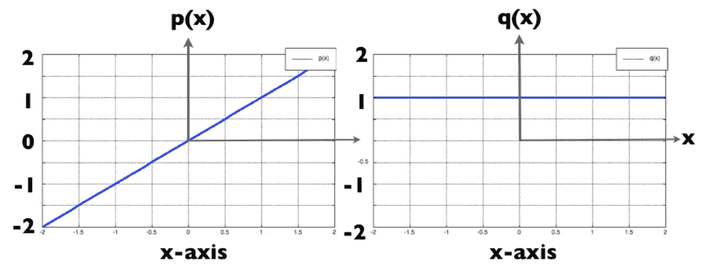

线性函数(左)及其导数(右)

当我们对函数关于 x 求导时，结果就是 x 的系数，它是一个常数(q(x)= **a** )。

这里的梯度(或导数)是常数，完全不依赖于输入值 x。这意味着权重和偏差将在反向传播过程中被更新，但是更新因子将是相同的。在这种情况下，神经网络不会真正改善误差，因为梯度对于每次迭代都是相同的。网络将不能很好地训练并从数据中捕获复杂的模式。

# 激活功能的类型

## ****乙状结肠功能****

**Sigmoid 函数是一种广泛使用的激活函数，其数学定义为:**

**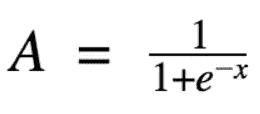****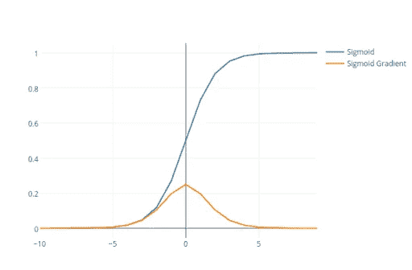**

**SIGMOID 函数和导数**

**这个 S 形函数已经被证明非常适用于结果为 **0** 或 **1** 的**二元分类**问题。如果值大于 **0.5** ，则结果很容易预测为 **1** ，否则为 **0** 。**

**这是一个光滑函数，并且是连续可微的。函数是非线性的，这种非线性使网络更加复杂，并允许我们用它来完成更多的任务。**

## **Tanh 函数**

**双曲正切函数只是放大的 sigmoid 函数。输出不是从 0 到 1，而是从-1 到 1。因此，下一层的输入不会总是相同的符号。它在数学上可以定义为**

**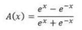****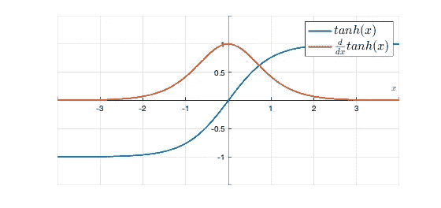**

**双曲正切函数和导数**

**与 sigmoid 类似，双曲正切函数在所有点上都是连续且可微的。与 sigmoid 函数相比，tanh 函数的梯度更陡。**

**通常双曲正切函数优于 sigmoid 函数，通过比较两个函数的导数图可以明显看出这一点。可以看出，tanh 的导数图比 sigmoid 的导数图更陡，即我们具有更高的梯度(导数)强度(范围在 0 和 1 之间，而 sigmoid 的梯度强度范围在 0 和 0.25 之间)，因此有助于快速学习(或收敛)。**

## **消失梯度问题**

****Sigmoid** 和 **Tanh** 函数共有的一个主要缺点是消失梯度问题。**

**我们知道，为了减少神经网络的损失函数，通过反向传播来修改每一层的权重。我们知道 Sigmoid 的梯度范围是 0 到 0.25，Tanh 的梯度范围是 0 到 1。然后，对于一个 n 层神经网络，如果我们对每一层使用 sigmoid/tanh 函数，那么随着信号的反向传播，梯度将变得越来越小。**

**反向传播使用链式法则，该法则具有将这些小分数的 n 倍相乘的效果，以计算梯度，该梯度将它们指数地减小，变得几乎等于 0。这意味着第一层几乎没有会使网络学习瘫痪的梯度。**

## **RELU**

**校正线性单元或 RELU 是最受欢迎的激活函数之一，通常用于语音识别和计算机视觉的深度学习神经网络。它在数学上可以定义为**

**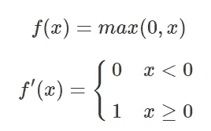****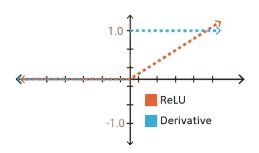**

**ReLU 函数和导数**

**RELU 函数图可能看起来与正轴上的线性函数具有相同的特征。但最重要的是，ReLU 本质上不是线性的。**

**RELU 的主要优点是一次只有几个神经元被激活，使网络变得稀疏，使其高效且易于计算，即如果输入为**负**则输出为 **0** ，如果输入为**正则输出为 **1** 。****

**RELU 的另一个优势是它没有消失梯度的问题。由于导数只是一个常数值，所以成本函数曲线收敛得很好。**

> **哇，这是一个职业吨。肯定有附加条件。**

**我们可以看到，对于负值，导数是 **0。**由于这个原因，在反向传播过程中，一些神经元的权重和偏差没有更新。这会产生永远不会被激活的死亡神经元。这是由漏 RELU 处理的。**

## **漏水的 RELU**

**Leaky ReLU 函数只不过是 ReLU 函数的改进版本。顾名思义，这个函数没有负值的 0 值，而是引入了一个称为泄漏的小值。**

**它在数学上可以定义为**

**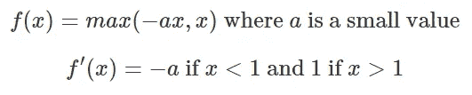****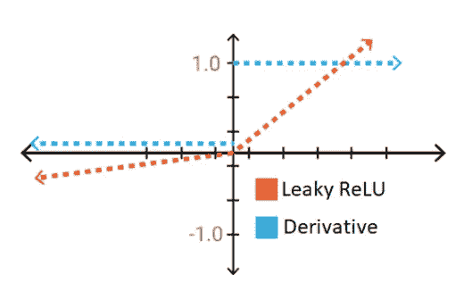**

**漏 ReLU 函数及其导数**

**这种泄漏或修改是试图修复垂死的 ReLU 问题，以便我们不再遇到该区域的死亡神经元。**

## **Softmax 函数**

**softmax 函数是一种类似于 sigmoid 函数的激活函数。当我们试图处理分类问题时，这是很方便的。T **最重要的一点是，它在深度学习模型的输出层是首选的，尤其是在需要分类两个以上的时候。**它允许确定输入属于特定类别的概率，报告每个类别的“置信度分数”。因为我们在这里处理的是概率，所以 softmax 函数返回的分数总和将为 1。**

**因此，预测类是列表中置信度得分最高的项目。**

**它在数学上可以定义为**

**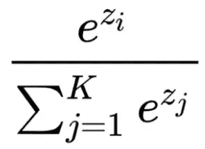**

**它指出，我们对输出层的每个元素应用一个标准指数函数，然后通过除以所有指数的总和来归一化这些值。这样做可以确保所有取幂值的总和等于 1。**

**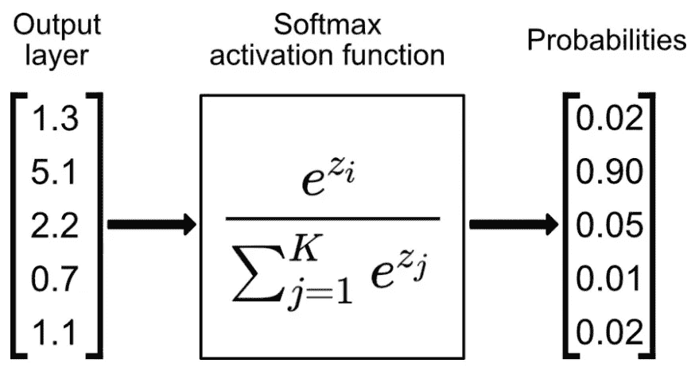**

## **要使用哪个激活功能**

**现在，在所有这些讨论之后，唯一和最重要的问题仍然是使用哪个激活函数。这是不是意味着我们做什么都用 ReLu？还是乙状结肠还是坦？嗯，是也不是。推荐一个适用于所有用例的激活功能是非常困难的。有许多考虑因素——计算导数有多困难(如果它是可微的话！)，你选择的激活函数的网络收敛速度有多快，有多光滑，是否满足泛逼近定理的条件，是否保持归一化等等。**

**通过这篇文章，我尽力描述了一些常用的重要激活函数。还有其他的激活功能，但总体思路是一样的。希望你了解激活函数背后的概念，为什么使用它们，以及我们如何决定使用哪一个。**

**感谢阅读。**