# ML 中的激活函数

> 原文：<https://medium.com/analytics-vidhya/activation-functions-in-ml-207aaf596b34?source=collection_archive---------15----------------------->

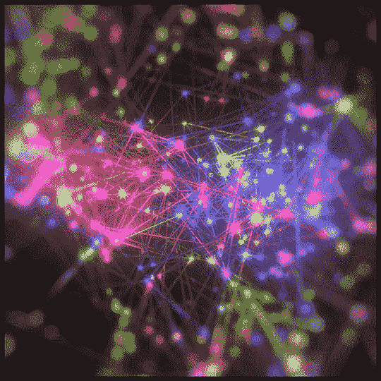

在机器学习中，神经网络是几个神经元的联合，以试图模仿人类神经元的行为，正如我们所知，我们的神经元相互连接，以执行不同的复杂任务，如对对象进行分类，检测某些顾客等。这就是机器学习中这些神经网络存在的原因。

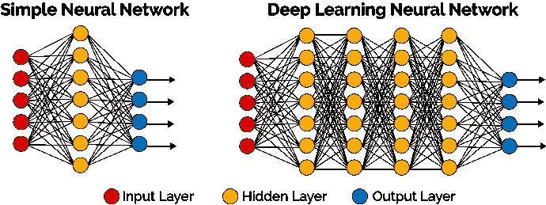

因此，这些网络能够执行图像分类、预测和决策等操作。组成神经网络的每个节点都接收信息，并将其计算为新值，该值将成为下一层的新输入。每个神经元都必须使用一个激活函数，因为它们与这个执行单元相连。

Z = W * X + b

A = act_fun(Z)

W =是每个神经元的权重

b =每个神经元的偏差

A =将作为下一层输入的最终结果

act_fun =活动函数

选择正确的激活函数非常重要，因为它将直接影响网络性能，这就是为什么我将尝试解释主要的激活函数，以便您可以选择与您的算法更好地匹配的函数。

## 阶跃函数

阶跃函数很容易理解，0 是小于或等于阈值的数，1 是大于阈值的数

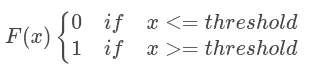

这个函数用于分类一个单独的类，所以你可以说一个特定的图片是否属于一个类，所以用这个函数你只能说是或不是，你没有更多的选择或者它属于或不属于，就是这样。

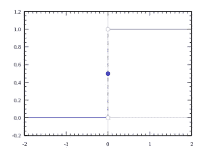

## **线性函数**

这是一个线性激活函数，我们的函数与神经元或输入的加权和成正比，如果你能看到这是同一条线的话。

A = cx

这个函数允许多个输出，因为你没有任何限制，正因为如此，你可以分类多个类。

但是作为二进制分类器，线性激活函数不能很好地工作，主要原因是梯度下降的问题，因为 A = cx，对 x 的导数是 c，这意味着梯度与输入无关。这是一个恒定的梯度，下降将是恒定的梯度，这意味着训练不依赖于输入的变化。

这个函数的另一个问题是，在学习过程中，不止一个神经元会被激活。

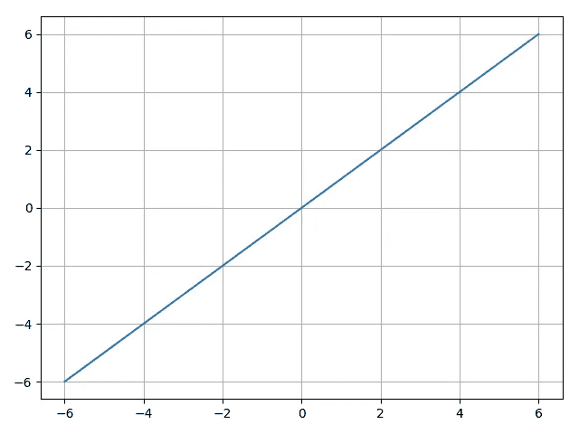

## **乙状结肠功能**

Sigmoid 是一个非线性函数，输出总是在 0 和 1 之间，因此是一个很好的分类器，你可以使用
概率方法来获得更高的值，并确定哪个神经元将被激活。

Sigmoid 函数是当今使用最广泛的激活函数之一。

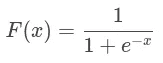

你会注意到，当值太大或太小时，该区域的梯度会变小。这就产生了一个“消失梯度”的问题，因此当梯度很小或已经消失时，由于其值极小而不能产生显著的变化。网络拒绝进一步学习或者速度非常慢

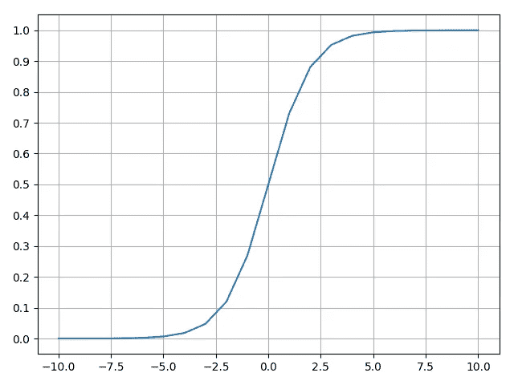

# Tanh 函数

这个函数与我们上面讨论的 sigmoid 函数有相似之处。它是非线性的，输出也有一个范围(-1，1)

Tanh 也是一个非常流行和广泛使用的激活函数。

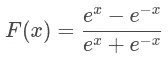

在 sigmoid 或 tanh 之间做出决定将取决于您对梯度强度的要求，因为 tanh 梯度比 sigmoid 更强，也更容易对具有强负值、中性值和强正值的输入进行建模。由于这些原因，带有 tanh 隐层的神经网络更容易训练。

问题是，作为 sigmoid，tanh 也有消失梯度问题。

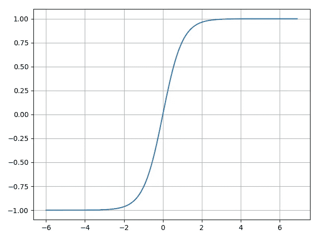

**ReLU**

代表整流线性单元，它混合了线性和非线性功能的优点，提供与 Sigmoid 相同的优势，但性能更好。

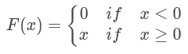

ReLu 在计算上比 tanh 和 sigmoid 便宜，因为它涉及更简单的数学运算。此外，这个功能不会同时激活所有的神经元。

由于另一个函数 ReLU 也有问题，当输入接近零或为负时，该函数的梯度为零，因此神经网络不会学习，这种现象称为死亡 Relu 问题。

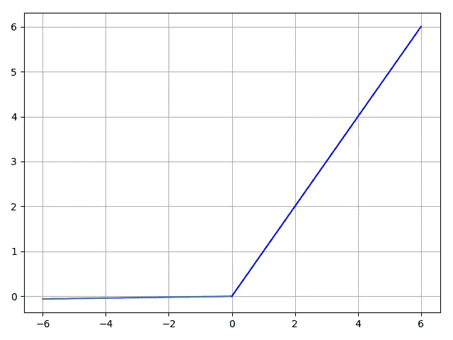

**Softmax**

理想的多类分类，当你需要选择一个类。因此通常用于输出层。

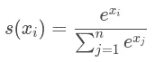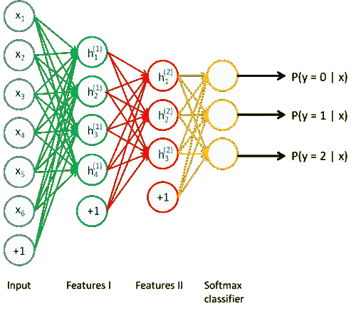

该函数计算所有可能的目标类中每个类的概率。所有概率的总和等于 1，并且它们的最大值是分类的类别。