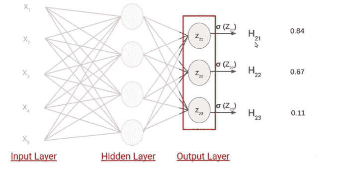

# 神经网络中的激活函数

> 原文：<https://medium.com/analytics-vidhya/activation-functions-in-neural-network-55d1afb5397a?source=collection_archive---------8----------------------->

来源:互联网

在这个博客中，我们将了解在深度学习中最广泛使用的激活函数。在进入正题之前，让我们简要回顾一下神经网络的基本架构，并理解它的工作原理。

为了简单起见，考虑多层感知器。

来源:Vidhya 分析

我们有一组输入。这些输入被发送到隐藏层，我们计算 Z 值，它是输入特征和一些权重的乘积。在此操作之后，我们使用激活函数来计算输出 h。我们在 z 上使用 sigmoid 激活函数。然后将结果发送到下一层，在那里我们有一些权重和偏差，然后我们计算输出 o。

更多细节你可以参考我以前的博客来更好地理解[https://medium . com/@ gauravrajpal 1994/introduction-to-neural-networks-1d 111 bb 4649](/@gauravrajpal1994/introduction-to-neural-networks-1d111bb4649)

**问题来了，我们到底为什么需要激活功能。要解决这个问题，让我们更好地理解它。**

一个主要原因是它不能捕捉数据中的复杂关系。此外，我们将只剩下输入和权重以及偏差的线性组合。

让我们用 [TensorFlow 游乐场](https://playground.tensorflow.org/#activation=tanh&batchSize=10&dataset=circle&regDataset=reg-plane&learningRate=0.03&regularizationRate=0&noise=0&networkShape=4,2&seed=0.79089&showTestData=false&discretize=false&percTrainData=50&x=true&y=true&xTimesY=false&xSquared=false&ySquared=false&cosX=false&sinX=false&cosY=false&sinY=false&collectStats=false&problem=classification&initZero=false&hideText=false)来形象化。

来源:Vidhya 分析

在 TensorFlow Playground 中，我们可以看到左侧有多个数据选项。在中间，我们定义了我们的架构。我们有输入 X1 和 X2 和单一隐藏层，然后输出层。我们还可以看到一个选项来改变激活功能，学习率等。**目标是创建一个决策边界，将橙色点与蓝色点分开**。所以，让我们看看在激活函数为**线性**之后，结果是什么。

我们将在图中观察到，在不到 100 个时期内，它可以为我们选择的简单数据集创建最佳决策边界，并且训练和测试集损失为 0。

来源:Vidhya 分析

现在让我们在张量流运动场中选择另一个数据集，其中决策边界不是那么容易创建的。它是一个循环，稍后当使用线性激活函数训练模型时，我们将会看到，即使在更多次数的时期之后，并且在训练和测试损失中没有改善，我们也不能在分离橙色和蓝色点的最佳决策边界处导出。

来源:Vidhya 分析

现在，让我们想象当我们选择 sigmoid 激活函数时的决策边界，保持一切不变。

我们将看到，该模型能够很好地进行训练，并能够在不到 200 个时期内正确地对这两种类型的数据点进行分类。

来源:Vidhya 分析

因此，将激活函数从线性改为 sigmoid 增加了网络中的非线性，这使得网络足够强大以捕捉数据中的关系。希望现在你们都清楚激活功能的用法了吧？

现在，既然你意识到了激活函数的重要性，那么让我们深入研究一下深度学习中使用的激活函数的类型。

# **激活功能的类型。**

> ***线性激活功能***

线性激活函数是最简单的激活函数。它没有捕捉到我们之前观察到的数据中的任何非线性。

线性激活函数的数学等式是 **y = ax** 这表示对于任何输入 x，输出将是 x 的 a 倍。

假设 a = 1，图表看起来会像这样，

来源:Vidhya 分析

基于上面观察到的结果，我们可以说输入可以是范围从(-无穷大，+无穷大)的任何值，输出也是如此。这是激活函数连续的条件之一。

来源:Vidhya 分析

激活函数的第二个条件是，“它在每一点都应该是可微的。”。让我们看看线性激活函数的导数。我们会看到，当我们对 w . r . t . x 求导时，我们会得到 x 的系数，即 a。

来源:Vidhya 分析

这是最简单的激活函数，不会捕获数据中的非关系。该函数常用于回归问题的输出层。考虑这样一个例子，我们需要预测基于年龄、经验和资格的收入。

来源:Vidhya 分析

> ***乙状结肠激活功能***

这是最常用的激活函数，我们之前也曾使用它来演示如何通过张量流操场捕捉数据中的非线性。

sigmoid 激活函数的数学方程如下:

来源:Vidhya 分析

sigmoid 激活函数最好的部分是它将输出值限制在 0 和 1 之间。这些值通常被视为概率，因此 sigmoid 函数通常用于输出层，我们需要在此计算类的概率。此外，从上面的图表中我们可以看到，sigmoid 激活函数在每个点都是连续且可微的。

让我们看看 SIGMOID 激活函数的导数。

来源:Vidhya 分析

从上面的图中我们可以看到，曲线非常平坦，这意味着这个激活函数的梯度或导数值将非常小。

为了更好地理解我们如何得到 sigmoid 激活函数的导数的步骤，你们都可以参考下面的链接。

 [## Sigmoid 函数的导数

### 在本文中，我们将看到在人工智能中使用的 Sigmoid 函数的完整推导…

towardsdatascience.com](https://towardsdatascience.com/derivative-of-the-sigmoid-function-536880cf918e) 

> ***TANH 激活功能***

TANH 激活函数非常类似于 sigmoid 激活函数。我们可以说它是 sigmoid 激活函数的缩放版本。

双曲正切激活函数的数学方程如下:

来源:Vidhya 分析

在双曲正切激活函数中，输出值在(-1，1)之间，而在 sigmoid 激活函数中，我们看到输出值范围在(0，1)之间。

**与*之差&之差*之差**

来源:Vidhya 分析

从上图我们可以看到，双曲正切函数在 0 附近的中心更陡。此外，该图清楚地表明 **TANH 是 SIGMOID 的缩放版本。**

让我们看看双曲正切激活函数的导数。

来源:Vidhya 分析

与 sigmoid 激活函数相比，tanh 激活函数的值相对较大。因此，就 tanh 而言，训练更快，因为梯度值将更大，并且更新权重将更快。

> ***ReLU 激活功能***

ReLU 代表**Re**ctived**L**iner**U**nit。它是深度学习中最常用的激活函数之一。

对于所有负值，该函数返回 0，对于任何大于 0 的值，该函数返回相同的输出。让我们看看下面的等式。

来源:Vidhya 分析

我们可以看到，对于所有大于 0 的值，它的行为就像一个线性函数，也可以表示为 max(0，x)，其中 x 是任何实数。同样清楚的是，任何负的权重输入值的结果都将是 0，这意味着神经元在正向传播过程中没有被激活。因为只有一定数量的神经元被激活，所以 ReLU 激活函数与 sigmoid 和 tanh 激活函数相比在计算上是有效的。

***ReLU、TANH 之差&乙状结肠***

来源:Vidhya 分析

回到 **TANH** 和 **SIGMOID** 激活函数，我们看到它们在每个点都是可微的，但是回到 **ReLU** 激活函数，我们看到它在 x = 0 点是不可微的。

让我们看看 ReLU 激活函数的导数。

来源:Vidhya 分析

正如我们看到的，对于所有大于 0 的值，它的导数是 1，对于小于 0 的值，它是 0。它的导数没有定义在 x=0 的值上。

**为了实现的目的，x=0 处的导数的值被认为是 0。**

这个函数还有一个这样的问题。一些神经元的导数仍然变为 0，因此一些权重和偏差没有被更新。因此，为了解决这个问题，我们有另一个激活功能。

> ***漏热路激活功能***

Leaky ReLU 是一个激活函数，它克服了 ReLU 层中遇到的缺点，即某些神经元的导数变为 0。为了解决这个问题，它为 x < 0 instead of 0.

Let us look at equation below.

Source : Analytics Vidhya

Lets look at the derivative of Leaky ReLU activation function.

Source : Analytics Vidhya

So, when we calculate the derivative of leaky relu activation function it will be 0.01 for all values of x ≤ 0 and 1 for all values of x > 0 返回 x 的一个小值 0.01。

> ***SOFTMAX 激活功能***

SoftMax 激活通常用于多类分类。

在进入为什么这个激活函数被用于多类分类之前，让我们首先理解什么是多类分类问题。例如:

考虑下图，对于每个观察值，我们有 5 个特征，目标变量有 3 个类别(类别 1、类别 2 和类别 3)

来源:Vidhya 分析

让我们为上面讨论的问题创建一个简单的神经网络。我们将看到输入图层中有 5 个输入要素。接下来我们有一个隐藏层，它有 4 个神经元。显然，我们可以增加神经元的数量和体系结构中的层数，但目前我们只考虑具有 4 个隐藏层的神经元。这些神经元中的每一个都使用输入、权重和偏置来计算 Zij(第 1 层的第 1 个神经元，我们称之为 Z11 等等)表示的值 Z。通过这些值，我们应用激活函数，并将结果发送到输出层。

现在你能猜出输出层的神经元数量吗？？？

如果你猜对了，你是对的，因为我们数据集的目标变量中有 3 个类。每一个单独的神经元都会给你单独类的概率。

来源:Vidhya 分析

在上图中，我们可以看到输出层中的第 1 个神经元将给出它属于第 1 类的概率。类似地，第二个神经元将给出它属于类别 2 的概率，最后第三个神经元将给出它属于类别 3 的概率。

现在，假设我们使用输出图层的权重和偏差计算 Z 值，并应用 sigmoid 激活函数，已知 sigmoid 激活函数为我们提供 0 和 1 之间的值，我们将获得一些输出值。

来源:Vidhya 分析

如果我们更深入地思考，我们会发现在这种情况下我们会遇到两个问题。首先，如果我们应用阈值= 0.5，它会告诉我们输入层属于 2 个类(类 1: 0.84，类 2: 0.67)。其次，概率值是相互独立的(数据点属于第 1 类的概率不考虑其他 2 类的概率)。

***这就是 SIGMOID 激活函数对于多类分类问题不是首选的原因。所以我们用 SOFTMAX 激活函数代替 SIGMOID。***

使用 SoftMax 激活我们可以获得相对概率，这意味着它使用目标中多个类的概率值来计算最终输出。

让我们看看 SoftMax 激活功能是如何工作的。

来源:互联网

SoftMax 函数将 logit[2.0，1.0，0.1]转换为概率[0.7，0.2，0.1]，概率总和为 1。

*在深度学习中，术语 logits 层普遍用于神经网络的最后一个神经元层，用于分类任务，产生范围从[-无穷大，+无穷大]的实数形式的原始预测值。—维基百科*

SoftMax 通过获取每个输出的指数，然后通过这些指数的总和归一化每个数字，从而将 *logits* (多类分类神经网络的最后一个线性层的数字输出)转化为概率，因此整个输出向量加起来等于 1。

让我们逐步考虑基本上发生了什么(假设):

**步骤 1:假设我们获得了输出层的以下值。**

来源:Vidhya 分析

**步骤 2:将 SoftMax 激活函数应用于这些神经元中的每一个。**

来源:Vidhya 分析

我们必须注意，这些是属于各自类别的输入数据点的概率值。我们必须注意在这些情况下概率总和是 1。因此，在这种情况下，很明显输入属于类别 1。此外，如果任何类别的概率值改变，类别 1 的概率值也将改变。

这都是关于 SOFTMAX 激活功能的。希望你明白了？

# 如何为我们的神经网络选择激活函数？

你们可能想知道，到目前为止，我们已经研究了各种激活函数，看了它们的数学方程和导数，理解了为什么它们有用的术语。在这一部分中，我们将探索哪一个激活函数可以用于我们的神经网络。

1.  **线性激活功能**

它用于目标变量连续的输出层的**回归**类问题。正如我们已经讨论过的，线性激活函数不能捕捉数据中的非线性，因此最好在输出层使用它，而我们可以在隐藏层使用非线性函数，如 RELU 和双曲正切函数。

2.**乙状结肠激活功能**

正如我们所知，它返回 0 到 1 之间的值，这些值被视为输出类的概率。通常它用于**二元分类问题**，而我们可以在隐藏层使用其他激活函数。

3. **ReLU & TanH 激活功能**

这些激活函数通常用于神经网络的**隐藏层**。事实上，ReLU 激活功能比其他激活功能表现更好，是最受欢迎的选择。

4. **Softmax 激活功能**

与 sigmoid 激活函数相似，softmax 激活函数返回每个类别的概率，用于输出层，最常用于**多类别分类。**

C 结论

这就结束了我们的讨论话题。希望你喜欢它，喜欢探索深度学习中使用的激活函数背后的理论概念。如果是的话，请喜欢它并为它鼓掌。

请务必在 LinkedIn 上联系我:[https://www.linkedin.com/in/gaurav-rajpal/](https://www.linkedin.com/in/gaurav-rajpal/)

***敬请关注优化器/损失函数和深度学习演示项目的进一步更新。***

问候，

高拉夫·拉杰帕尔·(gauravrajpal1994@gmail.com)