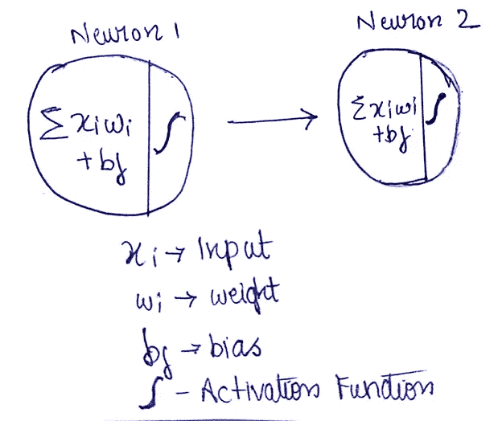
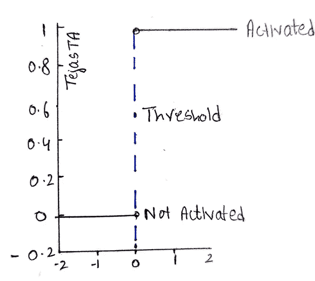
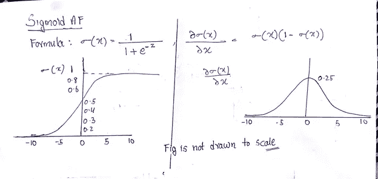
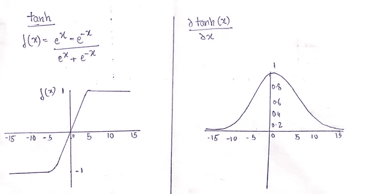
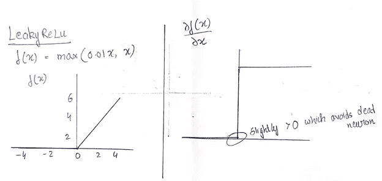
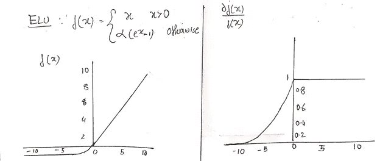
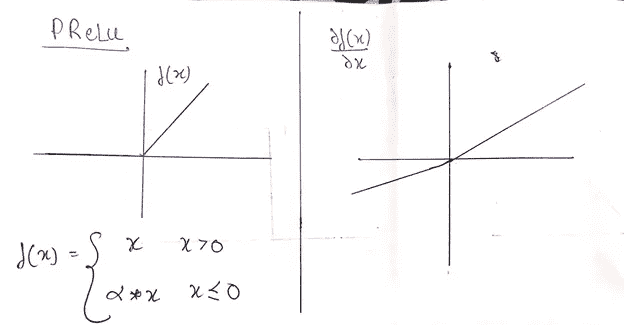
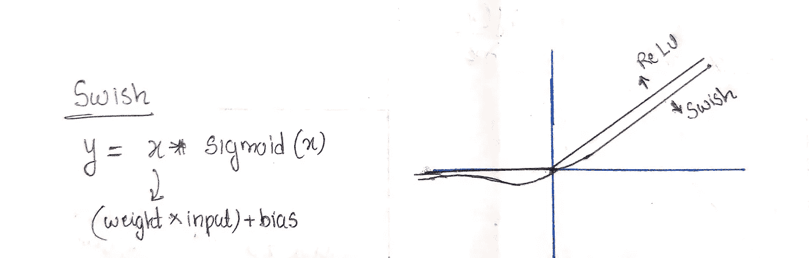
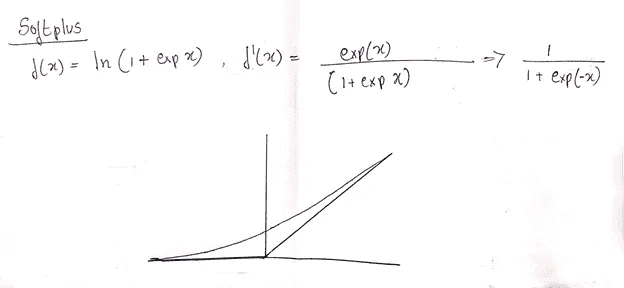
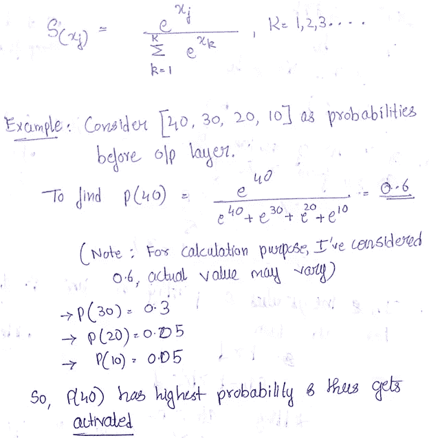

# 神经网络中的激活函数

> 原文：<https://medium.com/analytics-vidhya/activation-functions-in-neural-networks-69197497bd1d?source=collection_archive---------20----------------------->

激活函数决定了神经网络的输出。它们负责神经网络的准确性和训练网络所需的计算能力。这些激活功能被连接到网络中的每个神经元，并作为一个门，从而在接收到正确的输入集时“激发”神经元。

例 —你把手浸入冷水中，你会感觉到冷，把手浸入热水中，你会感觉到热。这是由于大脑中负责检测冷热的某些神经元的激活。

神经元中心房颤动的表现

激活函数的表示

**激活功能的类型-**

1.二进制步骤

2.线性的

3.非线性的

1.  **二进制步骤**

这是一个基于*阈值*的 AF。你决定一个阈值，如果输出值大于阈值，那么神经元被激活，如果输出值小于阈值，则不被激活。这个 AF 的问题是，如果你有多个神经元输出激活的*信号，那么应该考虑哪一个？。结果，采用二进制阶跃函数的网络不能将输出分类为许多期望输出类别中的一个。*

二元步进 AF

二进制阶跃函数不可微，因此没有反向传播的余地。

**2。** **线性函数** —将输入乘以权重并添加偏差。之后，应用线性 AF，产生对应于输入信号的输出。因此，它适用于多种类别，我们可以以最大的概率获取神经元的输出。

直线的斜率是一个常数，所以在反向传播中，我们不知道应该调整多少权重以及针对哪个神经元。因此，网络效率不高，无法正确理解输入，导致输出层的精度非常低。

**3。非线性函数**——适用于复杂网络，允许构建具有多个层的更深层次网络。他们可以处理复杂的数据集，包括图像、音频和视频。此外，它们可以有效地调整反向传播中的权重。

# **3.1 乙状结肠房颤**

无论它接收什么输入，输出值都将在 **0 和 1 之间。**

乙状结肠房颤

**缺点**—

●曲线不是正态分布的，因此网络的计算成本很高，达到全局最小值需要很长时间。

●在反向传播中会出现消失梯度问题，由于该问题，必须添加的新权重将等于旧权重，网络的学习会减少。

# **3.2** **塔那夫**

无论它接收到什么输入，输出值都会在 **-1 和 1 之间。**

tanh AF

**优势** —数据呈正态分布或以零为中心，因此计算成本更低。

**缺点**——反向传播中会出现消失梯度问题，因此需要增加的新权值将等于旧权值，网络的学习能力会下降。

# **3.3 ReLu(整流线性单元)** **AF**

●如果 x 的值> 0，则输出为 x。

●如果 x 的值为< 0 then output is 0.

**则优势**-解决消失梯度问题。

**劣势** —死亡**神经元**状态，x 相对于 x 的导数为 1，但相对于 x 的负权重的导数为 0，因此在反向传播中没有新的权重可添加，从而导致**死于**或**死亡神经元**状态。

# **3.4 泄漏的 ReLU AF**

为了避免死神经元状态，我们将一个小正数乘以 x，但这再次引入了消失梯度问题，正如我们在下面的示例中看到的-

泄漏 ReLU AF

# **3.5 ELU(指数线性单位)AF**

由于存在指数项，计算非常昂贵。

ELU

# **3.6 PReLU(参数 ReLU)**

●如果 x > 0，则输出为 x 值。

●如果 x = 0，则输出为 0。

预聚焦自动对焦

以上两个条件使激活功能像 ReLU 一样工作。

我们引入了∞，这只是一个学习率。

●如果∝ = 0.01，则变为泄漏 ReLU。

●如果∞= 0，则变为 ReLU。

●任何其他值∝则变为参数 ReLU。

注意:∞是一个超参数。

# **3.7 嗖嗖**

当网络由 LSTM 小区组成时最常用。因为当隐藏层的数量大于 40 时，使用 Swish 会在计算上比较昂贵。

正如我们在上面的图像中看到的，x 只不过是(权重*输入)+偏差，因此我们得到了用蓝色绘制的曲线。

Swish AF

优势-

●解决消失梯度问题

●防止神经元死亡状态

●正态分布

# **3.8 Softplus**

Softplus 房颤的衍生物与乙状结肠房颤相同。这是 2001 年开发的一种较新的房颤。

SoftPlus AF

# **3.9 SoftMax**

当输出层有超过 2 个神经元时，则使用 SoftMax。

**soft max 的工作-**

SoftMax 工作

**致谢** -

1.  克里斯·纳伊克—[https://www.youtube.com/user/krishnaik06/featured](https://www.youtube.com/user/krishnaik06/featured)
2.  [https://missing link . ai/guides/neural-network-concepts/7-types-neural-network-Activation-functions-right/#:~:text = Activation % 20 functions % 20 are % 20 mathematic % 20 equations，relevant % 20 for % 20 model % 20 prediction](https://missinglink.ai/guides/neural-network-concepts/7-types-neural-network-activation-functions-right/#:~:text=Activation%20functions%20are%20mathematical%20equations,relevant%20for%20the%20model's%20prediction)。
3.  【https://en.wikipedia.org/wiki/Activation_function 号

通过以下方式联系我—

电子邮件—tejasta@gmail.com

领英—【https://www.linkedin.com/in/tejasta/ 

感谢阅读！