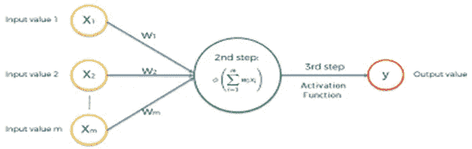
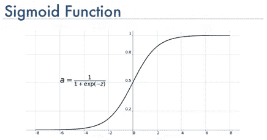
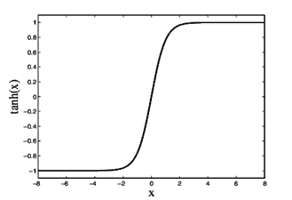
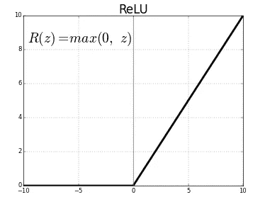
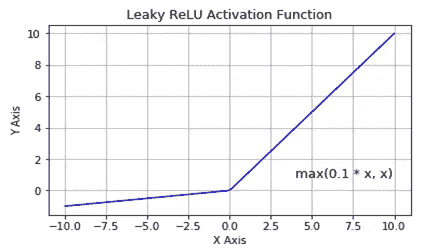
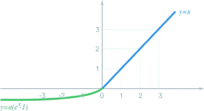
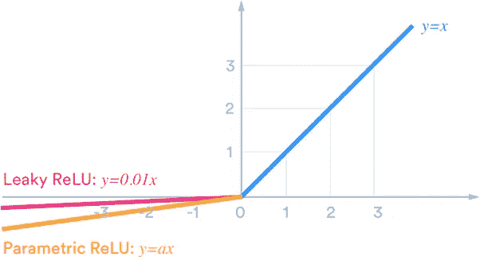
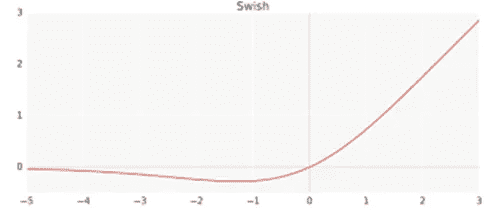

# 神经网络中的激活函数

> 原文：<https://medium.com/analytics-vidhya/activation-functions-in-neural-networks-811e782d37e8?source=collection_archive---------12----------------------->

**什么是激活功能？**

**激活函数**是决定神经网络输出的数学方程。在计算其输入(xi)的“加权和(Wi)”后，将**函数**附加到网络中的每个神经元，添加一个偏差，并根据每个神经元的输入是否与模型的预测相关来确定是否应该激活**(“触发”)。**

****任何激活函数的重要用途是将非线性属性引入我们的网络。****

**所有的 ***输入 Xi 的*** 乘以它们的 ***权重 Wi 的*** 分配给每个环节并连同 ***偏差*** ***b*** 一起求和。**

****

****激活功能类型:****

**线性函数**

**非线性函数**

****线性函数****

**线性激活函数的形式为 **y=mx+c.** 它采用输入( ***Xi 的*** )，乘以每个神经元的权重( ***Wi 的*** )，并产生与输入成比例的输出。函数的输出将不会被限制在任何范围之间。由于该函数遵循线性模式，因此用于回归问题。**

****非线性函数-****

**非线性激活函数是最常用的激活函数。这使得模型很容易概括或适应各种数据，并区分输出。它允许模型在网络的输入和输出之间创建复杂的映射，这对神经元的学习和解决复杂的业务问题至关重要。**

**非线性函数的类型:**

**乙状结肠的**

**双曲正切**

**热卢**

**泄漏 Relu**

**Swish Relu**

**ELU**

**预 relu**

****乙状结肠:****

**sigmoid 函数(y)的输出始终介于 0 和 1 之间。**

**在浅层神经网络的情况下，用于隐藏层和输出层。**

**Sigmoid 函数 f(x)的导数将总是在 0 到 0.25 之间。**

**遭受消失梯度问题。**

**数据不是以零为中心的，这使得收敛更加困难并且计算量很大。**

> ****用于分类问题。****

****

****TanH-****

**Tanh 将 y 的值在-1 到 1 之间转换。**

**双曲正切函数 f(y)的导数总是在 0 和 1 之间。**

**数据以零为中心。**

**收敛更容易。**

**深度神经网络中的消失梯度问题。**

> ****Tanh 优于乙状结肠。****

****

****ReLU:(整流线性单元)****

**ReLU 是已经流行的非线性激活函数**

**ReLU 转换 0 到 max(x)之间的值。它将负值转换为 0。**

**函数 f(x)的导数将是 0 或 1。**

**解决消失梯度问题。**

**它计算速度更快，容易收敛。**

**面临死亡神经元的问题。(在反向传播期间，如果权重为负，则 wold=wnew，并且该神经元是死神经元)**

**数据不是以零为中心的。**

****

****泄漏的 ReLU:****

**Leaky ReLU 函数只不过是 ReLU 函数的改进版本。当 x 小于 0 时，我们没有将 Relu 函数定义为 0，而是将其定义为 x 的一个小的线性分量。通常，对于 x 的负值，会引入 0.01 的值。**

**它解决了死神经元问题。**

**y 的值将是最大值(0.01*y 到 y)。**

**y 的导数将在 0 和 1 之间。**

**这在计算上更容易。**

****

****ELU:(指数线性单位)****

****指数线性(ELU)** 有一个额外的阿尔法常数，它应该是正数。如果 x 的值小于 0，则负数上加一个 alpha 值。alpha 大于或等于 0。**

**解决死亡神经元的问题。**

**数据以零为中心。**

**计算成本高**

**由于阿尔法项导致收敛缓慢。**

**导数永远不会等于 0。**

****

****PReLu(参数 ReLU):****

**如果 x 是 0.01，它将是漏 relu，如果α是 0，它是 relu。在 PReLU 中，alpha 值是动态训练的，这使它不同于其他 ReLU 函数。**

****α的值一般在 0 到 1 之间。****

****解决死神经元问题。****

****Swish ReLU:(一个自门控功能)****

****

****Y=x*sigmoid(x)****

**适用于层数超过 40 层的深度神经网络。**

**用于自动门控和 LSTM。**

**这在计算上非常昂贵。**

**解决死神经元问题。**

****如何选择激活功能？****

****

**选择一个激活函数是一个超参数，是由试凑法决定的，请记住下面的参数**

**线性激活函数用于解决回归问题。**

**在浅层神经网络的情况下，Sigmoid 用于分类问题。**

**TanH 和 Sigmoid 的组合用于深度神经网络。**

**ReLU 广泛应用于大多数神经网络的隐层中。向前发展，ReLU 的各种变体可用于解决 ReLU 的死神经元问题。**

*****我希望我已经给了你一些关于激活函数的基本理解。*****

> **让我们连接:**

**领英:[https://www.linkedin.com/in/prerna-nichani](https://www.linkedin.com/in/prerna-nichani)**

*****感谢阅读！*****

*****Thankyou for Reading!*****