# 神经网络中的激活函数

> 原文：<https://medium.com/analytics-vidhya/activation-functions-in-neural-networks-f36ed3946d91?source=collection_archive---------10----------------------->

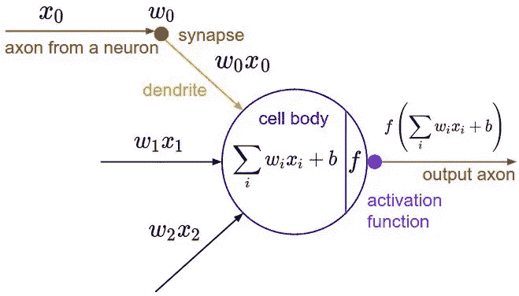

激活功能

**激活函数**是一种非线性转换，我们在将输入发送到下一层神经元或最终作为输出之前对其进行转换

*   我们需要激活函数将非线性真实世界的属性引入人工神经网络。

**那么为什么需要非线性函数呢？**

多阶函数称为非线性函数。

*   神经网络使用非线性激活函数，可以帮助网络学习复杂的数据，计算和学习几乎任何代表问题的函数，并提供准确的预测。

**没有激活功能的神经网络将只是一个线性回归模型，其能力有限，并且大多数时候表现不佳**

激活功能基本上可以分为两种类型

1.  线性激活函数
2.  非线性激活函数

# **线性或身份激活功能**

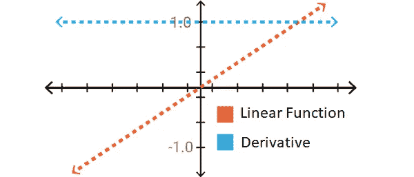

线性激活函数和导数

如你所见，这个函数是一条直线或线性的。因此，函数的输出将不会被限制在任何范围之间。

**等式:** f(x) = x →输出与输入相同

**范围:**(-无穷大到无穷大)

它对输入到神经网络的通常数据的各种参数的复杂性没有帮助。

**y=mx+c(在神经网络中，m 是表示 W 的直线方程，c 表示为 b，因此该方程可以修改为 *y=Wx+b* )**

它将输入(Xi)乘以每个神经元的权重(Wi ),并产生与输入成比例的输出。简单地说，加权和输入与输出成正比。

**线性函数的问题，**

*   线性函数处理复杂性的能力有限。它可以用于简单的任务，如可解释性。
*   微分结果是常数。
*   神经网络的所有层都合二为一。
*   线性函数意味着第一层的输出与第 n 层的输出相同。

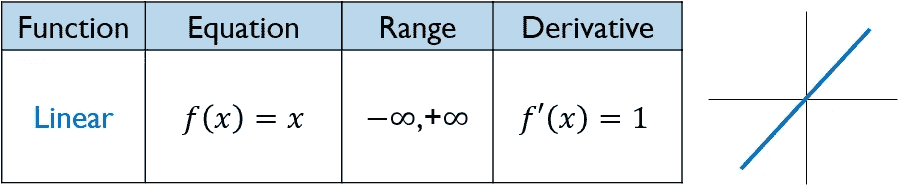

# **非线性激活功能**

大多数现代神经网络使用非线性函数作为激活函数来激活神经元。原因是它们允许模型在网络的输入和输出之间创建复杂的映射，这对于学习和建模复杂的数据是必不可少的，例如图像、视频、音频和非线性或具有高维度的数据集。

***非线性函数优于线性函数:***

*   微分在所有非线性函数中都是可能的。
*   网络的堆叠是可能的，这有助于我们创建深度神经网络。
*   这使得模型很容易概括或适应各种数据，并区分输出。

需要理解非线性函数的主要术语有:

***导数或微分:****y 轴的变化 w . r . t . x 轴的变化。它也被称为斜坡。*

***单调函数:*** *要么完全非增，要么完全非减的函数。*

## **1。乙状结肠或逻辑激活功能:-**

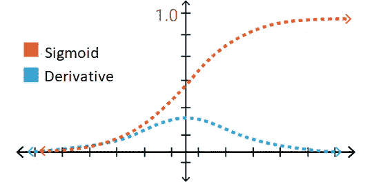

Sigmoid 激活函数和导数

Sigmoid 函数曲线看起来像 S 形。

我们使用 sigmoid 函数的主要原因是它存在于 **(0 到 1)之间。**因此，它特别适用于我们必须**预测概率**作为输出的模型。由于任何事情的概率只存在于 **0 到 1 的范围内，** sigmoid 是正确的选择。

函数是**可微的。**这意味着，我们可以在任意两点找到 s 形曲线的斜率。

函数是**单调的**，但函数的导数不是。

逻辑 sigmoid 函数会导致神经网络在训练时停滞不前。

******那么乙状结肠功能*** *有什么问题吗？*

如果我们仔细观察函数两端的图形，y 值对 x 值的变化反应很小。

大家想想这是个什么样的问题！这些区域的导数值非常小，收敛到 0。这被称为**消失梯度**并且学习是最小的。如果为 0，则没有任何学习！当缓慢学习发生时，使误差最小化的优化算法可以附加到局部最小值，并且不能从人工神经网络模型获得最大性能。

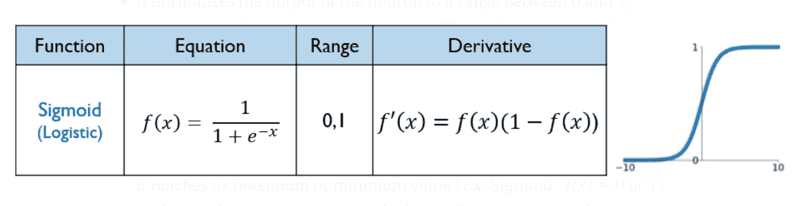

## **2。双曲正切或双曲正切激活函数**

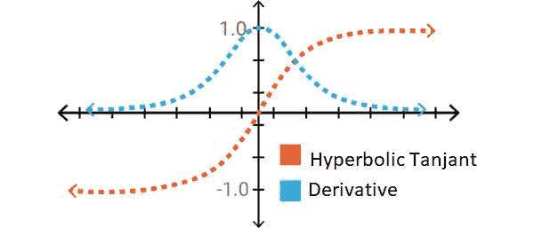

Tanh 激活函数及其导数

Tanh 也像逻辑 s 形但更好。双曲正切函数的范围是从(-1 到 1)。tanh 也是 s 形的(s 形)。

它的结构非常类似于 Sigmoid 函数。但是，这一次函数被定义为(-1，+ 1)。相对于 sigmoid 函数的优势在于它的导数更陡，这意味着它可以获得更多的值。这意味着它的效率会更高，因为它的学习和评分范围更广。但是，函数两端的梯度问题仍然存在。

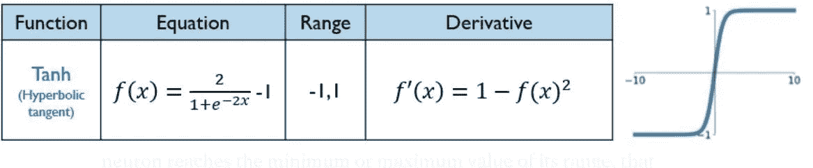

**3。ReLU(整流线性单元)激活功能**

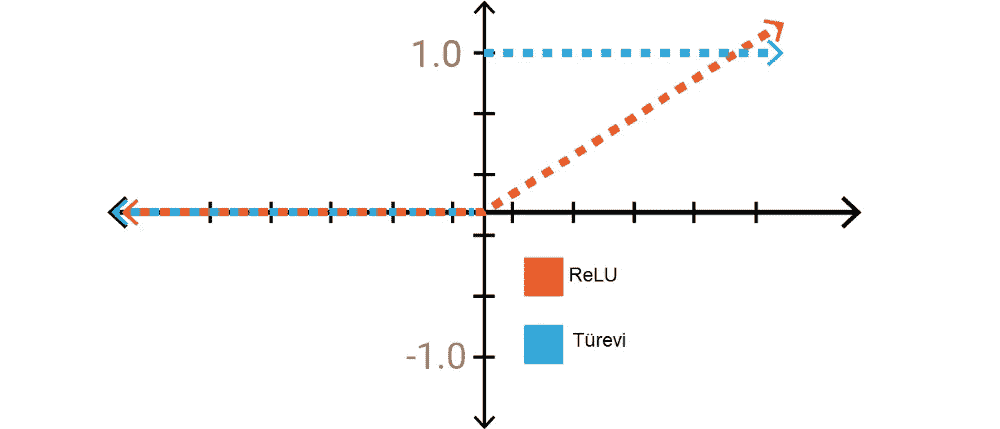

ReLU 激活函数及其导数

ReLU 是目前世界上使用最多的激活函数。因为它用于几乎所有的卷积神经网络或深度学习。

正如你所看到的，ReLU 是半整流(从底部)。当 z 小于零时 f(z)为零，当 z 大于或等于零时 f(z)等于 z。

**范围:**【0 到无穷大】

函数及其导数**都是** **单调**。

但问题是，所有的负值立即变为零，这降低了模型根据数据进行适当拟合或训练的能力。这意味着给予 ReLU 激活函数的任何负输入都会在图形中立即将值变成零，这反过来会通过不适当地映射负值来影响结果图形。

让我们想象一个有太多神经元的大型神经网络。Sigmoid 和双曲线正切导致几乎所有的神经元都以相同的方式被激活。这意味着激活非常密集。网络中的一些神经元是活跃的，并且激活是不频繁的，所以我们想要有效的计算负载。我们用 ReLU 得到它。负轴上的值为 0 意味着网络将运行得更快。**计算负荷小于 sigmoid 和双曲线正切函数的事实导致了对多层网络的更高偏好。**

但是即使是热路也不完全是伟大的，为什么？因为这个零值区域给了我们这个过程的速度！所以学习不是发生在那个区域。那你就需要找一个新的激活功能，有窍门的。

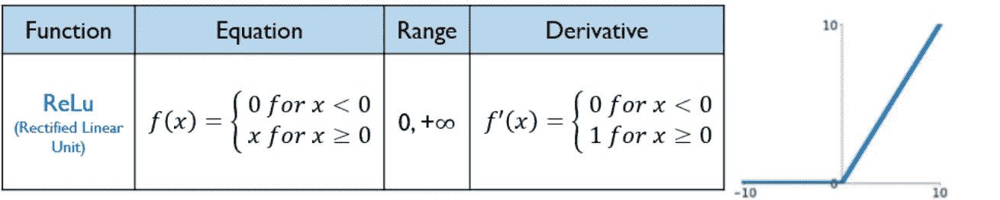

**4。泄漏的 ReLU**

负平面上的泄漏是解决垂死的 ReLU 问题的一种尝试

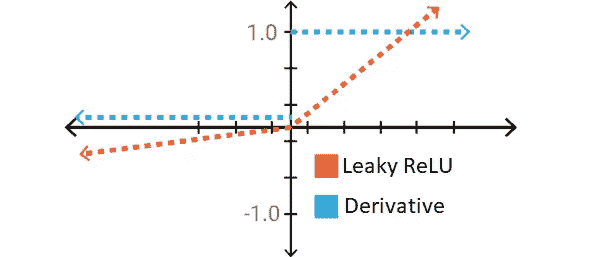

泄漏 ReLU 和导数

泄漏有助于增加 ReLU 功能的范围。通常情况下， **a** 的值在 0.01 左右。

当 **a 不为 0.01** 时，称为**随机化 ReLU** 。

因此，泄漏 ReLU 的**范围**是(-无穷大到无穷大)。

泄漏和随机化 ReLU 函数本质上都是单调的。同样，它们的导数在性质上也是单调的。

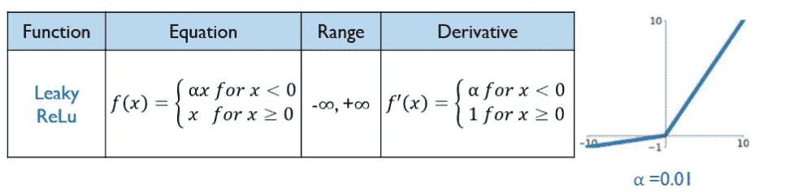

**5。ELU(指数线性单位)激活函数:**

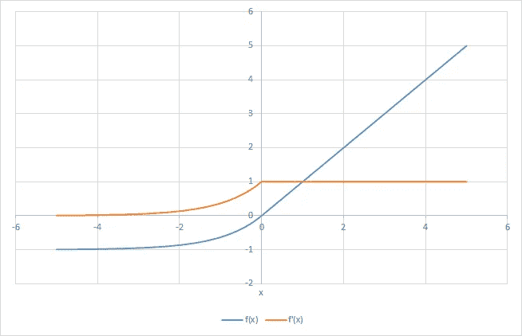

ELU 激活函数及其导数

*   ELU 还提出解决神经元死亡的问题。
*   没有死 ReLU 问题
*   零中心的

**缺点:**

*   计算密集型。
*   类似于 Leaky ReLU，虽然理论上比 ReLU 好，但是目前在实践中没有很好的证据证明 eLU 总是比 ReLU 好。
*   只有当 alpha 大于或等于 0 时，f(x)才是单调的。
*   只有当α在 0 和 1 之间时，ELU 的 f′(x)导数才是单调的。
*   指数函数导致收敛缓慢。

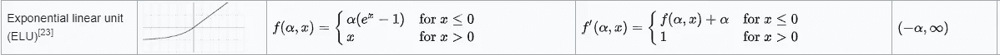

**6。P ReLu(参数 ReLu)激活功能:**

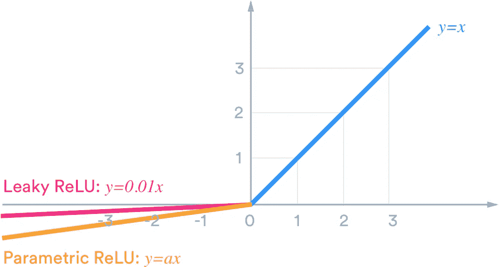

**参数 ReLU**

*   漏 ReLU 的概念可以进一步扩展。
*   我们可以用一个“超参数(可训练参数)”来乘 x，而不是用一个常数项来乘 x，这似乎对泄漏 ReLU 更有效。这种对泄漏 ReLU 的扩展被称为参数 ReLU。
*   参数α一般是 0 到 1 之间的数，一般比较小。
*   由于可训练参数，比泄漏 Relu 稍有优势。
*   处理神经元死亡的问题。

**缺点:**

*   与泄漏的 Relu 相同。
*   当 a >或=0 时，f(x)是单调的，当 a =1 时，f'(x)是单调的

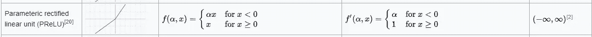

**7。唰(一种自门控)** **激活功能:(乙状结肠线性单元)**

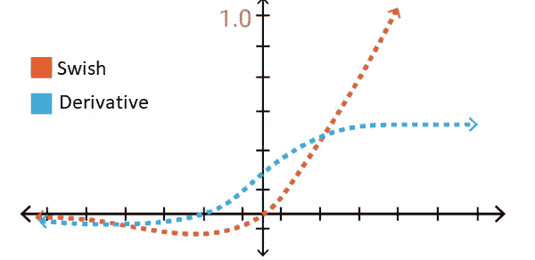

Swish 激活函数及其导数

*   Google Brain 团队提出了一个新的激活函数，命名为 **Swish** ，简单来说就是 **f(x) = x sigmoid(x)** 。
*   他们的实验表明，在许多具有挑战性的数据集上，Swish 往往比 ReLU 更好地工作。
*   ***Swish 函数的曲线是光滑的*** 并且函数在所有点上都是可微的*。这在模型优化过程中是有帮助的，并且被认为是 swish 优于 ReLU 的原因之一。*
*   *唰功能是 ***不单调*** 。这意味着即使输入值在增加，函数值也可能减少。*
*   ***函数上无界下有界。***

****“Swish 倾向于持续匹配或超越 ReLu”****

*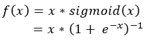*

****注意，即使输入增加，swish 功能的输出也可能下降。这是一个有趣的 swish 特有的特性。*** (由于非单调字符)*

## ***8。Softmax 功能***

*   *“softmax”函数也是一种 sigmoid 函数，但它对于处理多类分类问题非常有用。*
*   *" Softmax 可以描述为多个 s 形函数的组合."*
*   *" Softmax 函数返回属于每个单独类的数据点的概率."*
*   *"注意所有值的总和是 1 . "*

*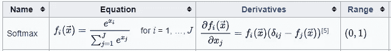**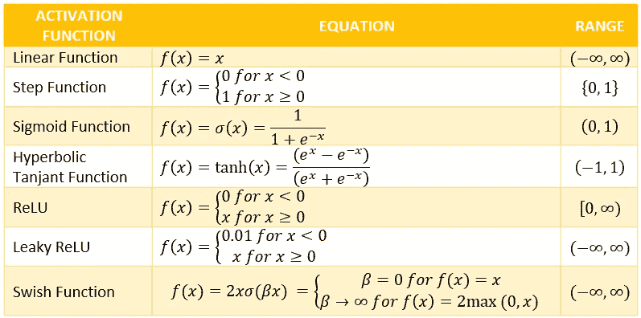*

*激活函数及其方程列表*